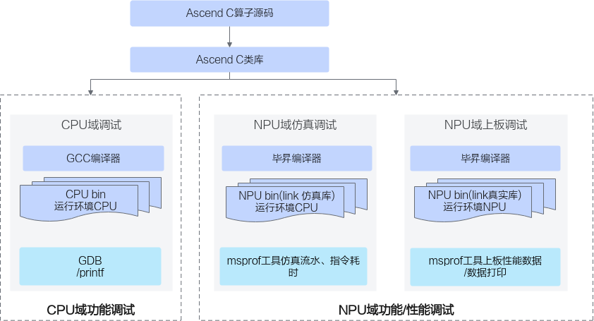

# 概述-调试调优-编程指南-Ascend C算子开发-算子开发-CANN社区版8.5.0开发文档-昇腾社区

**页面ID:** atlas_ascendc_10_0071
**来源：** https://www.hiascend.com/document/detail/zh/CANNCommunityEdition/850/opdevg/Ascendcopdevg/atlas_ascendc_10_0071.html
---

# 概述

Ascend C算子调试的整体方案如下：开发者通过调用Ascend C类库编写Ascend C算子Kernel侧源码，Kernel侧源码通过通用的GCC编译器进行编译，编译生成通用的CPU域的二进制，可以通过gdb通用调试工具等调试手段进行调试；Kernel侧源码通过毕昇编译器进行编译，编译生成NPU域的二进制文件，可以通过仿真打点图或者Profiling工具进行上板数据采集等方式进行调试。

具体的调试调优方法和使用的工具列表如下：

| 分类                                                                                                                                                                                       | 子分类                                                                                                                          | 方法                                                                                                                                                                                                                                                                              |
| ------------------------------------------------------------------------------------------------------------------------------------------------------------------------------------------ | ------------------------------------------------------------------------------------------------------------------------------- | --------------------------------------------------------------------------------------------------------------------------------------------------------------------------------------------------------------------------------------------------------------------------------- |
| 功能调试                                                                                                                                                                                   | CPU域孪生调试                                                                                                                   | 孪生调试：相同的算子代码可以在CPU域调试精度，NPU域调试性能。在CPU域可以进行gdb调试、使用printf命令打印。                                                                                                                                                                          |
| NPU域上板调试                                                                                                                                                                              | printf/assert：printf主要用于打印标量和字符串信息；assert主要用于在代码中设置检查点，当某个条件不满足时，程序会立即终止并报错。 |                                                                                                                                                                                                                                                                                   |
| DumpTensor：使用DumpTensor接口打印指定Tensor的数据。                                                                                                                                       |                                                                                                                                 |                                                                                                                                                                                                                                                                                   |
| 上板调试工具：使用msDebug工具调试NPU侧运行的算子程序，在真实的硬件环境中，对算子的输入输出进行测试，以验证算子的功能是否正确。具体功能包括断点设置、打印变量和内存、单步调试、中断运行等。 |                                                                                                                                 |                                                                                                                                                                                                                                                                                   |
| 内存检测工具：使用msSanitizer工具进行内存检测，可以检测并报告算子运行中对外部存储(Global Memory)和内部存储(Local Memory)的越界及未对齐等内存访问异常。                                     |                                                                                                                                 |                                                                                                                                                                                                                                                                                   |
| 性能调优                                                                                                                                                                                   | -                                                                                                                               | msprof工具：msProf工具用于采集和分析运行在昇腾AI处理器上算子的关键性能指标，用户可根据输出的性能数据，快速定位算子的软、硬件性能瓶颈，提升算子性能的分析效率。当前支持基于不同运行模式（上板或仿真）和不同文件形式（可执行文件或算子二进制。o文件）进行性能数据的采集和自动解析。 |
