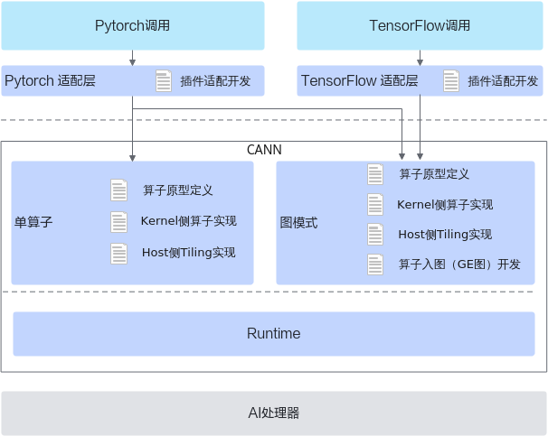

# 概述-AI框架算子适配-附录-编程指南-Ascend C算子开发-算子开发-CANN社区版8.5.0开发文档-昇腾社区

**页面ID:** atlas_ascendc_10_0080
**来源：** https://www.hiascend.com/document/detail/zh/CANNCommunityEdition/850/opdevg/Ascendcopdevg/atlas_ascendc_10_0080.html
---

# 概述

本章节内容介绍AI框架调用自定义算子的方法。如下图所示，Pytorch支持单算子和图模式两种，TensorFlow仅支持图模式。

AI框架调用时，除了需要提供CANN框架调用时需要的代码实现文件，还需要进行插件适配开发。

