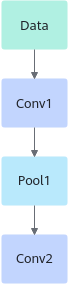
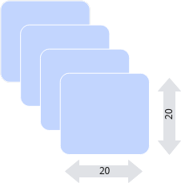
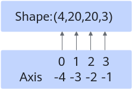

# 算子基本概念-神经网络和算子-概念原理和术语-编程指南-Ascend C算子开发-算子开发-CANN社区版8.5.0开发文档-昇腾社区

**页面ID:** atlas_ascendc_10_0097
**来源：** https://www.hiascend.com/document/detail/zh/CANNCommunityEdition/850/opdevg/Ascendcopdevg/atlas_ascendc_10_0097.html
---

# 算子基本概念

算子（Operator，简称OP），是深度学习算法中执行特定数学运算或操作的基础单元，例如激活函数（如ReLU）、卷积(Conv)、池化(Pooling)以及归一化（如Softmax）。通过组合这些算子，可以构建神经网络模型。

本章节介绍算子中常用的基本概念。

#### 算子名称(Op Name)

算子的名称，用于标识网络中的某个算子，同一网络中算子的名称需要保持唯一。如下图所示Conv1、Pool1、Conv2都是此网络中的算子名称，其中Conv1与Conv2算子的类型为Convolution，表示分别做一次卷积运算。

#### 算子类型(Op Type)

网络中每一个算子根据算子类型进行算子实现的匹配，相同类型算子的实现逻辑相同。在一个网络中同一类型的算子可能存在多个，例如上图中的Conv1算子与Conv2算子的类型都为Convolution。

#### 张量(Tensor)

Tensor是算子计算数据的容器，包含如下属性信息。

| 属性         | 定义                                                                                                                                                                                     |
| ------------ | ---------------------------------------------------------------------------------------------------------------------------------------------------------------------------------------- |
| 形状         | Tensor的形状，比如(10, )或者(1024, 1024)或者(2, 3, 4)等。如形状(3, 4)表示第一维有3个元素，第二维有4个元素，(3, 4)表示一个3行4列的矩阵数组。形式：(i1, i2, …, in)，其中i1到in均为正整数。 |
| 数据类型     | 指定Tensor对象的数据类型。取值范围：float16, float32, int8, int16, int32, uint8, uint16, bfloat16, bool等。                                                                              |
| 数据排布格式 | 数据的物理排布格式，详细请参见数据排布格式。                                                                                                                                             |

#### 形状(Shape)

张量的形状，以(D0, D1, … ,Dn-1)的形式表示，D0到Dn是任意的正整数。

如形状(3,4)表示第一维有3个元素，第二维有4个元素，(3,4)表示一个3行4列的矩阵数组。

形状的第一个元素对应张量最外层中括号中的元素个数，形状的第二个元素对应张量中从左边开始数第二个中括号中的元素个数，依此类推。例如：

| 张量                           | 形状      | 描述                  |
| ------------------------------ | --------- | --------------------- |
| 1                              | (0,)      | 0维张量，也是一个标量 |
| [1,2,3]                        | (3,)      | 1维张量               |
| [[1,2],[3,4]]                  | (2, 2)    | 2维张量               |
| [[[1,2],[3,4]], [[5,6],[7,8]]] | (2, 2, 2) | 3维张量               |

物理含义我们应该怎么理解呢？假设我们有这样一个shape=(4, 20, 20, 3)。

假设有一些照片，每个像素点都由红/绿/蓝3色组成，即shape里面3的含义，照片的宽和高都是20，也就是20*20=400个像素，总共有4张的照片，这就是shape=(4, 20, 20, 3)的物理含义。

如果体现在编程上，可以简单把shape理解为操作Tensor的各层循环，比如我们要对shape=(4, 20, 20, 3)的A tensor进行操作，循环语句如下：

#### 轴(axis)

轴是相对shape来说的，轴代表张量的shape的下标，比如张量a是一个5行6列的二维数组，即shape是(5,6)，则axis=0表示是张量中的第一维，即行。axis=1表示是张量中的第二维，即列。

例如张量数据[[[1,2],[3,4]], [[5,6],[7,8]]]，Shape为(2,2,2)，则轴0代表第一个维度的数据即[[1,2],[3,4]]与[[5,6],[7,8]]这两个矩阵，轴1代表第二个维度的数据即[1,2]、[3,4]、[5,6]、[7,8]这四个数组，轴2代表第三个维度的数据即1，2，3，4，5，6，7，8这八个数。

轴axis可以为负数，此时表示是倒数第axis个维度。

N维Tensor的轴有：0 , 1, 2,……，N-1。

