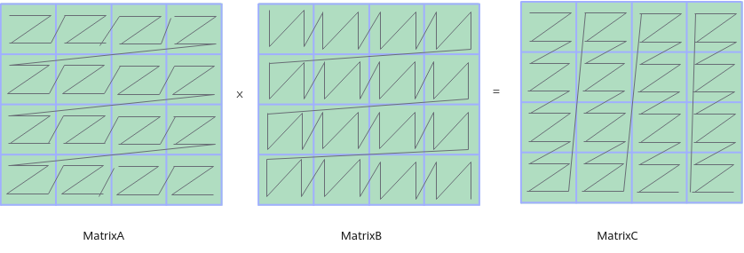

# 数据排布格式-神经网络和算子-概念原理和术语-编程指南-Ascend C算子开发-算子开发-CANN社区版8.5.0开发文档-昇腾社区

**页面ID:** atlas_ascendc_10_0099
**来源：** https://www.hiascend.com/document/detail/zh/CANNCommunityEdition/850/opdevg/Ascendcopdevg/atlas_ascendc_10_0099.html
---

# 数据排布格式

数据排布格式(Data Layout Format)是深度学习中对多维Tensor在内存中存储方式的描述。

常见的数据格式包括ND、NHWC和NCHW等，为Tensor的每个轴赋予了特定的业务语义。

除了上述NHWC和NCHW格式外，还存在一些特殊的私有数据格式，如FRACTAL_NZ（也简称NZ）、NC1HWC0、FRACTAL_Z、NDC1HWC0、FRACTAL_Z_3D等。这些格式的引入是为了满足AI Core中Cube计算单元的高性能计算需求，通过优化内存布局，这些格式能够提升计算效率。在使用矩阵乘、卷积API开发相关算子的过程中，您可以看到这些格式的具体应用。

#### 普通格式

- ND、NHWC和NCHW数据排布格式最初用于表示图像在内存中的存储方式，其中常见的包括ND、NHWC和NCHW。在一般情况下，所有的Tensor都是N维的(ND)，而NHWC和NCHW则是为四维Tensor中的每个轴赋予了特定的业务语义，例如高度(Height)、宽度(Width)和通道数(Channels)。NHWC和NCHW的主要区别在于通道(Channel)维度的位置：NHWC格式中，通道维度位于最后一个位置。NCHW格式中，通道维度位于高度和宽度之前。具体解释每个轴的含义：N：Batch数量，表示图像的数目。H：Height，图像的高度，即垂直方向的像素个数。W：Width，图像的宽度，即水平方向的像素个数。C：Channels，图像的通道数，例如彩色RGB图像的Channels为3。如图1所示，以一张格式为RGB的图片为例，NCHW中，C排列在外层，实际存储的是“RRRRRRGGGGGGBBBBBB”，即同一通道的所有像素值顺序存储在一起；而NHWC中C排列在最内层，实际存储的则是“RGBRGBRGBRGBRGBRGB”，即多个通道的同一位置的像素值顺序存储在一起。图1NCHW和NHWC存储示例尽管存储的数据相同，但不同的存储顺序会导致数据的访问特性不一致，因此即便进行同样的运算，相应的计算性能也会不同。

- NDHWC和NCDHWNDHWC和NCDHW是五维Tensor，较NHWC和NCHW多了一个D的维度，D代表特征深度(Depth)，表示数据在深度方向上的扩展，如视频的时间步或医学图像的深度层，因此该类格式便于在时间维度上进行卷积操作。以NDHWC为例，其数据格式如下图所示：

#### 矩阵乘相关特殊格式

使用Mmad基础API进行矩阵乘计算时，对矩阵输入输出的数据排布格式有一定的要求，如下图所示，要求A矩阵（位于L0A Buffer）为FRACTAL_ZZ，B矩阵（位于L0B Buffer）为FRACTAL_ZN，C矩阵（位于L0C Buffer）为FRACTAL_NZ。这些格式将矩阵划分成了一些分形(Fractal Matrix)，适配Cube计算单元每次读取(16, 16)× (16, 16)的数据进行计算的硬件特点（以half数据类型为例），从而提高矩阵计算的效率。分形的大小和数据类型有关，也和所在的存储位置有关，具体可参见下文的详细介绍。

- FRACTAL_NZ/NZFRACTAL_NZ格式，简称NZ格式，是对一个Tensor最低两维（一个Tensor的所有维度，右侧为低维，左侧为高维）进行填充(pad)、拆分(reshape)和转置(transpose)操作后得到的格式。具体的转换过程如下：(M，N)大小的矩阵被分为M1 * N1个分形，按照column major（列优先）排布，形状如N字形；每个分形内部有M0 * N0个元素，按照row major（行优先）排布，形状如Z字形，所以这种数据格式称为NZ格式。其中，(M0, N0)表示一个分形的大小。通过公式表达为：(…, B, M, N)->pad->(…, B, M1 * M0, N1 * N0)->reshape->(…, B, M1, M0, N1, N0)->transpose->(…, B, N1, M1, M0, N0)通常情况下，NZ格式在L0C Buffer和L1 Buffer中分别用于不同的场景：在L0C Buffer中，NZ格式用于存储矩阵乘法的结果。其分形形状为16x16，包含256个元素，这种结构非常适合Cube计算单元进行高效的矩阵乘法运算。在L1 Buffer中，NZ格式被采用以便于将数据搬运到L0A Buffer和L0B Buffer时，能够方便地转换为对应的ZZ和ZN格式。此时，分形形状为16 x (32B / sizeof(Datatype))，大小为512字节。因此，当数据从L0C Buffer搬运到L1 Buffer时，其分形大小可能会发生变化。下面通过一个具体的例子来了解ND格式转换为NZ格式的过程。原始Tensor的Shape为(20, 28)：1234data=[xforxinrange(20*28)]data_a=data*np.ones((20*28),dtype="float16")tensor_a=data_a.reshape((20,28))print(tensor_a)原始Tensor数据打印如下：12345678910111213141516171819202122232425262728293031323334353637383940[[0.1.2.3.4.5.6.7.8.9.10.11.12.13.14.15.16.17.18.19.20.21.22.23.24.25.26.27.][28.29.30.31.32.33.34.35.36.37.38.39.40.41.42.43.44.45.46.47.48.49.50.51.52.53.54.55.][56.57.58.59.60.61.62.63.64.65.66.67.68.69.70.71.72.73.74.75.76.77.78.79.80.81.82.83.][84.85.86.87.88.89.90.91.92.93.94.95.96.97.98.99.100.101.102.103.104.105.106.107.108.109.110.111.][112.113.114.115.116.117.118.119.120.121.122.123.124.125.126.127.128.129.130.131.132.133.134.135.136.137.138.139.][140.141.142.143.144.145.146.147.148.149.150.151.152.153.154.155.156.157.158.159.160.161.162.163.164.165.166.167.][168.169.170.171.172.173.174.175.176.177.178.179.180.181.182.183.184.185.186.187.188.189.190.191.192.193.194.195.][196.197.198.199.200.201.202.203.204.205.206.207.208.209.210.211.212.213.214.215.216.217.218.219.220.221.222.223.][224.225.226.227.228.229.230.231.232.233.234.235.236.237.238.239.240.241.242.243.244.245.246.247.248.249.250.251.][252.253.254.255.256.257.258.259.260.261.262.263.264.265.266.267.268.269.270.271.272.273.274.275.276.277.278.279.][280.281.282.283.284.285.286.287.288.289.290.291.292.293.294.295.296.297.298.299.300.301.302.303.304.305.306.307.][308.309.310.311.312.313.314.315.316.317.318.319.320.321.322.323.324.325.326.327.328.329.330.331.332.333.334.335.][336.337.338.339.340.341.342.343.344.345.346.347.348.349.350.351.352.353.354.355.356.357.358.359.360.361.362.363.][364.365.366.367.368.369.370.371.372.373.374.375.376.377.378.379.380.381.382.383.384.385.386.387.388.389.390.391.][392.393.394.395.396.397.398.399.400.401.402.403.404.405.406.407.408.409.410.411.412.413.414.415.416.417.418.419.][420.421.422.423.424.425.426.427.428.429.430.431.432.433.434.435.436.437.438.439.440.441.442.443.444.445.446.447.][448.449.450.451.452.453.454.455.456.457.458.459.460.461.462.463.464.465.466.467.468.469.470.471.472.473.474.475.][476.477.478.479.480.481.482.483.484.485.486.487.488.489.490.491.492.493.494.495.496.497.498.499.500.501.502.503.][504.505.506.507.508.509.510.511.512.513.514.515.516.517.518.519.520.521.522.523.524.525.526.527.528.529.530.531.][532.533.534.535.536.537.538.539.540.541.542.543.544.545.546.547.548.549.550.551.552.553.554.555.556.557.558.559.]]转换过程通过伪代码表达如下：N0 = 16
N1 = (28 + N0 - 1) // N0
pad_n = N1 * N0 - 28
M0 = 16
M1 = (20 + M0 - 1) // M0
pad_m = M1 * M0 - 20
tensor_b = np.pad(tensor_a, [[0, pad_m], [0, pad_n]])
tensor_b = tensor_b.reshape((M1, M0, N1, N0))
tensor_b = tensor_b.transpose((2, 0, 1, 3))
print(tensor_b)转换过程示意图如下：转换后Tensor打印如下：[[[[  0.   1.   2. ...  13.  14.  15.]
   [ 28.  29.  30. ...  41.  42.  43.]
   [ 56.  57.  58. ...  69.  70.  71.]
   ...
   [364. 365. 366. ... 377. 378. 379.]
   [392. 393. 394. ... 405. 406. 407.]
   [420. 421. 422. ... 433. 434. 435.]]

  [[448. 449. 450. ... 461. 462. 463.]
   [476. 477. 478. ... 489. 490. 491.]
   [504. 505. 506. ... 517. 518. 519.]
   ...
   [  0.   0.   0. ...   0.   0.   0.]
   [  0.   0.   0. ...   0.   0.   0.]
   [  0.   0.   0. ...   0.   0.   0.]]]

 [[[ 16.  17.  18. ...   0.   0.   0.]
   [ 44.  45.  46. ...   0.   0.   0.]
   [ 72.  73.  74. ...   0.   0.   0.]
   ...
   [380. 381. 382. ...   0.   0.   0.]
   [408. 409. 410. ...   0.   0.   0.]
   [436. 437. 438. ...   0.   0.   0.]]

  [[464. 465. 466. ...   0.   0.   0.]
   [492. 493. 494. ...   0.   0.   0.]
   [520. 521. 522. ...   0.   0.   0.]
   ...
   [  0.   0.   0. ...   0.   0.   0.]
   [  0.   0.   0. ...   0.   0.   0.]
   [  0.   0.   0. ...   0.   0.   0.]]]]

- FRACTAL_ZZ/ZZFRACTAL_ZZ格式，简称ZZ格式，是对一个Tensor最低两维（一个Tensor的所有维度，右侧为低维，左侧为高维）进行填充(pad)、拆分(reshape)和转置(transpose)操作后得到的格式。具体转换过程如下：(M, K)大小的矩阵被分为M1 * K1个分形，按照row major排布，形状如Z字形；每个分形内部有M0 * K0个元素，按照row major排布，形状如Z字形，所以这种数据格式称为ZZ格式。其中，(M0, K0)表示一个分形的大小，分形Shape为16 x (32B / sizeof(Datatype))，大小为512字节。通过公式表达转换过程如下：(…, B, M, K)->pad->(…, B, M1 * M0, K1 * K0)->reshape->(…, B, M1, M0, K1, K0)->transpose->(…, B, M1, K1, M0, K0)对于不同的数据类型，M0和K0的大小不同：位宽为4的数据类型：M0=16，K0=64。位宽为8的数据类型：M0=16，K0=32。位宽为16的数据类型：M0=16，K0=16。位宽为32的数据类型，M0=16，K0=8。

- FRACTAL_ZN/ZNFRACTAL_ZN格式，简称ZN格式，是对一个Tensor最低两维（一个Tensor的所有维度，右侧为低维，左侧为高维）进行填充(pad)、拆分(reshape)和转置(transpose)操作后得到的格式。具体转换过程如下：(K, N)大小的矩阵被分为K1 * N1个分形，按照row major排布，形状如Z字形；每个分形内部有K0 * N0个元素，按照column major排布，形状如N字形，所以这种数据格式称为ZN格式。其中，(K0, N0)表示一个分形的大小，分形shape为(32B / sizeof(Datatype)) x 16，大小为512字节。通过公式表达转换过程如下：(…, B, K, N)->pad->(…, B, K1 * K0, N1 * N0)->reshape->(…, B, K1, K0, N1, N0)->transpose->(…, B, K1, N1, K0, N0)对于不同的数据类型，K0和N0的大小不同：位宽为4的数据类型：K0=64，N0=16；位宽为8的数据类型：K0=32，N0=16；位宽为16的数据类型：K0=16，N0=16；位宽为32的数据类型：K0=8，N0=16。

#### 卷积相关特殊格式

- NC1HWC0昇腾AI处理器中，为了提高通用矩阵乘法(GEMM)运算数据块的访问效率，所有张量数据统一采用NC1HWC0的五维数据格式。其中C0与微架构强相关，等于AI Core中矩阵计算单元的大小。C1=(C+C0-1)/C0。如果结果不整除，向下取整。NHWC/NCHW -> NC1HWC0的转换过程为：将数据在C维度进行分割，变成C1份NHWC0/NC0HW，再将C1份NHWC0/NC0HW在内存中连续排列成NC1HWC0，其格式转换示意图如下图所示。NHWC -> NC1HWC0的转换公式如下：Tensor.reshape( [N, H, W, C1, C0]).transpose( [0, 3, 1, 2, 4] )NCHW -> NC1HWC0的转换公式如下：Tensor.reshape( [N, C1, C0, H, W]).transpose( [0, 1, 3, 4, 2] )

- FRACTAL_ZFRACTAL_Z是用于定义卷积权重的数据格式，由FT Matrix（FT：Filter，卷积核）变换得到。FRACTAL_Z是送往Cube的最终数据格式，采用“C1HW,N1,N0,C0”的4维数据排布。数据有两层Tiling，如下图所示：第一层与Cube的Size相关，数据按照列的方向连续（小n）；第二层与矩阵的Size相关，数据按照行的方向连续（大Z）。例如：HWCN = (2, 2, 32, 32)，将其变成FRACTAL_Z(C1HW, N1, N0, C0) = (8, 2, 16, 16)。HWCN变换FRACTAL_Z的过程为：Tensor.padding([ [0,0], [0,0], [0,(C0-C%C0)%C0], [0,(N0-N%N0)%N0] ]).reshape( [H, W, C1, C0, N1, N0]).transpose( [2, 0, 1, 4, 5, 3] ).reshape( [C1*H*W, N1, N0, C0])NCHW变换FRACTAL_Z的过程为：Tensor.padding([ [0,(N0-N%N0)%N0], [0,(C0-C%C0)%C0], [0,0], [0,0] ]).reshape( [N1, N0, C1, C0, H, W,]).transpose( [2, 4, 5, 0, 1, 3] ).reshape( [C1*H*W, N1, N0, C0])

- NDC1HWC0为了提高矩阵乘法运算数据块的访问效率，将NDHWC转换为NDC1HWC0格式。其中C0与微架构强相关，等于AI Core中矩阵计算单元的大小，对于float16_t类型为16，对于int8_t类型则为32，这部分数据需要连续存储。C1=(C+C0-1)/C0。如果结果不整除，向下取整。NDHWC -> NDC1HWC0的转换过程为：将数据在C维度进行分割，变成C1份NDHWC0，再将C1份NDHWC0在内存中连续排列成NDC1HWC0，其格式转换示意图如下图所示。
- FRACTAL_Z_3DFRACTAL_Z_3D是3D卷积权重格式，例如Conv3D算子都会涉及到用这种格式来表达3D卷积的权重。NDHWC –> FRACTAL_Z_3D的变换过程通过公式表达如下：(…, N, D, H, W, C)->pad->(…, N1 * N0, D, H, W, C1 * C0)->reshape->(…, N1, N0, D, H, W, C1, C0)->transpose->(D, C1, H, W, N1, N0, C0)->reshape->(…, D * C1 * H * W, N1, N0, C0)对于不同的数据类型，C0和N0的大小不同：位宽为4的数据类型：C0=64，N0=16；位宽为8的数据类型：C0=32，N0=16；位宽为16的数据类型：C0=16，N0=16；位宽为32的数据类型：C0=8，N0=16。输入一个NDHWC格式的Tensor，Shape大小为(48, 2, 2, 2, 32)：转换后，得到FRACTAL_Z_3D格式如下所示：

#### Matmul高阶API相关格式

- BSH/SBH：B：Batch，批处理的大小；S：sequence length，序列长度；H = N * D，其中，N为head的数量，D为head的大小，此格式通常用于Matmul矩阵乘。数据排布格式如下图所示：

- BMNK：通用数据格式；B：Batch，批处理的大小；M、N、K为矩阵乘[M, K]*[K, N]的矩阵维度；其数据排布格式如下：

- BSNGD：为原始BSH shape做reshape后的shape，S和D为单Batch的矩阵乘的M轴（或N轴）和K轴，一个SD为一个batch的计算数据，此格式通常用于Matmul矩阵乘，数据排布格式如下图所示：
- SBNGD：为原始SBH shape做reshape后的shape，S和D为单Batch的矩阵乘的M轴（或N轴）和K轴，一个SD为一个Batch的计算数据，此格式通常用于Matmul矩阵乘，数据排布格式如下图所示：

- BNGS1S2：一般为前两种数据排布进行矩阵乘的输出，S1S2数据连续存放，一个S1S2为一个Batch的计算数据，此格式通常用于Matmul矩阵乘，数据排布格式如下图所示

- ND_ALIGN：ND_ALIGN是ND数据格式的一种变换数据格式。输出矩阵乘的结果矩阵C时，用于配置C矩阵按照N方向32字节对齐的规则进行输出。ND->ND_ALIGN变换过程如下图所示，假设矩阵乘结果矩阵C的数据类型是int32_t，输出到VECOUT，原矩阵N方向没有32字节对齐，设置ND_ALIGN后则在其后补0，将其对齐到32字节。
- VECTOR：VECTOR是GEMV（矩阵向量乘，General Matrix-Vector Multiply）场景使用的一种数据格式，配置矩阵为VECTOR数据排布格式即代表输入数据是一个向量。图2GEMV场景输入Vector格式的A矩阵示意图
