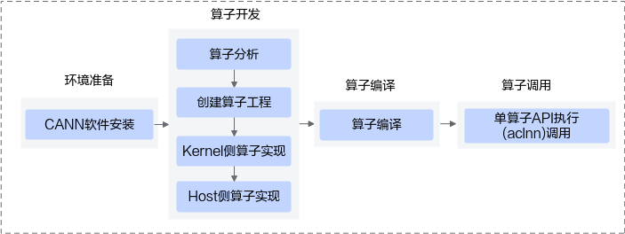
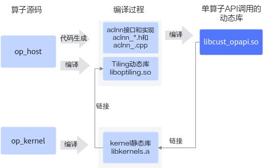

# 简易自定义算子工程-附录-编程指南-Ascend C算子开发-算子开发-CANN社区版8.5.0开发文档-昇腾社区

**页面ID:** atlas_ascendc_10_0101
**来源：** https://www.hiascend.com/document/detail/zh/CANNCommunityEdition/850/opdevg/Ascendcopdevg/atlas_ascendc_10_0101.html
---

# 简易自定义算子工程

本章节介绍的简易自定义算子工程，是上文中介绍的自定义算子工程的简化版，对算子的编译、打包、部署过程进行简化，便于开发者将该工程集成到自己的算子工程。

基于简易自定义算子工程进行算子开发的完整样例请参考简易自定义算子工程。

基于简易自定义算子工程的算子开发流程图如下：

#### 创建算子工程

和创建算子工程类似，简易自定义算子工程通过msOpGen生成，基于算子原型定义输出算子工程，包括算子host侧代码实现文件、算子kernel侧实现文件以及工程编译配置文件等。主要差异点在于：创建简易算子工程需要通过-f参数配置framework框架为aclnn。

使用msOpGen工具创建简易算子开发工程的步骤如下：

1. 编写算子的原型定义json文件，用于生成算子开发工程。例如，AddCustom算子的json文件命名为add_custom.json，文件内容如下：[
    {
        "op": "AddCustom",
        "input_desc": [
            {
                "name": "x",
                "param_type": "required",
                "format": [
                    "ND",
                    "ND",
                    "ND"
                ],
                "type": [
                    "fp16",
                    "float",
                    "int32"
                ]
            },
            {
                "name": "y",
                "param_type": "required",
                "format": [
                    "ND",
                    "ND",
                    "ND"
                ],
                "type": [
                    "fp16",
                    "float",
                    "int32"
                ]
            }
        ],
        "output_desc": [
            {
                "name": "z",
                "param_type": "required",
                "format": [
                    "ND",
                    "ND",
                    "ND"
                ],
                "type": [
                    "fp16",
                    "float",
                    "int32"
                ]
            }
        ]
    }
]
1. 使用msOpGen工具生成算子的开发工程。以生成AddCustom的算子工程为例，下文仅针对关键参数进行解释，详细参数说明请参见msOpGen工具。${INSTALL_DIR}/python/site-packages/bin/msopgen gen -i$HOME/sample/add_custom.json -c ai_core-<soc_version>-lan cpp -out $HOME/sample/AddCustom-f aclnn${INSTALL_DIR}为CANN软件安装后文件存储路径，请根据实际环境进行替换。-i：指定算子原型定义文件add_custom.json所在路径，请根据实际情况修改。-c：ai_core-<soc_version>代表算子在AI Core上执行，<soc_version>为昇腾AI处理器的型号。AI处理器的型号<soc_version>请通过如下方式获取：针对如下产品：在安装昇腾AI处理器的服务器执行npu-smi info命令进行查询，获取Name信息。实际配置值为AscendName，例如Name取值为xxxyy，实际配置值为Ascendxxxyy。Atlas A2 训练系列产品/Atlas A2 推理系列产品Atlas 200I/500 A2 推理产品Atlas推理系列产品Atlas训练系列产品针对如下产品，在安装昇腾AI处理器的服务器执行npu-smi info -t board -iid-cchip_id命令进行查询，获取Chip Name和NPU Name信息，实际配置值为Chip Name_NPU Name。例如Chip Name取值为Ascendxxx，NPU Name取值为1234，实际配置值为Ascendxxx_1234。其中：id：设备id，通过npu-smi info -l命令查出的NPU ID即为设备id。chip_id：芯片id，通过npu-smi info -m命令查出的Chip ID即为芯片id。Atlas A3 训练系列产品/Atlas A3 推理系列产品基于同系列的AI处理器型号创建的算子工程，其基础功能（基于该工程进行算子开发、编译和部署）通用。-lan：参数cpp代表算子基于Ascend C编程框架，使用C/C++编程语言开发。-out：生成文件所在路径，可配置为绝对路径或者相对路径，并且工具执行用户对路径具有可读写权限。若不配置，则默认生成在执行命令的当前路径。-f：表示框架类型，aclnn表示生成简易工程。
1. 命令执行完后，会在-out指定目录或者默认路径下生成算子工程目录，工程中包含算子实现的模板文件，编译脚本等，以AddCustom算子为例，目录结构如下所示：AddCustom
├── build.sh                        // 编译入口脚本
├── cmake 
│   ├──config.cmake// 编译配置项│   ├── func.cmake
│   ├── intf.cmake
│   └── util                       // 算子工程编译所需脚本及公共编译文件存放目录
├── CMakeLists.txt                  // 算子工程的CMakeLists.txt
├── op_host                         // host侧实现文件
│   ├──add_custom_tiling.h// 算子tiling定义文件│   ├──add_custom.cpp// 算子原型注册、tiling实现等内容文件│   ├── CMakeLists.txt
├── op_kernel                       // kernel侧实现文件
│   ├── CMakeLists.txt   
│   ├──add_custom.cpp// 算子代码实现文件上述目录结构中的粗体文件为后续算子开发过程中需要修改的文件，其他文件无需修改。

#### 算子实现

参考Kernel侧算子实现、Host侧Tiling实现、算子原型定义完成算子实现。

#### 算子编译

算子kernel侧和host侧实现开发完成后，需要对算子进行编译，生成算子静态库；自动生成aclnn调用实现代码和头文件，链接算子静态库生成aclnn动态库，以支持后续的单算子API执行方式(aclnn)的算子调用。编译过程如下：

- 根据host侧算子实现文件自动生成aclnn接口aclnn_*.h和aclnn实现文件aclnn_.cpp。
- 编译Tiling实现和算子原型定义生成Tiling动态库liboptiling.so(libcust_opmaster_rt2.0)。
- 编译kernel侧算子实现文件，并加载Tiling动态库，生成kernel静态库libkernels.a。
- 编译aclnn实现文件，并链接kernel静态库libkernels.a生成单算子API调用的动态库libcust_opapi.so。

上述编译过程示意图如下：

上文描述的过程都封装在编译脚本中，开发者进行编译时参考如下的步骤进行操作：

1. 完成工程编译相关配置。修改cmake目录下config.cmake中的配置项，config.cmake文件内容如下：set(CMAKE_CXX_FLAGS_DEBUG "")
set(CMAKE_CXX_FLAGS_RELEASE "")

if (NOT DEFINED CMAKE_BUILD_TYPE)
    set(CMAKE_BUILD_TYPERelease CACHE STRING "")
endif()
if (CMAKE_INSTALL_PREFIX_INITIALIZED_TO_DEFAULT) 
    set(CMAKE_INSTALL_PREFIX"${CMAKE_SOURCE_DIR}/build_out" CACHE PATH "" FORCE)
endif()
if (NOT DEFINED ASCEND_CANN_PACKAGE_PATH)
    set(ASCEND_CANN_PACKAGE_PATH/usr/local/Ascend/cannCACHE PATH "") //请替换为CANN软件包安装后的实际路径endif()
if (NOT DEFINED ASCEND_PYTHON_EXECUTABLE)
    set(ASCEND_PYTHON_EXECUTABLE python3 CACHE STRING "")
endif()
if (NOT DEFINED ASCEND_COMPUTE_UNIT)
    set(ASCEND_COMPUTE_UNIT ascendxxx CACHE STRING "")
endif()
if (NOT DEFINED ENABLE_TEST)
    set(ENABLE_TEST FALSE CACHE BOOL "")
endif()
if (NOT DEFINED ENABLE_CROSS_COMPILE)
    set(ENABLE_CROSS_COMPILE  FALSE CACHE BOOL "")
endif()
if (NOT DEFINED CMAKE_CROSS_PLATFORM_COMPILER)
    set(CMAKE_CROSS_PLATFORM_COMPILER "/your/cross/compiler/path" CACHE PATH "")
endif()
set(ASCEND_TENSOR_COMPILER_PATH ${ASCEND_CANN_PACKAGE_PATH}/compiler)
set(ASCEND_CCEC_COMPILER_PATH ${ASCEND_TENSOR_COMPILER_PATH}/ccec_compiler/bin)
set(ASCEND_AUTOGEN_PATH ${CMAKE_BINARY_DIR}/autogen)
file(MAKE_DIRECTORY ${ASCEND_AUTOGEN_PATH})
set(CUSTOM_COMPILE_OPTIONS "custom_compile_options.ini")
execute_process(COMMAND rm -rf ${ASCEND_AUTOGEN_PATH}/${CUSTOM_COMPILE_OPTIONS}
                COMMAND touch ${ASCEND_AUTOGEN_PATH}/${CUSTOM_COMPILE_OPTIONS})表1需要开发者配置的常用参数列表参数名称参数描述默认值ASCEND_CANN_PACKAGE_PATHCANN软件包安装路径，请根据实际情况进行修改。“/usr/local/Ascend/cann”CMAKE_BUILD_TYPE编译模式选项，可配置为：“Release”，Release版本，不包含调试信息，编译最终发布的版本。“Debug”，“Debug”版本，包含调试信息，便于开发者开发和调试。“Release”CMAKE_INSTALL_PREFIX编译产物存放的目录，不指定则为默认值。${CMAKE_SOURCE_DIR}/build_out：算子工程目录下的build_out目录配置编译相关环境变量（可选）表2环境变量说明环境变量配置说明CMAKE_CXX_COMPILER_LAUNCHER用于配置C++语言编译器（如g++）、毕昇编译器的启动器程序为ccache，配置后即可开启cache缓存编译，加速重复编译并提高构建效率。用法如下，在对应的CMakeLists.txt进行设置：set(CMAKE_CXX_COMPILER_LAUNCHER <launcher_program>)其中<launcher_program>是ccache的安装路径，比如ccache的安装路径为/usr/bin/ccache，示例如下：set(CMAKE_CXX_COMPILER_LAUNCHER /usr/bin/ccache)
1. （可选）如果需要编译多个算子，在op_kernel目录下的CMakeLists.txt中增加要编译的算子。# set custom compile options
if ("${CMAKE_BUILD_TYPE}x" STREQUAL "Debugx")
    add_ops_compile_options(ALL OPTIONS -g -O0)
endif()
#多算子编译通过add_kernel_compile命令增加算子源码文件即可
add_kernel_compile(AddCustom ${CMAKE_CURRENT_SOURCE_DIR}/add_custom.cpp)
add_kernel_compile(SubCustom ${CMAKE_CURRENT_SOURCE_DIR}/sub_custom.cpp)
if(ENABLE_TEST AND EXISTS ${CMAKE_CURRENT_SOURCE_DIR}/testcases)
    add_subdirectory(testcases)
endif()
1. （可选）在算子工程中，如果开发者想对算子kernel侧代码增加一些自定义的编译选项，可以参考支持自定义编译选项进行编译选项的定制。
1. 在算子工程目录下执行如下命令，进行算子工程编译。./build.sh编译成功后，会在CMAKE_INSTALL_PREFIX/op_api目录存放生成的aclnn头文件和lib库，每一个算子都会对应一个单独的头文件。具体目录结构如下：├── op_api
│   ├── include
│       ├── aclnn_optype1.h
│       └── aclnn_optype2.h
│       └── aclnn_optypexxx.h
│   ├── lib
│       ├── libcust_opapi.so对于lib目录下生成的库文件可通过msobjdump工具进一步解析得到kernel信息，具体操作参见msobjdump工具。

#### 算子调用

完成单算子API调用。
