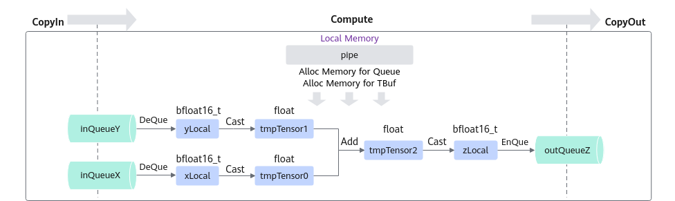

# TBuf的使用-矢量编程-SIMD算子实现-算子实践参考-Ascend C算子开发-算子开发-CANN社区版8.5.0开发文档-昇腾社区

**页面ID:** atlas_ascendc_10_10003
**来源：** https://www.hiascend.com/document/detail/zh/CANNCommunityEdition/850/opdevg/Ascendcopdevg/atlas_ascendc_10_10003.html
---

# TBuf的使用

在大多数算子开发时，核函数计算过程需要使用临时内存来存储运算的中间结果，这些中间结果以临时变量表示，临时变量占用的内存可以使用TBuf数据结构来管理，具体介绍请参考TBuf。下文将以输入的数据类型为bfloat16_t、在单核上运行的Add算子为例，介绍TBuf的使用方式。本样例中介绍的算子完整代码请参见使用临时内存的Add算子样例。

在Atlas A2 训练系列产品/Atlas 800I A2 推理产品上，Add接口不支持对数据类型bfloat16_t的源操作数进行求和计算。因此，需要先将算子输入的数据类型转换成Add接口支持的数据类型，再进行计算。为保证计算精度，调用Cast接口将输入bfloat16_t类型转换为float类型，再进行Add计算，并在计算结束后将float类型转换回bfloat16_t类型。

通过以上分析，得到Ascend CAdd算子的设计规格如下：

| 算子类型(OpType)                      | Add                    |            |           |        |
| ------------------------------------- | ---------------------- | ---------- | --------- | ------ |
| 算子输入输出                          | name                   | shape      | data type | format |
| x（输入）                             | (1, 2048)              | bfloat16_t | ND        |        |
| y（输入）                             | (1, 2048)              | bfloat16_t | ND        |        |
| z（输出）                             | (1, 2048)              | bfloat16_t | ND        |        |
| 核函数名称                            | add_custom             |            |           |        |
| 使用的主要接口                        | DataCopy：数据搬移接口 |            |           |        |
| Cast：矢量精度转换接口                |                        |            |           |        |
| Add：矢量基础算术接口                 |                        |            |           |        |
| EnQue、DeQue等接口：Queue队列管理接口 |                        |            |           |        |
| 算子实现文件名称                      | add_custom.cpp         |            |           |        |

#### 算子类实现

该样例的CopyIn，CopyOut任务与基础矢量算子相同，Compute任务的具体流程如下图所示。

| 123456789101112131415161718 | classKernelAdd{public:__aicore__inlineKernelAdd(){}__aicore__inlinevoidInit(GM_ADDRx,GM_ADDRy,GM_ADDRz){}__aicore__inlinevoidProcess(){}private:__aicore__inlinevoidCopyIn(){}__aicore__inlinevoidCompute(){}__aicore__inlinevoidCopyOut(){}private:AscendC:TPipepipe;AscendC:TQue<AscendC:TPosition:VECIN,1>inQueueX,inQueueY;AscendC:TQue<AscendC:TPosition:VECOUT,1>outQueueZ;AscendC:TBuf<AscendC:TPosition:VECCALC>tmpBuf0,tmpBuf1,tmpBuf2;AscendC:GlobalTensor<bfloat16_t>xGm;AscendC:GlobalTensor<bfloat16_t>yGm;AscendC:GlobalTensor<bfloat16_t>zGm;}; |
| --------------------------- | -------------------------------------------------------------------------------------------------------------------------------------------------------------------------------------------------------------------------------------------------------------------------------------------------------------------------------------------------------------------------------------------------------------------------------------------------------------------------------------------------------------------------------------------------------------- |

初始化函数阶段除原有步骤外，需要调用InitBuffer接口为TBuf变量分配内存，具体的初始化函数代码如下：

| 1234567891011121314 | __aicore__inlinevoidInit(GM_ADDRx,GM_ADDRy,GM_ADDRz){xGm.SetGlobalBuffer((__gm__half*)x,TOTAL_LENGTH);yGm.SetGlobalBuffer((__gm__half*)y,TOTAL_LENGTH);zGm.SetGlobalBuffer((__gm__half*)z,TOTAL_LENGTH);pipe.InitBuffer(inQueueX,1,TOTAL_LENGTH*sizeof(bfloat16_t));pipe.InitBuffer(inQueueY,1,TOTAL_LENGTH*sizeof(bfloat16_t));pipe.InitBuffer(outQueueZ,1,TOTAL_LENGTH*sizeof(bfloat16_t));pipe.InitBuffer(tmpBuf0,TOTAL_LENGTH*sizeof(float));pipe.InitBuffer(tmpBuf1,TOTAL_LENGTH*sizeof(float));pipe.InitBuffer(tmpBuf2,TOTAL_LENGTH*sizeof(float));} |
| ------------------- | ---------------------------------------------------------------------------------------------------------------------------------------------------------------------------------------------------------------------------------------------------------------------------------------------------------------------------------------------------------------------------------------------------------------------------------------------------------------------------------------------------------------------------------------------------------- |

基于矢量编程范式，核函数需要实现3个基本任务：CopyIn，Compute，CopyOut。与基础矢量算子实现相同，Process函数按顺序调用CopyIn函数，Compute函数，CopyOut函数。其中，CopyIn函数，CopyOut函数与基础矢量算子的CopyIn函数、基础矢量算子的CopyOut函数的实现没有差异，此处不过多赘述。Compute函数的实现步骤如下：

1. 使用DeQue从VECIN的Queue中取出LocalTensor。
1. 使用TBuf.Get从TBuf上获取全部长度的Tensor作为临时内存。
1. 使用Cast接口将LocalTensor转换为float类型，并存入临时内存。
1. 使用Add接口完成矢量计算，将计算结果存入临时内存。
1. 使用Cast接口将临时内存中的计算结果转换为bfloat16_t类型。
1. 使用EnQue将bfloat16_t类型的结果LocalTensor放入VECOUT的Queue中。
1. 使用FreeTensor释放不再使用的LocalTensor。

| 12345678910111213141516171819 | __aicore__inlinevoidCompute(){AscendC:LocalTensor<bfloat16_t>xLocal=inQueueX.DeQue<bfloat16_t>();AscendC:LocalTensor<bfloat16_t>yLocal=inQueueY.DeQue<bfloat16_t>();AscendC:LocalTensor<bfloat16_t>zLocal=outQueueZ.AllocTensor<bfloat16_t>();AscendC:LocalTensor<float>tmpTensor0=tmpBuf0.Get<float>();AscendC:LocalTensor<float>tmpTensor1=tmpBuf1.Get<float>();AscendC:LocalTensor<float>tmpTensor2=tmpBuf2.Get<float>();AscendC:Cast(tmpTensor0,xLocal,AscendC:RoundMode:CAST_NONE,TOTAL_LENGTH);AscendC:Cast(tmpTensor1,yLocal,AscendC:RoundMode:CAST_NONE,TOTAL_LENGTH);AscendC:Add(tmpTensor2,tmpTensor0,tmpTensor1,TOTAL_LENGTH);AscendC:Cast(zLocal,tmpTensor2,AscendC:RoundMode:CAST_RINT,TOTAL_LENGTH);outQueueZ.EnQue<bfloat16_t>(zLocal);inQueueX.FreeTensor(xLocal);inQueueY.FreeTensor(yLocal);} |
| ----------------------------- | --------------------------------------------------------------------------------------------------------------------------------------------------------------------------------------------------------------------------------------------------------------------------------------------------------------------------------------------------------------------------------------------------------------------------------------------------------------------------------------------------------------------------------------------------------------------------------------------------------------------------------------------------------------------------------------------------------------------------------------------------------------------------------------------------------------- |
