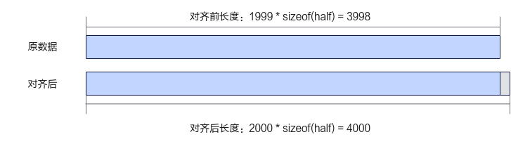

# 尾核Tiling-多核&Tiling切分-矢量编程-SIMD算子实现-算子实践参考-Ascend C算子开发-算子开发-CANN社区版8.5.0开发文档-昇腾社区

**页面ID:** atlas_ascendc_10_10008
**来源：** https://www.hiascend.com/document/detail/zh/CANNCommunityEdition/850/opdevg/Ascendcopdevg/atlas_ascendc_10_10008.html
---

# 尾核Tiling

对于不同shape的输入进行数据切分时，可能会发生数据无法平均分配到多个核的情况。例如当算子的输入shape为[1, 1999]，使用核数为8，数据类型为half时，需要计算的数据总量为1 * 1999 * sizeof(half) = 3998字节，3998字节既不满足32字节对齐，也无法平均分配到8个核上。因此该场景下，对数据进行多核切分后，每个核的计算数据量不同。此种情况下，应该尽可能均匀的分配数据，所有核上的计算数据量有两种情况，将计算量较多的核称为整核，计算量较少的核称为尾核。

#### Tiling实现

- 因为昇腾AI处理器在进行数据搬运和Vector计算时，对于搬运的数据长度和Unified Buffer首地址都有必须32字节对齐的要求，首先待处理数据需要先保证向上对齐到32字节的大小。该场景下后续搬运和计算的处理细节请参考非对齐场景。如下代码片段展示了将数据对齐到datablock大小的示例：123456constexpruint32_tSIZE_OF_HALF=2;constexpruint32_tBLOCK_SIZE=32;constexpruint32_tBLOCK_DIM=8;constexpruint32_tALIGN_NUM=BLOCK_SIZE/SIZE_OF_HALF;// shape需要对齐到的32字节，假设原totalLength为1999，向上满足32字节对齐后为2000uint32_ttotalLengthAligned=((totalLength+ALIGN_NUM-1)/ALIGN_NUM)*ALIGN_NUM;

- 满足32字节对齐后的数据，应尽可能的均分到每个核上。如果无法均分，那么先将可以均分的部分平均分配，剩余的部分分配给部分核，会有部分核多算一个datablock。为了保证切分后的数据仍是满足32字节对齐的，以ALIGN_NUM（ALIGN_NUM个数据为32字节）为粒度，将数据分配到所有核上。在本样例中，数据类型为half，ALIGN_NUM = BLOCK_SIZE / sizeof(half) = 16。将对齐后的数据总量按ALIGN_NUM为粒度分成x个数据块，x = 2000 / 16 = 125。AI处理器的核数BLOCK_DIM为8，无法将125个数据块均分到8个核上。按照以下步骤将数据块尽可能的均分到每个核上：计算x / BLOCK_DIM = 15；计算x % BLOCK_DIM = 5。根据上述步骤得出，如果每个核上分配15个数据块，那么将有5个数据块剩余。将这5个剩余的数据块分配到5个核上，这样可以得到5个计算16个数据块的整核和3个计算15个数据块的尾核。下图展示了数据无法均分时多核切分的示例。图2无法均分到每个核上的示例

基于上文，设计如下的算子Tiling结构体成员：

- formerNum：分配到数据量较多的核数，即整核的核数。
- tailNum：分配到数据量较少的核数，即尾核的核数。
- formerLength：整核计算的数据长度。
- tailLength：尾核计算的数据长度。

Tiling参数的计算代码如下：

| 123456789101112131415161718192021 | constexpruint32_tBLOCK_DIM=8;constexpruint32_tSIZE_OF_HALF=2;constexpruint32_tBLOCK_SIZE=32;// shape需要对齐到的最小单位constexpruint32_tALIGN_NUM=BLOCK_SIZE/SIZE_OF_HALF;...uint8_t*GenerateTiling(){// shape需要对齐到的datablock,假设原totalLength为1999，向上满足32字节对齐后为2000uint32_ttotalLengthAligned=((totalLength+ALIGN_NUM-1)/ALIGN_NUM)*ALIGN_NUM;// 核心数为8，一个datablock包含16个数，那么：datablock的总数：2000 / 16 = 125// 有5个核会分到16个datablock：125 % 8 =5，可以称之为整核// 有3个核会分到15个datablock：8 - 5 = 3，可以称之为尾核uint32_tformerNum=(totalLengthAligned/ALIGN_NUM)%BLOCK_DIM;uint32_ttailNum=BLOCK_DIM-formerNum;// 整核计算的数据长度：totalLengthAligned / BLOCK_DIM为每个核上计算的元素个数，formerLength为上述元素个数向上32字节对齐的结果uint32_tformerLength=((totalLengthAligned/BLOCK_DIM+ALIGN_NUM-1)/ALIGN_NUM)*ALIGN_NUM;// 尾核计算的数据长度：totalLengthAligned / BLOCK_DIM为每个核上计算的元素个数，tailLength为上述元素个数向下32字节对齐的结果uint32_ttailLength=(totalLengthAligned/BLOCK_DIM/ALIGN_NUM)*ALIGN_NUM;...} |
| --------------------------------- | ---------------------------------------------------------------------------------------------------------------------------------------------------------------------------------------------------------------------------------------------------------------------------------------------------------------------------------------------------------------------------------------------------------------------------------------------------------------------------------------------------------------------------------------------------------------------------------------------------------------------------------------------------------------------------------------------------------------------------------------------------------------------------------------------------------------------------------------------------------------------------------------------------------------------------------------------------------------------------------------------------------------------------------------------------------------------------------------- |

#### 算子类实现

在Kernel侧的Init函数中，计算输入在Global Memory上的内存偏移地址时，应对整核和尾核加以区分。

整核上，输入的内存偏移地址计算代码如下：

| 1   | xGm.SetGlobalBuffer((__gm__half*)x+formerLength*AscendC:GetBlockIdx(),formerLength); |
| --- | ------------------------------------------------------------------------------------ |

尾核上，计算输入的内存偏移地址时，需在全部整核的数据长度基础上加上尾核的偏移量，代码如下：

| 1   | xGm.SetGlobalBuffer((__gm__half*)x+formerLength*formerNum+tailLength*(AscendC:GetBlockIdx()-formerNum),tailLength); |
| --- | ------------------------------------------------------------------------------------------------------------------- |

完整的Init函数实现代码如下：

| 1234567891011121314151617 | __aicore__inlinevoidInit(GM_ADDRx,GM_ADDRy,GM_ADDRz,AddCustomTilingDatatiling){if(AscendC:GetBlockIdx()<formerNum){this->tileLength=formerLength;xGm.SetGlobalBuffer((__gm__half*)x+formerLength*AscendC:GetBlockIdx(),formerLength);yGm.SetGlobalBuffer((__gm__half*)y+formerLength*AscendC:GetBlockIdx(),formerLength);zGm.SetGlobalBuffer((__gm__half*)z+formerLength*AscendC:GetBlockIdx(),formerLength);}else{this->tileLength=tailLength;xGm.SetGlobalBuffer((__gm__half*)x+formerLength*formerNum+tailLength*(AscendC:GetBlockIdx()-formerNum),tailLength);yGm.SetGlobalBuffer((__gm__half*)y+formerLength*formerNum+tailLength*(AscendC:GetBlockIdx()-formerNum),tailLength);zGm.SetGlobalBuffer((__gm__half*)z+formerLength*formerNum+tailLength*(AscendC:GetBlockIdx()-formerNum),tailLength);}pipe.InitBuffer(inQueueX,1,this->tileLength*sizeof(half));pipe.InitBuffer(inQueueY,1,this->tileLength*sizeof(half));pipe.InitBuffer(outQueueZ,1,this->tileLength*sizeof(half));} |
| ------------------------- | ----------------------------------------------------------------------------------------------------------------------------------------------------------------------------------------------------------------------------------------------------------------------------------------------------------------------------------------------------------------------------------------------------------------------------------------------------------------------------------------------------------------------------------------------------------------------------------------------------------------------------------------------------------------------------------------------------------------------------------------------------------------------------------------------------------------------------------------------------------------------------------------------------------------------------------------------------------------------------------------- |

其余实现与多核Tiling中的实现一致，这里不重复进行说明。
