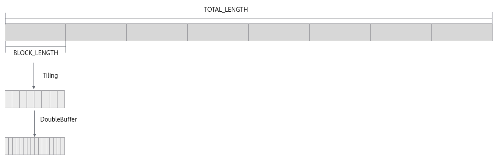

# DoubleBuffer场景-矢量编程-SIMD算子实现-算子实践参考-Ascend C算子开发-算子开发-CANN社区版8.5.0开发文档-昇腾社区

**页面ID:** atlas_ascendc_10_10010
**来源：** https://www.hiascend.com/document/detail/zh/CANNCommunityEdition/850/opdevg/Ascendcopdevg/atlas_ascendc_10_10010.html
---

# DoubleBuffer场景

因存在算子中多次搬入搬出数据的场景，为充分利用硬件资源，实现多流水并行，引入DoubleBuffer机制。DoubleBuffer是通过将输入数据分成大小相等的两块，充分利用AI Core的硬件资源，实现数据搬入、计算、数据搬出的并行执行方式。下面以“核间不均分，核内不均分”的样例为例，介绍算子中DoubleBuffer的实现，完整样例代码请参见使用DoubleBuffer的Add算子样例。

#### Tiling实现

使能DoubleBuffer后，每一个数据块会分成大小相等的两块，因此，若要使能DoubleBuffer，要求数据总量应该能够均分。为了简化处理，将可用的Unified Buffer空间以32字节为粒度，分成n块dataBlock，如果n不是偶数，则减1，这样就可以保证一套代码兼容开启或不开启DoubleBuffer功能。对应步骤如下：

1. 判断数据总长度totalLength是否满足32字节对齐，如不满足，则计算totalLength向上32字节对齐后的长度totalLengthAligned。123456constexpruint32_tBLOCK_SIZE=32;// 为方便计算，这里根据数据类型定义变量alignNum作为对齐数uint32_talignNum=BLOCK_SIZE/dataTypeSize;// totalLength为数据总量uint32_ttotalLengthAligned=(totalLength%alignNum==0)?totalLength:((totalLength+alignNum-1)/alignNum)*alignNum;
1. 根据totalLengthAligned，计算每个核的计算数据长度blockLength，分核策略可参照尾核Tiling。
1. 计算其余Tiling参数。对当前Unified Buffer可用空间以32字节为粒度，进行切分，计算出数据块个数UB_BLOCK_NUM。根据是否开启DoubleBuffer计算出当前可用的最大数据块个数，记作MAX_AVAILABLE_UB_BLOCK_NUM。最后，以MAX_AVAILABLE_UB_BLOCK_NUM为粒度，对blockLength进行切分。为方便演示，如下代码直接给出UB_BLOCK_NUM，作为当前Unified Buffer可用空间包含的block（32字节）数。123456789101112131415161718constexpruint32_tBUFFER_NUM=2;constexpruint32_tUB_BLOCK_NUM=21;// UB最大可以使用的block数量constexpruint32_tMAX_AVAILABLE_UB_BLOCK_NUM=UB_BLOCK_NUM/BUFFER_NUM*BUFFER_NUM;tileNum=blockLength/(alignNum*MAX_AVAILABLE_UB_BLOCK_NUM);if(tileNum==0){// 单核需要计算的长度小于UB可用空间，按照仅有尾块处理tileLength=0;lastTileLength=(blockLength+alignNum-1)/alignNum*alignNum;}elseif((blockLength/alignNum)%MAX_AVAILABLE_UB_BLOCK_NUM==0){// 单核的计算量能被当前可用UB空间均分，仅有主块，无尾块tileLength=MAX_AVAILABLE_UB_BLOCK_NUM*alignNum;lastTileLength=0;}else{// 同时有主块和尾块tileLength=MAX_AVAILABLE_UB_BLOCK_NUM*alignNum;lastTileLength=blockLength-tileNum*tileLength;}

#### 算子类实现

不开启DoubleBuffer时，只需要对每个核上最后一个分块的起始地址做处理；开启DoubleBuffer后，需要处理的数据块长度变成原来的一半，所以需要对最后两个数据块的起始地址做处理。

开启DoubleBuffer，参考InitBuffer接口函数原型，将num参数配置成2，即BUFFER_NUM。

| 1234 | this->initBufferLength=AscendC:Std:max(this->tileLength,this->lastTileLength);pipe.InitBuffer(inQueueX,BUFFER_NUM,this->initBufferLength*sizeof(dataType));pipe.InitBuffer(inQueueY,BUFFER_NUM,this->initBufferLength*sizeof(dataType));pipe.InitBuffer(outQueueZ,BUFFER_NUM,this->initBufferLength*sizeof(dataType)); |
| ---- | ---------------------------------------------------------------------------------------------------------------------------------------------------------------------------------------------------------------------------------------------------------------------------------------------------------------------- |

同时在计算核内每个数据块的长度时，考虑DoubleBuffer场景，需要将Buffer数量，即BUFFER_NUM=2带入计算。

| 1   | this->tileLength=tiling.tileLength/BUFFER_NUM; |
| --- | ---------------------------------------------- |

由于无法保证尾块满足DoubleBuffer的条件，因此不对尾块进行切分。

| 1   | this->lastTileLength=tiling.lastTileLength; |
| --- | ------------------------------------------- |

Init函数实现代码如下：

| 123456789101112131415161718192021222324252627282930313233343536373839 | __aicore__inlinevoidInit(GM_ADDRx,GM_ADDRy,GM_ADDRz,AddCustomTilingDatatiling){if(tiling.isEvenCore){this->blockLength=tiling.blockLength;this->tileNum=tiling.tileNum;this->tileLength=tiling.tileLength/BUFFER_NUM;this->lastTileLength=tiling.lastTileLength;xGm.SetGlobalBuffer((__gm__dataType*)x+this->blockLength*AscendC:GetBlockIdx(),this->blockLength);yGm.SetGlobalBuffer((__gm__dataType*)y+this->blockLength*AscendC:GetBlockIdx(),this->blockLength);zGm.SetGlobalBuffer((__gm__dataType*)z+this->blockLength*AscendC:GetBlockIdx(),this->blockLength);}else{if(AscendC:GetBlockIdx()<tiling.formerNum){this->tileNum=tiling.formerTileNum;this->tileLength=tiling.formerTileLength/BUFFER_NUM;this->lastTileLength=tiling.formerLastTileLength;xGm.SetGlobalBuffer((__gm__dataType*)x+tiling.formerLength*AscendC:GetBlockIdx(),tiling.formerLength);yGm.SetGlobalBuffer((__gm__dataType*)y+tiling.formerLength*AscendC:GetBlockIdx(),tiling.formerLength);zGm.SetGlobalBuffer((__gm__dataType*)z+tiling.formerLength*AscendC:GetBlockIdx(),tiling.formerLength);}else{this->tileNum=tiling.tailTileNum;this->tileLength=tiling.tailTileLength/BUFFER_NUM;this->lastTileLength=tiling.tailLastTileLength;xGm.SetGlobalBuffer((__gm__dataType*)x+tiling.formerLength*tiling.formerNum+tiling.tailLength*(AscendC:GetBlockIdx()-tiling.formerNum),tiling.tailLength);yGm.SetGlobalBuffer((__gm__dataType*)y+tiling.formerLength*tiling.formerNum+tiling.tailLength*(AscendC:GetBlockIdx()-tiling.formerNum),tiling.tailLength);zGm.SetGlobalBuffer((__gm__dataType*)z+tiling.formerLength*tiling.formerNum+tiling.tailLength*(AscendC:GetBlockIdx()-tiling.formerNum),tiling.tailLength);}}uint32_tinitBufferLength=AscendC:Std:max(this->tileLength,this->lastTileLength);pipe.InitBuffer(inQueueX,BUFFER_NUM,initBufferLength*sizeof(dataType));pipe.InitBuffer(inQueueY,BUFFER_NUM,initBufferLength*sizeof(dataType));pipe.InitBuffer(outQueueZ,BUFFER_NUM,initBufferLength*sizeof(dataType));} |
| --------------------------------------------------------------------- | ---------------------------------------------------------------------------------------------------------------------------------------------------------------------------------------------------------------------------------------------------------------------------------------------------------------------------------------------------------------------------------------------------------------------------------------------------------------------------------------------------------------------------------------------------------------------------------------------------------------------------------------------------------------------------------------------------------------------------------------------------------------------------------------------------------------------------------------------------------------------------------------------------------------------------------------------------------------------------------------------------------------------------------------------------------------------------------------------------------------------------------------------------------------------------------------------------------------------------------------------------------------------------------------------------------------------------------------------------------------------------------------------------------------------------------------------------------------------------------------------------------------------------------------------------------------------------------------------------------------------------------------------------------------------------------------------------------------------------------------------------------------------------------------------------------------------------------------------------------------------------------------------------------------------------------------------------------------------------------------------------------------- |

由于开启DoubleBuffer后，切分后的主块数据块个数翻倍，在Process函数中，需要将BUFFER_NUM带入计算循环次数；尾块独立计算，不开启DoubleBuffer。后续主尾块在CopyIn、Compute、CopyOut函数中的处理，与尾块tiling处理相同。

| 12345678910111213141516 | __aicore__inlinevoidProcess(){// 主块进行DoubleBuffer计算，所以loopCount得乘以2uint32_tloopCount=this->tileNum*BUFFER_NUM;for(uint32_ti=0;i<loopCount;i++){CopyIn(i,this->tileLength);Compute(i,this->tileLength);CopyOut(i,this->tileLength);}// 尾块进行计算，不做DoubleBuffer操作if(this->lastTileLength>0U){CopyIn(loopCount,this->lastTileLength);Compute(loopCount,this->lastTileLength);CopyOut(loopCount,this->lastTileLength);}} |
| ----------------------- | ----------------------------------------------------------------------------------------------------------------------------------------------------------------------------------------------------------------------------------------------------------------------------------------------------------------------------------------------------------------------------------------------------------------------------------------- |
