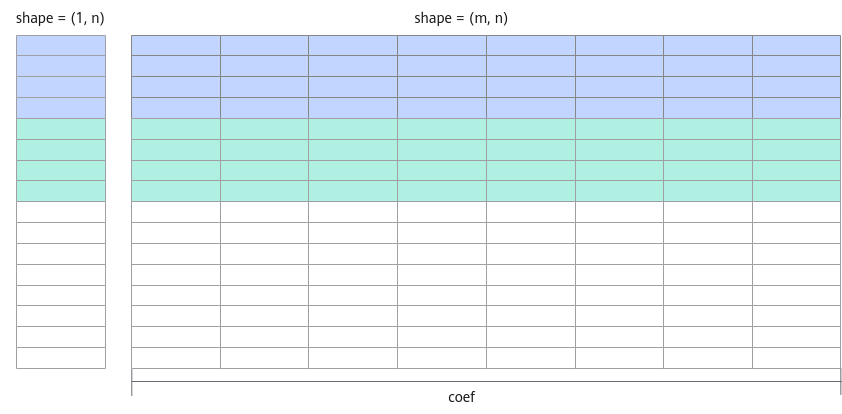

# Broadcast场景-矢量编程-SIMD算子实现-算子实践参考-Ascend C算子开发-算子开发-CANN社区版8.5.0开发文档-昇腾社区

**页面ID:** atlas_ascendc_10_10011
**来源：** https://www.hiascend.com/document/detail/zh/CANNCommunityEdition/850/opdevg/Ascendcopdevg/atlas_ascendc_10_10011.html
---

# Broadcast场景

在某些场景下，可能会存在两个输入shape不相同的情况。由于Add接口只支持对shape相同的输入进行计算，因此需要先对输入进行shape变换，再进行Add计算。本节将对满足Broadcast条件的输入在算子实现中的Broadcast处理进行介绍，其他场景可以参考本章节中提供的思路。

Broadcast机制通过扩展较小维度的数据，使得不同shape的输入能够进行运算，从而避免了显式的复制操作，提高了计算效率。数据进行Broadcast需满足：两个输入的维度个数相同，并且仅在某一个维度上的长度不同，某一个输入在此维度的长度为1。比如：shape为(32, 8)和(32, 1)的两个输入可以进行Broadcast，因为它们都是二维，且第一个维度大小相等，而不相等的维度中第二个输入的维度为1，满足条件。

本节中将使用Broadcast接口，因此输入需满足该API相关约束。同时，由于硬件限制，该API的输入地址需满足32字节对齐。本节以输入维度为2、第二个轴(axis = 1)需要Broadcast为例进行说明。完整的样例代码请参见输入Broadcast的Add算子样例。

#### Tiling实现

与输入shape相同的场景相比，在Tiling结构体中增加相应的成员变量，表示是否需要对输入进行Broadcast、需要对哪个维度进行Broadcast、Broadcast的轴需要扩充的倍数。因此新增四个Tiling结构体成员：

- xLen和yLen：表示两个输入的数据长度。
- axis：表示对输入的哪个维度进行Broadcast。
- coef：表示Broadcast的输入需要扩维的倍数。例如，x shape为(m, n), y shape为(1, n), 则coef = m。如下图所示，图中相同颜色部分为单次计算的数据块。

Tiling结构体定义代码如下所示：

| 1234567 | structAddCustomTilingData{uint32_txLen;uint32_tyLen;uint32_tcoef;uint32_taxis;...}; |
| ------- | ----------------------------------------------------------------------------------- |

设需要进行Broadcast的输入长度为shorterAxisLen；不需要进行Broadcast的输入长度为totalLength。

| 1234 | constexpruint32_tBLOCK_SIZE=32;...// 读入数据uint32_ttotalLength=(xLen>yLen)?xLen:yLen;uint32_tshorterAxisLen=(xLen<yLen)?xLen:yLen; |
| ---- | ------------------------------------------------------------------------------------------------------------------------------------ |

| 123456789101112 | constexpruint32_tBLOCK_SIZE=32;if(shorterAxisLen%(BLOCK_DIM*BUFFER_NUM)==0){uint32_tblockLength=shorterAxisLen/BLOCK_DIM*coef;...}else{uint32_tformerNum=(shorterAxisLen/BUFFER_NUM)%BLOCK_DIM;uint32_ttailNum=BLOCK_DIM-formerNum;uint32_tformerLength=((shorterAxisLen/BUFFER_NUM)/BLOCK_DIM+1)*BUFFER_NUM*coef;uint32_ttailLength=((shorterAxisLen/BUFFER_NUM)/BLOCK_DIM)*BUFFER_NUM*coef;....} |
| --------------- | -------------------------------------------------------------------------------------------------------------------------------------------------------------------------------------------------------------------------------------------------------------------------------------------------------------------------------------------------------------------------------------------------- |

| 123456789101112131415161718192021 | ubBlockAligned=(UB_BLOCK_NUM*alignNum/(coef*BUFFER_NUM)*(coef*BUFFER_NUM)==0)?UB_BLOCK_NUM:UB_BLOCK_NUM*alignNum/(coef*BUFFER_NUM)*(coef*BUFFER_NUM);...tileNum=length/ubBlockAligned;if(length%ubBlockAligned==0 |     | tileNum==0){if(tileNum==0){tileNum=1;}if(length<ubBlockAligned){tileLength=length;lastTileLength=tileLength;}else{tileLength=ubBlockAligned;lastTileLength=tileLength;}}else{tileNum=tileNum+1;tileLength=ubBlockNum;lastTileLength=(length-(tileNum-1)*tileLength);} |
| --------------------------------- | ----------------------------------------------------------------------------------------------------------------------------------------------------------------------------------------------------------------- | --- | --------------------------------------------------------------------------------------------------------------------------------------------------------------------------------------------------------------------------------------------------------------------- |

#### 算子类实现

在核函数初始化阶段，根据Tiling结构体传入的参数确定对哪个输入进行Broadcast。由于针对输入的第二个轴(axis = 1)进行Broadcast，可以计算出，对于需要进行Broadcast的输入，每个核搬入数据长度为blockLength / coef。

初始化函数代码如下：

| 1234567891011121314151617181920212223242526272829303132333435363738394041424344 | __aicore__inlinevoidInit(GM_ADDRx,GM_ADDRy,GM_ADDRz,AddCustomTilingDatatiling){GM_ADDRlongerInputPtr;GM_ADDRshorterInputPtr;if(tiling.xLen>tiling.yLen){longerInputPtr=x;shorterInputPtr=y;}else{longerInputPtr=y;shorterInputPtr=x;}this->coef=tiling.coef;if(tiling.isEvenCore){this->tileNum=tiling.tileNum;this->tileLength=tiling.tileLength/BUFFER_NUM;this->lastTileLength=tiling.lastTileLength;xGm.SetGlobalBuffer((__gm__dataType*)longerInputPtr+tiling.blockLength*AscendC:GetBlockIdx(),tiling.blockLength);yGm.SetGlobalBuffer((__gm__dataType*)shorterInputPtr+tiling.blockLength*AscendC:GetBlockIdx()/this->coef,tiling.blockLength/this->coef);zGm.SetGlobalBuffer((__gm__dataType*)z+tiling.blockLength*AscendC:GetBlockIdx(),tiling.blockLength);}else{if(AscendC:GetBlockIdx()<tiling.formerNum){this->tileNum=tiling.formerTileNum;this->tileLength=tiling.formerTileLength/BUFFER_NUM;this->lastTileLength=tiling.formerLastTileLength;xGm.SetGlobalBuffer((__gm__dataType*)longerInputPtr+tiling.formerLength*AscendC:GetBlockIdx(),tiling.formerLength);yGm.SetGlobalBuffer((__gm__dataType*)shorterInputPtr+tiling.formerLength*AscendC:GetBlockIdx()/this->coef,tiling.formerLength/this->coef);zGm.SetGlobalBuffer((__gm__dataType*)z+tiling.formerLength*AscendC:GetBlockIdx(),tiling.formerLength);}else{this->tileNum=tiling.tailTileNum;this->tileLength=tiling.tailTileLength/BUFFER_NUM;this->lastTileLength=tiling.tailLastTileLength;xGm.SetGlobalBuffer((__gm__dataType*)longerInputPtr+tiling.formerLength*tiling.formerNum+tiling.tailLength*(AscendC:GetBlockIdx()-tiling.formerNum),tiling.tailLength);yGm.SetGlobalBuffer((__gm__dataType*)shorterInputPtr+tiling.formerLength*tiling.formerNum/this->coef+tiling.tailLength*(AscendC:GetBlockIdx()-tiling.formerNum)/this->coef,tiling.tailLength/this->coef);zGm.SetGlobalBuffer((__gm__dataType*)z+tiling.formerLength*tiling.formerNum+tiling.tailLength*(AscendC:GetBlockIdx()-tiling.formerNum),tiling.tailLength);}}pipe.InitBuffer(inQueueX,BUFFER_NUM,this->tileLength*sizeof(dataType));pipe.InitBuffer(inQueueY,BUFFER_NUM,this->coef*sizeof(dataType));pipe.InitBuffer(outQueueZ,BUFFER_NUM,this->tileLength*sizeof(dataType));pipe.InitBuffer(tmpBuf2,this->tileLength*sizeof(dataType));} |
| ------------------------------------------------------------------------------- | ------------------------------------------------------------------------------------------------------------------------------------------------------------------------------------------------------------------------------------------------------------------------------------------------------------------------------------------------------------------------------------------------------------------------------------------------------------------------------------------------------------------------------------------------------------------------------------------------------------------------------------------------------------------------------------------------------------------------------------------------------------------------------------------------------------------------------------------------------------------------------------------------------------------------------------------------------------------------------------------------------------------------------------------------------------------------------------------------------------------------------------------------------------------------------------------------------------------------------------------------------------------------------------------------------------------------------------------------------------------------------------------------------------------------------------------------------------------------------------------------------------------------------------------------------------------------------------------------------------------------------------------------------------------------------------------------------------------------------------------------------------------------------------------------------------------------------------------------------------------------------------------------------------------------------------------------------------------------------------------------------------------------------------------------------------------------------------------------------------------------------------------------------------------------------------------------------------------------------------------------------------------------------------------------- |

由于数据是向coef对齐的，在数据拷贝的过程中可能会出现地址不满足32字节对齐的场景，因此CopyIn函数、CopyOut函数中使用DataCopyPad进行数据拷贝。

CopyIn函数实现代码如下：

| 12345678910111213141516171819 | __aicore__inlinevoidCopyIn(int32_tprogress){AscendC:LocalTensor<dataType>xLocal=inQueueX.AllocTensor<dataType>();AscendC:LocalTensor<dataType>yLocal=inQueueY.AllocTensor<dataType>();AscendC:DataCopyExtParamscopyXParams={1,(uint32_t)(this->tileLength*sizeof(dataType)),0,0,0};AscendC:DataCopyExtParamscopyYParams={1,(uint32_t)(this->tileLength*sizeof(dataType)/this->coef),0,0,0};AscendC:DataCopyPadExtParams<dataType>padParams={false,0,0,0};if(progress==(this->tileNum*BUFFER_NUM-1)){AscendC:DataCopyPad<dataType>(xLocal,xGm[(progress-LAST_TWO_TILE)*this->tileLength+this->lastTileLength],copyXParams,padParams);AscendC:DataCopyPad<dataType>(yLocal,yGm[((progress-LAST_TWO_TILE)*this->tileLength+this->lastTileLength)/this->coef],copyYParams,padParams);}else{AscendC:DataCopyPad<dataType>(xLocal,xGm[progress*this->tileLength],copyXParams,padParams);AscendC:DataCopyPad<dataType>(yLocal,yGm[progress*this->tileLength/this->coef],copyYParams,padParams);}inQueueX.EnQue(xLocal);inQueueY.EnQue(yLocal);} |
| ----------------------------- | ---------------------------------------------------------------------------------------------------------------------------------------------------------------------------------------------------------------------------------------------------------------------------------------------------------------------------------------------------------------------------------------------------------------------------------------------------------------------------------------------------------------------------------------------------------------------------------------------------------------------------------------------------------------------------------------------------------------------------------------------------------------------------------------------------------------------------------------------------------------------------------------------------------------------------------------------------------------------------------------------------------------------------------------- |

CopyOut函数实现代码如下：

| 1234567891011 | __aicore__inlinevoidCopyOut(int32_tprogress){AscendC:LocalTensor<dataType>zLocal=outQueueZ.DeQue<dataType>();AscendC:DataCopyExtParamscopyParams={1,(uint32_t)(this->tileLength*sizeof(dataType)),0,0,0};if(progress==(this->tileNum*BUFFER_NUM-1)){AscendC:DataCopyPad<dataType>(zGm[(progress-LAST_TWO_TILE)*this->tileLength+this->lastTileLength],zLocal,copyParams);}else{AscendC:DataCopyPad<dataType>(zGm[progress*this->tileLength],zLocal,copyParams);}outQueueZ.FreeTensor(zLocal);} |
| ------------- | ---------------------------------------------------------------------------------------------------------------------------------------------------------------------------------------------------------------------------------------------------------------------------------------------------------------------------------------------------------------------------------------------------------------------------------------------------------------------------------------------- |

在Compute函数中，调用Add接口前需要先对输入进行Broadcast。这里需要计算Broadcast前后的shape。基于前文提到的数据关系，可以计算得出Broadcast前后的shape分别为{tileLength / broadcastCoef, 1}和{tileLength / broadcastCoef, broadcastCoef}。在此基础上对输入进行Broadcast，并将计算结果存入临时空间中，然后进行Add计算。实现代码示例如下所示：

| 1234567891011 | __aicore__inlinevoidCompute(int32_tprogress){AscendC:LocalTensor<dataType>xLocal=inQueueX.DeQue<dataType>();AscendC:LocalTensor<dataType>yLocal=inQueueY.DeQue<dataType>();AscendC:LocalTensor<dataType>zLocal=outQueueZ.AllocTensor<dataType>();AscendC:LocalTensor<dataType>broadcastTmpTensor=broadcastTmpBuf.Get<dataType>();uint32_tdstShape[]={this->tileLength/this->coef,this->coef};uint32_tsrcShape[]={this->tileLength/this->coef,1};AscendC:BroadCast<dataType,2,1>(broadcastTmpTensor,yLocal,dstShape,srcShape);...} |
| ------------- | --------------------------------------------------------------------------------------------------------------------------------------------------------------------------------------------------------------------------------------------------------------------------------------------------------------------------------------------------------------------------------------------------------------------------------------------------------------------------------------------------------------------------------- |
