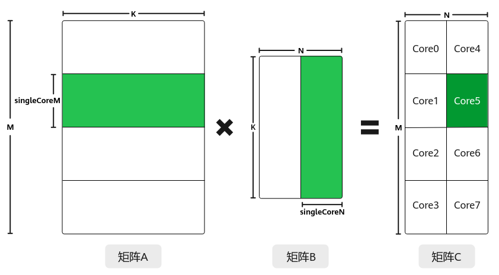
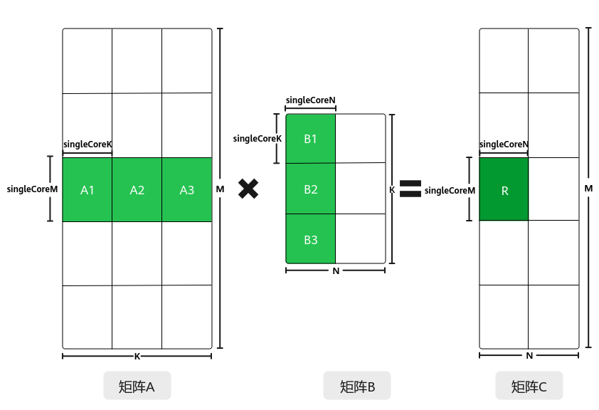

# 多核对齐切分-特性场景-矩阵编程（高阶API）-SIMD算子实现-算子实践参考-Ascend C算子开发-算子开发-CANN社区版8.5.0开发文档-昇腾社区

**页面ID:** atlas_ascendc_10_10013
**来源：** https://www.hiascend.com/document/detail/zh/CANNCommunityEdition/850/opdevg/Ascendcopdevg/atlas_ascendc_10_10013.html
---

# 多核对齐切分

#### 功能介绍

为了实现多核并行，提升计算效率，需要将矩阵数据进行切分，分配到不同的核上进行处理。主要的切分策略有切分K轴和不切分K轴两种。

不切分K轴、仅切分M、N轴的策略如下：

- 对于A矩阵，沿着M轴进行切分，切分成多份的singleCoreM，单核上处理SingleCoreM * K大小的数据。
- 对于B矩阵，沿着N轴进行切分，切分成多份的singleCoreN，单核上处理K * SingleCoreN大小的数据。
- 对于C矩阵，SingleCoreM * K大小的A矩阵和K * SingleCoreN大小的B矩阵相乘得到SingleCoreM * SingleCoreN大小的C矩阵，即为单核上输出的C矩阵大小。

比如，下图中共有8个核参与计算，将A矩阵沿着M轴划分为4块，将B矩阵沿着N轴切分为两块，单核上仅处理某一分块（比如图中绿色部分为core5上参与计算的数据）：SingleCoreM * K大小的A矩阵分块和SingleCoreN * K大小的B矩阵分块相乘得到SingleCoreM * SingleCoreN大小的C矩阵分块。

切分M、N、K轴的策略如下图所示：

- 对于A矩阵，沿着M轴进行切分，切分成多份的singleCoreM，沿着K轴切分，切分成多份的singleCoreK，单核上处理singleCoreM * singleCoreK大小的数据。
- 对于B矩阵，沿着K轴进行切分，切分成多份的singleCoreK，沿着N轴进行切分，切分成多份的singleCoreN，单核上处理singleCoreK * singleCoreN大小的数据。
- 对于C矩阵，singleCoreM * singleCoreK大小的A矩阵与singleCoreK * singleCoreN大小的B矩阵相乘并累加得到singleCoreM * singleCoreN大小的C矩阵分块。

比如下图中，C矩阵中的R矩阵块，是通过A1*B1+A2*B2+A3*B3累加得到的，其中，A1*B1、A2*B2、A3*B3可在多个核上并行计算。

- 纯Cube模式（只有矩阵计算）场景，本节内容以纯Cube模式举例。SetDim设置当前AI处理器可用的核数，通过Tiling计算得到执行Matmul计算实际使用的核数，实际使用的核数小于等于AI处理器可用的核数。SetBlockDim按照实际使用的核数由用户进行配置。
- MIX模式（包含矩阵计算和矢量计算）的设置规则请参考MIX场景核数设置规则。

#### 使用场景

多核处理Matmul矩阵计算场景。

#### 约束说明

无

#### 调用示例

该场景的关键代码示例如下。Matmul多核对齐场景的完整样例请参考：多核切M、N的样例：Matmul多核Kernel直调样例；多核切K的样例：多核切K场景的算子样例。

| 123456789101112131415 | // 构造多核Tiling对象autoascendcPlatform=platform_ascendc:PlatformAscendCManager:GetInstance(socVersion);matmul_tiling:MultiCoreMatmulTilingcubeTiling(*ascendcPlatform);// 仅包含Cube计算的算子，设置可参与矩阵乘运算的核数为当前AI处理器上的Cube核数cubeTiling.SetDim(ascendcPlatform.GetCoreNumAic());cubeTiling.SetAType(matmul_tiling:TPosition:GM,matmul_tiling:CubeFormat:ND,matmul_tiling:DataType:DT_FLOAT16);cubeTiling.SetBType(matmul_tiling:TPosition:GM,matmul_tiling:CubeFormat:ND,matmul_tiling:DataType:DT_FLOAT16);cubeTiling.SetCType(matmul_tiling:TPosition:GM,matmul_tiling:CubeFormat:ND,matmul_tiling:DataType:DT_FLOAT);cubeTiling.SetBiasType(matmul_tiling:TPosition:GM,matmul_tiling:CubeFormat:ND,matmul_tiling:DataType:DT_FLOAT);cubeTiling.SetOrgShape(M,N,K);cubeTiling.SetShape(M,N,K);cubeTiling.EnableBias(isBias);optiling:TCubeTilingtilingData;// 获取Tiling参数intret=cubeTiling.GetTiling(tilingData);// if ret = -1, gen tiling failed |
| --------------------- | -------------------------------------------------------------------------------------------------------------------------------------------------------------------------------------------------------------------------------------------------------------------------------------------------------------------------------------------------------------------------------------------------------------------------------------------------------------------------------------------------------------------------------------------------------------------------------------------------------------------------------------------------------------------------------------------------------------------------------------------------------------------------------------------------------------------------------------------------------------------------------------------------------------------------------------------------------------------------------- |
