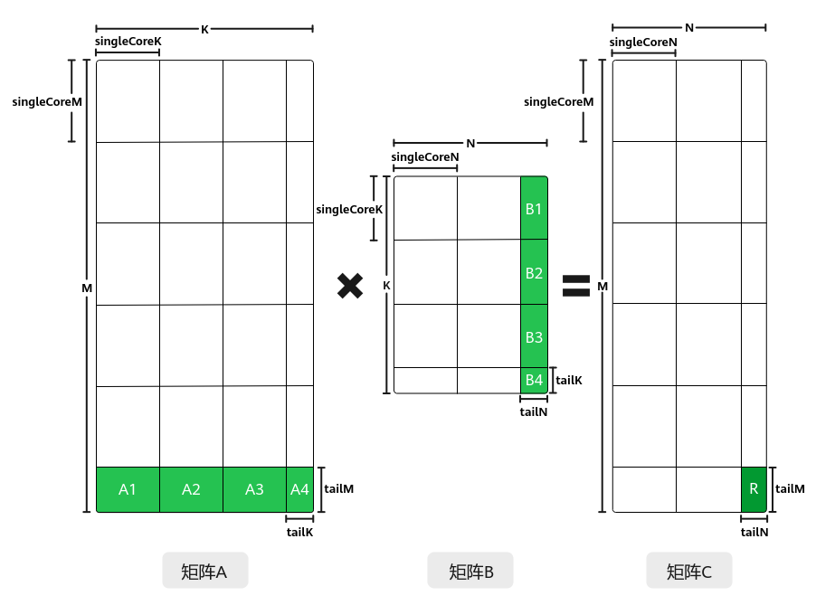

# 多核非对齐切分-特性场景-矩阵编程（高阶API）-SIMD算子实现-算子实践参考-Ascend C算子开发-算子开发-CANN社区版8.5.0开发文档-昇腾社区

**页面ID:** atlas_ascendc_10_10014
**来源：** https://www.hiascend.com/document/detail/zh/CANNCommunityEdition/850/opdevg/Ascendcopdevg/atlas_ascendc_10_10014.html
---

# 多核非对齐切分

#### 功能介绍

多核场景，对矩阵进行切分时，若M、N、K无法整除singleCoreM 、singleCoreN、 singleCoreK时，就会出现尾块，即多核非对齐场景。如下图矩阵A、B的最后一行和最后一列的矩阵块：

此时，C矩阵中的R矩阵块，依然是通过A1*B1+A2*B2+A3*B3+A4*B4累加得到的，处理A1*B1、A2*B2、A3*B3、A4*B4等尾块时，需在kernel侧设置尾块大小，在不改变原有tiling的情况下，调用SetTail接口重新设置本次计算的singleCoreM/singleCoreN/singleCoreK，在处理尾块的时候按照设置的值也就是tailM/tailN/tailK进行搬运和计算。

#### 使用场景

多核处理Matmul矩阵计算，存在尾块的场景。

#### 约束说明

处理尾块调用的SetTail接口，需要在Iterate/IterateAll之前调用。

#### 调用示例

Matmul多核非对齐场景的完整样例请参考Matmul多核非对齐切分算子样例。该场景的关键代码示例如下。

| 123456789 | // 处理尾块inttailM=tiling.M-mCoreIndex*tiling.singleCoreM;tailM=tailM<tiling.singleCoreM?tailM:tiling.singleCoreM;inttailN=tiling.N-nCoreIndex*tiling.singleCoreN;tailN=tailN<tiling.singleCoreN?tailN:tiling.singleCoreN;// 当tailM < singleCoreM或tailN < singleCoreN时被认为需要处理尾块，此时可以调用SetTail接口进行设置if(tailM<tiling.singleCoreM |     | tailN<tiling.singleCoreN){matmulObj.SetTail(tailM,tailN);} |
| --------- | -------------------------------------------------------------------------------------------------------------------------------------------------------------------------------------------------------------------------------------------------------------------------------------------------------------------------------------------------------- | --- | ---------------------------------------------------------- |
