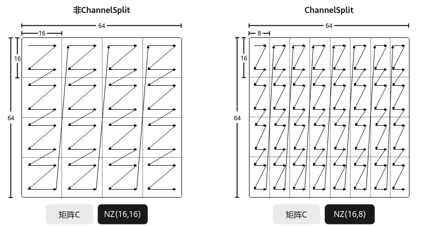

# 矩阵乘输出的Channel拆分-特性场景-矩阵编程（高阶API）-SIMD算子实现-算子实践参考-Ascend C算子开发-算子开发-CANN社区版8.5.0开发文档-昇腾社区

**页面ID:** atlas_ascendc_10_10018
**来源：** https://www.hiascend.com/document/detail/zh/CANNCommunityEdition/850/opdevg/Ascendcopdevg/atlas_ascendc_10_10018.html
---

# 矩阵乘输出的Channel拆分

#### 功能介绍

矩阵乘输出的Channel拆分，又称ChannelSplit。指当Matmul计算结果C矩阵的格式为NZ时，C矩阵采用分形存储，关于NZ格式的详细内容请参考数据格式。当C矩阵的物理排布格式为NZ、数据类型为float时，默认情况下，每个分形内部包含16*16个元素，即分形的大小为16*16。ChannelSplit的功能为将此场景下C矩阵的每个16*16的分形切分为16*8的分形，使得C矩阵按照16*8的分形进行存储。

由于1个float类型数据的大小为4字节，16*8的分形在内轴满足32字节对齐，内轴上的数据量与一条NPU矢量计算指令处理的数据单元一致，这便于后续的其它计算。ChannelSplit功能默认不启用，用户需通过设置MatmulConfig中的isEnableChannelSplit参数为true来开启此功能。

#### 使用场景

对于NZ格式、float类型的C矩阵，需要按16*8的分形存储时，使用该功能。

#### 约束说明

开启ChannelSplit功能需满足：

- C矩阵的数据排布格式为CubeFormat:NZ。
- C矩阵的数据类型为float。
- C矩阵的内存逻辑位置为Global Memory。

#### 调用示例

完整的算子样例请参考matmul_channelsplit算子样例。

| 123456789101112131415 | // 指定获取和修改的MatmulConfig模板constexprstaticMatmulConfigModeconfigMode=MatmulConfigMode:CONFIG_NORM;// 修改模板参数isEnableChannelSplit=true，开启该MatmulConfig模板的ChannelSplit功能constexprstaticMatmulFuncParamsfuncParamsChannelSplit{false,false,false,false,0,IterateOrder:ORDER_M,ScheduleType:INNER_PRODUCT,true,false,false,false,true/*isEnableChannelSplit*/};constexprstaticMatmulConfigMM_CFG=GetMMConfig<configMode>(funcParamsChannelSplit);Matmul<A_TYPE,B_TYPE,C_TYPE,BIAS_TYPE,MM_CFG>mm;// 常规Matmul计算，最后输出分形为16*8REGIST_MATMUL_OBJ(&pipe,GetSysWorkSpacePtr(),mm);mm.SetTensorA(gm_a);mm.SetTensorB(gm_b);mm.SetBias(gm_bias);mm.IterateAll(gm_c); |
| --------------------- | ----------------------------------------------------------------------------------------------------------------------------------------------------------------------------------------------------------------------------------------------------------------------------------------------------------------------------------------------------------------------------------------------------------------------------------------------------------------------------------------------------------------------------------------------------------------------------------------------------------------------------------------------------------------------------------------- |
