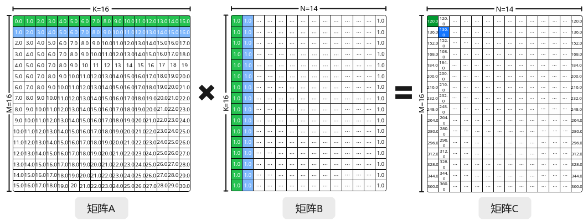
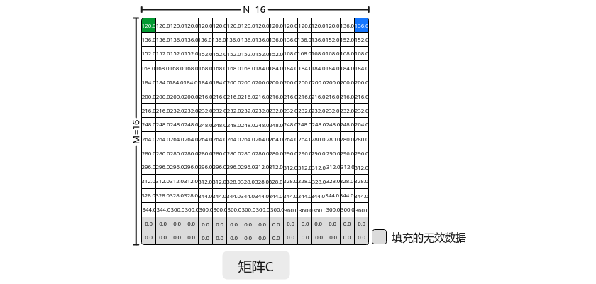
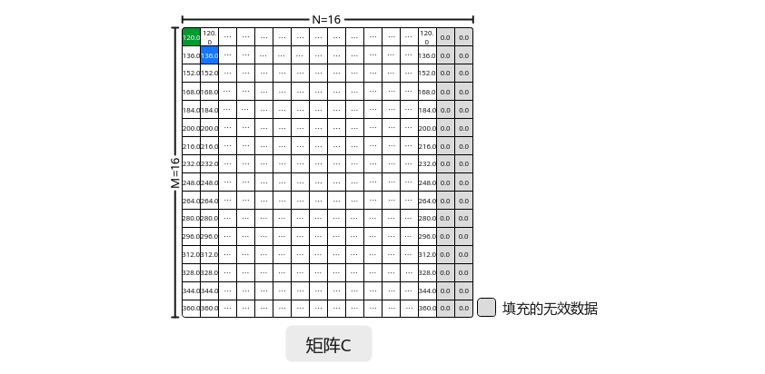

# 矩阵乘输出的N方向对齐-特性场景-矩阵编程（高阶API）-SIMD算子实现-算子实践参考-Ascend C算子开发-算子开发-CANN社区版8.5.0开发文档-昇腾社区

**页面ID:** atlas_ascendc_10_10026
**来源：** https://www.hiascend.com/document/detail/zh/CANNCommunityEdition/850/opdevg/Ascendcopdevg/atlas_ascendc_10_10026.html
---

# 矩阵乘输出的N方向对齐

#### 功能介绍

矩阵乘输出的N方向对齐，即矩阵乘结果C矩阵按ND_ALIGN格式输出。在Matmul矩阵乘法中，常用的矩阵数据格式有ND、NZ，相关介绍可参考数据格式章节。ND_ALIGN是矩阵的另一种数据格式，该格式一般用于N方向非32字节对齐的矩阵乘计算中，配置结果C矩阵为ND_ALIGN格式后，将按照N方向32字节对齐的补齐规则输出C矩阵，详细内容请见ND_ALIGN。

以M=16，K=16，N=14，A、B矩阵数据类型为half的Matmul为具体示例，说明ND_ALIGN输出功能。当配置C矩阵为ND格式并输出到Global Memory时，按照原始N方向大小非32字节对齐输出如图1所示。当配置C矩阵为ND格式时，按照N方向32字节对齐输出如图2所示，C矩阵的N方向最后两列由下一行的实际数据进行填充补齐，以实现N方向对齐到32字节并输出。当配置C矩阵为ND_ALIGN格式时，Matmul API会在C矩阵的N方向上通过添加无效数据来填充最后两列，以确保N方向对齐至32字节并输出，如图3所示。

#### 使用场景

Matmul计算中N方向非32字节对齐，输出C矩阵的N方向要求32字节对齐的场景。

#### 约束说明

若配置C矩阵为ND_ALIGN格式输出，则为C矩阵申请的Buffer空间为N向上32字节对齐后的空间大小。

#### 调用示例

完整的算子样例请参考matmul_nd_align算子样例。

- Tiling实现调用SetCType接口，设置C矩阵的数据格式为CubeFormat:ND_ALIGN，其它Tiling实现与基础场景相同。12345678910autoascendcPlatform=platform_ascendc:PlatformAscendC(context->GetPlatformInfo());matmul_tiling:MatmulApiTilingtiling(ascendcPlatform);tiling.SetAType(matmul_tiling:TPosition:GM,matmul_tiling:CubeFormat:ND,matmul_tiling:DataType:DT_FLOAT16);tiling.SetBType(matmul_tiling:TPosition:GM,matmul_tiling:CubeFormat:ND,matmul_tiling:DataType:DT_FLOAT16);// 设置C矩阵，buffer位置为GM，数据格式为ND_ALIGNtiling.SetCType(matmul_tiling:TPosition:GM,matmul_tiling:CubeFormat:ND_ALIGN,matmul_tiling:DataType:DT_FLOAT);tiling.SetBiasType(AscendC:TPosition:GM,matmul_tiling:CubeFormat:ND,matmul_tiling:DataType:DT_FLOAT);...// 其他实现内容optiling:TCubeTilingtilingData;intret=tiling.GetTiling(tilingData);

- Kernel实现相较于基础场景，ND_ALIGN输出功能要求在创建Matmul对象时，设置模板参数cType的数据格式为CubeFormat:ND_ALIGN。12345678#include"lib/matmul_intf.h"typedefAscendC:MatmulType<AscendC:TPosition:GM,CubeFormat:ND,half>aType;typedefAscendC:MatmulType<AscendC:TPosition:GM,CubeFormat:ND,half>bType;// 设置模板参数cType的数据格式为ND_ALIGNtypedefAscendC:MatmulType<AscendC:TPosition:GM,CubeFormat:ND_ALIGN,float>cType;typedefAscendC:MatmulType<AscendC:TPosition:GM,CubeFormat:ND,float>biasType;AscendC:Matmul<aType,bType,cType,biasType>mm;
