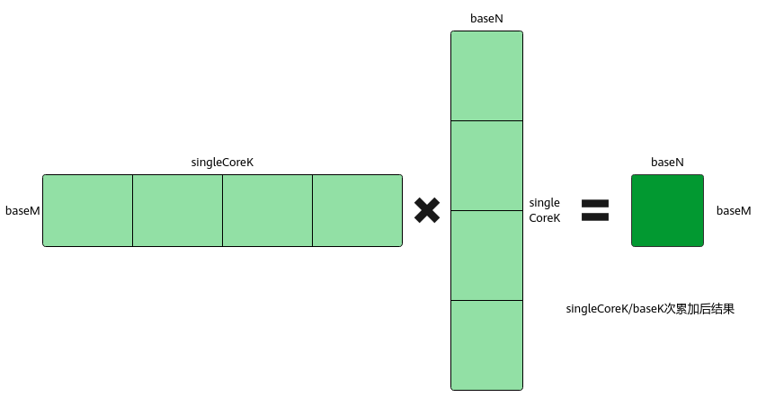
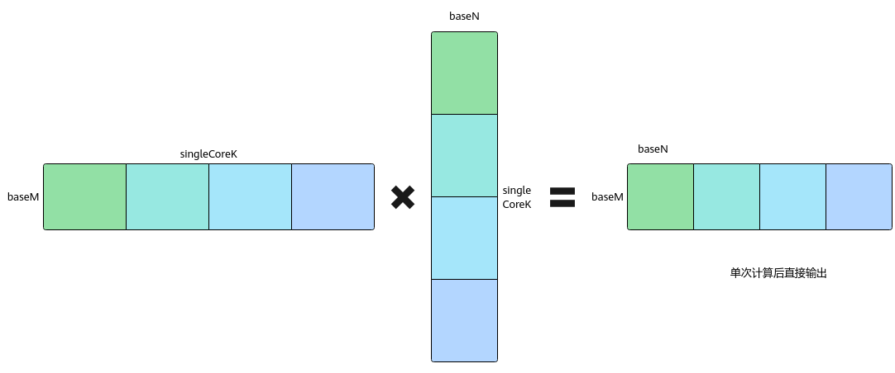

# 单次矩阵乘局部输出-特性场景-矩阵编程（高阶API）-SIMD算子实现-算子实践参考-Ascend C算子开发-算子开发-CANN社区版8.5.0开发文档-昇腾社区

**页面ID:** atlas_ascendc_10_10027
**来源：** https://www.hiascend.com/document/detail/zh/CANNCommunityEdition/850/opdevg/Ascendcopdevg/atlas_ascendc_10_10027.html
---

# 单次矩阵乘局部输出

#### 功能介绍

单次矩阵乘局部输出，又称Partial Output。如基础知识中所述，一次Iterate计算过程中，会按K方向进行一次或多次基本块计算，其中的一次基本块计算为baseM*baseK和baseK*baseN大小的输入数据进行计算得到baseM*baseN大小的结果；每次基本块计算的结果进行累加后，便得到baseM*singleCoreK和singleCoreK*baseN大小的输入数据计算得到的结果baseM*baseN，并将其作为一次Iterate的最终结果输出。

开启Partial Output功能后，调用Iterate接口不会进行K轴累加，只进行单次基本块计算。用户可以通过GetTensorC接口获取对应的单片数据，最后自行进行K轴上的累加。

#### 使用场景

矩阵乘计算结果不需要累加，只需要输出baseM*baseK和baseK*baseN的计算结果baseM*baseN。例如需要先获取单次基本块计算的数据进行反量化，再累加得到最终结果。

#### 约束说明

- 该功能仅支持MDL模板。
- 获取矩阵乘计算结果时，仅支持调用Iterate和GetTensorC接口的连续写模式，不支持非连续写模式以及IterateAll接口获取计算结果，连续写模式的介绍请参考GetTensorC。
- 该功能不支持带有Bias矩阵的Matmul计算，即不支持输入Bias矩阵。

#### 调用示例

完整的算子样例请参考开启Partial Output功能的算子样例。

| 1234567891011121314151617 | // 配置MDL模板，使能Partial OutputconstexprstaticMatmulConfigModeconfigMode=MatmulConfigMode:CONFIG_MDL;constexprstaticMatmulFuncParamsfuncParams={false,false,false,false,0,IterateOrder:UNDEF,ScheduleType:INNER_PRODUCT,true,true,true/* isPartialOutput */};constexprstaticMatmulConfigCFG_PARTIAL=GetMMConfig<configMode>(funcParams);Matmul<A_TYPE,B_TYPE,C_TYPE,BIAS_TYPE,CFG_PARTIAL>mm;REGIST_MATMUL_OBJ(&pipe,GetSysWorkSpacePtr(),mm);mm.Init(&tiling);mm.SetTensorA(gmA,isTransposeA);mm.SetTensorB(gmB,isTransposeB);while(mm.Iterate()){mm.GetTensorC(tmpGmC[dstOffset],false,true);dstOffset+=baseM*baseN;// 其他操作} |
| ------------------------- | ------------------------------------------------------------------------------------------------------------------------------------------------------------------------------------------------------------------------------------------------------------------------------------------------------------------------------------------------------------------------------------------------------------------------------------------------------------------------------------------------------------------------------------------------------------------------------------------------------------------------------------- |
