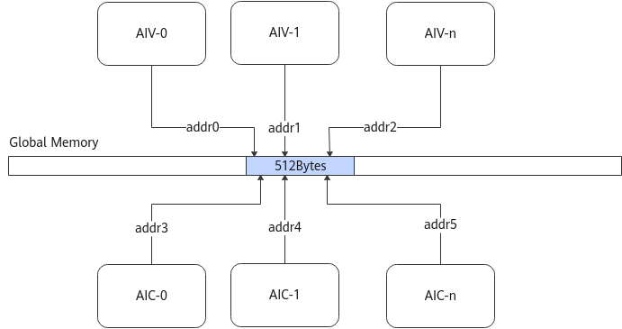

# 避免同地址访问-内存访问-SIMD算子性能优化-算子实践参考-Ascend C算子开发-算子开发-CANN社区版8.5.0开发文档-昇腾社区

**页面ID:** atlas_ascendc_best_practices_10_00013
**来源：** https://www.hiascend.com/document/detail/zh/CANNCommunityEdition/850/opdevg/Ascendcopdevg/atlas_ascendc_best_practices_10_00013.html
---

# 避免同地址访问

【优先级】高

【描述】MTE2、MTE3、Scalar等单元访问Global Memory数据时，其地址请求会按照512字节粒度对齐后进行处理。当同时访问Global Memory的数据，且地址处于连续的512字节范围内时，由于数据一致性的原因，多个请求会被串行处理，进而影响数据搬运效率。

当前算子执行机制保证用户Kernel入参（包括Workspace/Tiling）的地址512字节对齐，因此开发者只需要根据地址的偏移量即可判断两个地址是否会落入连续的512字节范围内。

如下图所示，AI Core内的各个核对Global Memory的数据同时发出读写请求，尽管addr0~addr5是多个不同的地址，但因为落在连续的512字节范围内，被视为同一个地址请求，此时这几个数据请求会被串行处理，数据访问效率会降低。同地址访问的影响受同时访问的核数影响，同地址访问的核数越多时，串行导致的性能劣化越严重。

避免同地址访问的方法主要有以下两种：调整数据访问顺序和修改切分策略。下文介绍配套的样例请参考避免同地址访问样例。

调整数据访问顺序

以一个形状为(8192, 128)的float类型输入进行Adds计算为例。

为了体现同地址冲突的影响，上述场景设计中每一行的数据大小为512字节（128个float），每个核每一轮计算处理512 * 8字节的数据，并进行全核同步（实际场景中并不需要），每一轮计算都需要等待所有核完成当前数据块的计算后，再进行下一轮。

| 实现方案 | 原始实现                                                                                                                                                                                                                                           | 优化实现                                                                                                                                                                                                                                                                       |                                                                                                                |                                                                                                                                                                                                             |          |                                                                                                                                                                                                     |
| -------- | -------------------------------------------------------------------------------------------------------------------------------------------------------------------------------------------------------------------------------------------------- | ------------------------------------------------------------------------------------------------------------------------------------------------------------------------------------------------------------------------------------------------------------------------------ | -------------------------------------------------------------------------------------------------------------- | ----------------------------------------------------------------------------------------------------------------------------------------------------------------------------------------------------------- | -------- | --------------------------------------------------------------------------------------------------------------------------------------------------------------------------------------------------- |
| 实现方法 | 使用16个核参与计算，按列方向进行切分，每个核总计算数据量为8192 * 8；单核执行循环16次，每次计算的数据量为512 * 8；每个核的循环顺序如下图所示，列方向0~15表示每个核的数据块执行顺序。由于多个核同时访问同一行数据（512字节），导致同地址冲突的发生。 | 使用16个核参与计算，按列方向进行切分，每个核总计算数据量为8192 * 8；单核执行循环16次，每次计算的数据量为512 * 8；每个核的循环顺序如下图所示，列方向0~15表示每个核的数据块执行顺序。由于每个核每一轮处理的地址在不同行，不会同时访问连续的512字节，所以不会导致同地址访问冲突。 |                                                                                                                |                                                                                                                                                                                                             |          |                                                                                                                                                                                                     |
| 示意图   |                                                                                                                                                                                                                                                    |                                                                                                                                                                                                                                                                                |                                                                                                                |                                                                                                                                                                                                             |          |                                                                                                                                                                                                     |
| 示例代码 | 1234567for(int32_ti=0;i<tiling->loopOneCore;i++){AscendC:SyncAll();CopyIn(i);Compute();AscendC:SyncAll();CopyOut(i);}                                                                                                                              | 1234567                                                                                                                                                                                                                                                                        | for(int32_ti=0;i<tiling->loopOneCore;i++){AscendC:SyncAll();CopyIn(i);Compute();AscendC:SyncAll();CopyOut(i);} | 12345678for(int32_ti=0;i<tiling->loopOneCore;i++){int32_tnewProgress=(i+AscendC:GetBlockIdx())%tiling->loopOneCore;AscendC:SyncAll();CopyIn(newProgress);Compute();AscendC:SyncAll();CopyOut(newProgress);} | 12345678 | for(int32_ti=0;i<tiling->loopOneCore;i++){int32_tnewProgress=(i+AscendC:GetBlockIdx())%tiling->loopOneCore;AscendC:SyncAll();CopyIn(newProgress);Compute();AscendC:SyncAll();CopyOut(newProgress);} |
| 1234567  | for(int32_ti=0;i<tiling->loopOneCore;i++){AscendC:SyncAll();CopyIn(i);Compute();AscendC:SyncAll();CopyOut(i);}                                                                                                                                     |                                                                                                                                                                                                                                                                                |                                                                                                                |                                                                                                                                                                                                             |          |                                                                                                                                                                                                     |
| 12345678 | for(int32_ti=0;i<tiling->loopOneCore;i++){int32_tnewProgress=(i+AscendC:GetBlockIdx())%tiling->loopOneCore;AscendC:SyncAll();CopyIn(newProgress);Compute();AscendC:SyncAll();CopyOut(newProgress);}                                                |                                                                                                                                                                                                                                                                                |                                                                                                                |                                                                                                                                                                                                             |          |                                                                                                                                                                                                     |

修改切分策略

仍以一个形状为(8192, 128)的float类型输入进行Adds计算为例。

为了体现同地址冲突的影响，上述场景设计中每一行的数据大小为512字节（128个float），每个核每一轮计算处理512 * 8字节的数据，并进行全核同步（实际场景中并不需要），每一轮计算都需要等待所有核完成当前数据块的计算后，再进行下一轮。

| 实现方案        | 原始实现                                                                                                                                                                                                                                                                                                                                                                                                                                                                                                                                                                                                                                                                                          | 优化实现                                                                                                                                                                                                                                                            |                                                                                                                                                                                                                                                                                                                                                                                                                                                                                                                                                                                                                       |                                                                                                                                                                                                                                                                                                                                                                                                                                                                                                                                                                                                                                                                                                                  |                 |                                                                                                                                                                                                                                                                                                                                                                                                                                                                                                                                                                                                                                                                                                   |
| --------------- | ------------------------------------------------------------------------------------------------------------------------------------------------------------------------------------------------------------------------------------------------------------------------------------------------------------------------------------------------------------------------------------------------------------------------------------------------------------------------------------------------------------------------------------------------------------------------------------------------------------------------------------------------------------------------------------------------- | ------------------------------------------------------------------------------------------------------------------------------------------------------------------------------------------------------------------------------------------------------------------- | --------------------------------------------------------------------------------------------------------------------------------------------------------------------------------------------------------------------------------------------------------------------------------------------------------------------------------------------------------------------------------------------------------------------------------------------------------------------------------------------------------------------------------------------------------------------------------------------------------------------- | ---------------------------------------------------------------------------------------------------------------------------------------------------------------------------------------------------------------------------------------------------------------------------------------------------------------------------------------------------------------------------------------------------------------------------------------------------------------------------------------------------------------------------------------------------------------------------------------------------------------------------------------------------------------------------------------------------------------- | --------------- | ------------------------------------------------------------------------------------------------------------------------------------------------------------------------------------------------------------------------------------------------------------------------------------------------------------------------------------------------------------------------------------------------------------------------------------------------------------------------------------------------------------------------------------------------------------------------------------------------------------------------------------------------------------------------------------------------- |
| 实现方法        | 使用16个核参与计算，按列方向进行切分，每个核总计算数据量为8192 * 8；单核执行循环16次，每次计算的数据量为512 * 8；每个核的循环顺序如下图所示，列方向0~15表示每个核的数据块执行顺序。由于多个核同时访问同一行数据（512字节），导致同地址冲突的发生。                                                                                                                                                                                                                                                                                                                                                                                                                                                | 使用16个核参与计算，按行方向进行切分，每个核总计算数据量为512 * 128；单核执行循环16次，每次计算的数据量为512 * 8；每个核的循环顺序如下图所示（行方向），均为从块0~块15。由于每个核每一轮处理的地址在不同行，不会同时访问连续的512字节，所以不会导致同地址访问冲突。 |                                                                                                                                                                                                                                                                                                                                                                                                                                                                                                                                                                                                                       |                                                                                                                                                                                                                                                                                                                                                                                                                                                                                                                                                                                                                                                                                                                  |                 |                                                                                                                                                                                                                                                                                                                                                                                                                                                                                                                                                                                                                                                                                                   |
| 示意图          |                                                                                                                                                                                                                                                                                                                                                                                                                                                                                                                                                                                                                                                                                                   |                                                                                                                                                                                                                                                                     |                                                                                                                                                                                                                                                                                                                                                                                                                                                                                                                                                                                                                       |                                                                                                                                                                                                                                                                                                                                                                                                                                                                                                                                                                                                                                                                                                                  |                 |                                                                                                                                                                                                                                                                                                                                                                                                                                                                                                                                                                                                                                                                                                   |
| 示例代码        | 1234567891011__aicore__inlinevoidInit(GM_ADDRx,GM_ADDRz,AddsCustomTilingData*tilingPtr){tiling=tilingPtr;xGm.SetGlobalBuffer((__gm__float*)x+AscendC:GetBlockIdx()*tiling->tileN);zGm.SetGlobalBuffer((__gm__float*)z+AscendC:GetBlockIdx()*tiling->tileN);// we disable the L2 cache mode to highlight the influence of the gm address conflictxGm.SetL2CacheHint(AscendC:CacheMode:CACHE_MODE_DISABLE);zGm.SetL2CacheHint(AscendC:CacheMode:CACHE_MODE_DISABLE);pipe.InitBuffer(inQueueX,BUFFER_NUM,tiling->tileM*tiling->tileN*sizeof(float));pipe.InitBuffer(outQueueZ,BUFFER_NUM,tiling->tileM*tiling->tileN*sizeof(float));}                                                                | 1234567891011                                                                                                                                                                                                                                                       | __aicore__inlinevoidInit(GM_ADDRx,GM_ADDRz,AddsCustomTilingData*tilingPtr){tiling=tilingPtr;xGm.SetGlobalBuffer((__gm__float*)x+AscendC:GetBlockIdx()*tiling->tileN);zGm.SetGlobalBuffer((__gm__float*)z+AscendC:GetBlockIdx()*tiling->tileN);// we disable the L2 cache mode to highlight the influence of the gm address conflictxGm.SetL2CacheHint(AscendC:CacheMode:CACHE_MODE_DISABLE);zGm.SetL2CacheHint(AscendC:CacheMode:CACHE_MODE_DISABLE);pipe.InitBuffer(inQueueX,BUFFER_NUM,tiling->tileM*tiling->tileN*sizeof(float));pipe.InitBuffer(outQueueZ,BUFFER_NUM,tiling->tileM*tiling->tileN*sizeof(float));} | 123456789101112__aicore__inlinevoidInit(GM_ADDRx,GM_ADDRz,AddsCustomTilingData*tilingPtr){tiling=tilingPtr;// change the tile method from column split to row splitxGm.SetGlobalBuffer((__gm__float*)x+AscendC:GetBlockIdx()*tiling->tileM*tiling->n);zGm.SetGlobalBuffer((__gm__float*)z+AscendC:GetBlockIdx()*tiling->tileM*tiling->n);// we disable the L2 cache mode to highlight the influence of the gm address conflictxGm.SetL2CacheHint(AscendC:CacheMode:CACHE_MODE_DISABLE);zGm.SetL2CacheHint(AscendC:CacheMode:CACHE_MODE_DISABLE);pipe.InitBuffer(inQueueX,BUFFER_NUM,tiling->tileM*tiling->tileN*sizeof(float));pipe.InitBuffer(outQueueZ,BUFFER_NUM,tiling->tileM*tiling->tileN*sizeof(float));} | 123456789101112 | __aicore__inlinevoidInit(GM_ADDRx,GM_ADDRz,AddsCustomTilingData*tilingPtr){tiling=tilingPtr;// change the tile method from column split to row splitxGm.SetGlobalBuffer((__gm__float*)x+AscendC:GetBlockIdx()*tiling->tileM*tiling->n);zGm.SetGlobalBuffer((__gm__float*)z+AscendC:GetBlockIdx()*tiling->tileM*tiling->n);// we disable the L2 cache mode to highlight the influence of the gm address conflictxGm.SetL2CacheHint(AscendC:CacheMode:CACHE_MODE_DISABLE);zGm.SetL2CacheHint(AscendC:CacheMode:CACHE_MODE_DISABLE);pipe.InitBuffer(inQueueX,BUFFER_NUM,tiling->tileM*tiling->tileN*sizeof(float));pipe.InitBuffer(outQueueZ,BUFFER_NUM,tiling->tileM*tiling->tileN*sizeof(float));} |
| 1234567891011   | __aicore__inlinevoidInit(GM_ADDRx,GM_ADDRz,AddsCustomTilingData*tilingPtr){tiling=tilingPtr;xGm.SetGlobalBuffer((__gm__float*)x+AscendC:GetBlockIdx()*tiling->tileN);zGm.SetGlobalBuffer((__gm__float*)z+AscendC:GetBlockIdx()*tiling->tileN);// we disable the L2 cache mode to highlight the influence of the gm address conflictxGm.SetL2CacheHint(AscendC:CacheMode:CACHE_MODE_DISABLE);zGm.SetL2CacheHint(AscendC:CacheMode:CACHE_MODE_DISABLE);pipe.InitBuffer(inQueueX,BUFFER_NUM,tiling->tileM*tiling->tileN*sizeof(float));pipe.InitBuffer(outQueueZ,BUFFER_NUM,tiling->tileM*tiling->tileN*sizeof(float));}                                                                             |                                                                                                                                                                                                                                                                     |                                                                                                                                                                                                                                                                                                                                                                                                                                                                                                                                                                                                                       |                                                                                                                                                                                                                                                                                                                                                                                                                                                                                                                                                                                                                                                                                                                  |                 |                                                                                                                                                                                                                                                                                                                                                                                                                                                                                                                                                                                                                                                                                                   |
| 123456789101112 | __aicore__inlinevoidInit(GM_ADDRx,GM_ADDRz,AddsCustomTilingData*tilingPtr){tiling=tilingPtr;// change the tile method from column split to row splitxGm.SetGlobalBuffer((__gm__float*)x+AscendC:GetBlockIdx()*tiling->tileM*tiling->n);zGm.SetGlobalBuffer((__gm__float*)z+AscendC:GetBlockIdx()*tiling->tileM*tiling->n);// we disable the L2 cache mode to highlight the influence of the gm address conflictxGm.SetL2CacheHint(AscendC:CacheMode:CACHE_MODE_DISABLE);zGm.SetL2CacheHint(AscendC:CacheMode:CACHE_MODE_DISABLE);pipe.InitBuffer(inQueueX,BUFFER_NUM,tiling->tileM*tiling->tileN*sizeof(float));pipe.InitBuffer(outQueueZ,BUFFER_NUM,tiling->tileM*tiling->tileN*sizeof(float));} |                                                                                                                                                                                                                                                                     |                                                                                                                                                                                                                                                                                                                                                                                                                                                                                                                                                                                                                       |                                                                                                                                                                                                                                                                                                                                                                                                                                                                                                                                                                                                                                                                                                                  |                 |                                                                                                                                                                                                                                                                                                                                                                                                                                                                                                                                                                                                                                                                                                   |

你可以通过执行如下命令行，通过msprof工具获取上述示例的性能数据并进行对比。

重点关注PipeUtilization.csv中的aiv_mte2_time(us)和aiv_mte3_time(us)搬运指令耗时。
