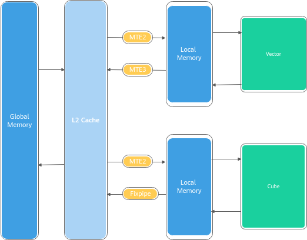
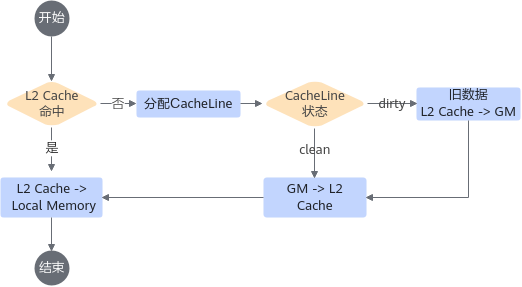
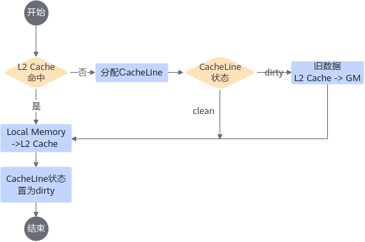

# 设置合理的L2 CacheMode-内存访问-SIMD算子性能优化-算子实践参考-Ascend C算子开发-算子开发-CANN社区版8.5.0开发文档-昇腾社区

**页面ID:** atlas_ascendc_best_practices_10_00014
**来源：** https://www.hiascend.com/document/detail/zh/CANNCommunityEdition/850/opdevg/Ascendcopdevg/atlas_ascendc_best_practices_10_00014.html
---

# 设置合理的L2 CacheMode

【优先级】高

【描述】L2 Cache常用于缓存频繁访问的数据，其物理位置如下图所示：

L2 Cache的带宽相比GM的带宽有数倍的提升，因此当数据命中L2 Cache时，数据的搬运耗时会优化数倍。通常情况下，L2 Cache命中率越高，算子的性能越好，在实际访问中需要通过设置合理的L2 CacheMode来保证重复读取的数据尽量缓存在L2 Cache上。

#### L2 Cache访问的原理及CacheMode介绍

数据通过MTE2搬运单元搬入时，L2 Cache访问的典型流程如下：

数据通过MTE3或者Fixpipe搬运单元搬出时，L2 Cache访问的典型流程如下：

从上面的流程可以看出，当数据访问总量超出L2 Cache容量时，AI Core会对L2 Cache进行数据替换。由于Cache一致性的要求，替换过程中旧数据需要先写回GM（此过程中会占用GM带宽），旧数据写回后，新的数据才能进入L2 Cache。

开发者可以针对访问的数据设置其CacheMode，对于只访问一次的Global Memory数据设置其访问状态为不进入L2 Cache，这样可以更加高效的利用L2 Cache缓存需要重复读取的数据，避免一次性访问的数据替换有效数据。

#### 设置L2 CacheMode的方法

Ascend C基于GlobalTensor提供了SetL2CacheHint接口，用户可以根据需要指定CacheMode。

考虑如下场景，构造两个Tensor的计算，x的输入Shape为(5120, 5120)，y的输入Shape为(5120, 15360)，z的输出Shape为(5120, 15360)，由于两个Tensor的Shape不相等，x分别与y的3个数据块依次相加。该方案主要为了演示CacheMode的功能，示例代码中故意使用重复搬运x的实现方式，真实设计中并不需要采用这个方案。下文完整样例请参考设置合理L2 CacheMode样例。

| 实现方案 | 原始实现                                                                                                                                                                                                                                                                                                                                                        | 优化实现                                                                                                                                                                                                                                                                                |                                                                                                                                                                                                        |                                                                                                                                                                                                                                                                                                                                                                       |        |                                                                                                                                                                                                                                                                                                                                                                 |
| -------- | --------------------------------------------------------------------------------------------------------------------------------------------------------------------------------------------------------------------------------------------------------------------------------------------------------------------------------------------------------------- | --------------------------------------------------------------------------------------------------------------------------------------------------------------------------------------------------------------------------------------------------------------------------------------- | ------------------------------------------------------------------------------------------------------------------------------------------------------------------------------------------------------ | --------------------------------------------------------------------------------------------------------------------------------------------------------------------------------------------------------------------------------------------------------------------------------------------------------------------------------------------------------------------- | ------ | --------------------------------------------------------------------------------------------------------------------------------------------------------------------------------------------------------------------------------------------------------------------------------------------------------------------------------------------------------------- |
| 实现方法 | 总数据量700MB，其中：x：100MB；y：300MB；z：300MB。使用40个核参与计算，按列方向切分。x、y、z对应GlobalTensor的CacheMode均设置为CACHE_MODE_NORMAL，需要经过L2 Cache，需要进入L2 Cache的总数据量为700MB。                                                                                                                                                         | 总数据量700MB，其中：x：100MB；y：300MB；z：300MB。使用40个核参与计算，按列方向切分。x对应的GlobalTensor的CacheMode设置为CACHE_MODE_NORMAL；y和z对应的GlobalTensor的CacheMode设置为CACHE_MODE_DISABLE。只有需要频繁访问的x，设置为需要经过L2 Cache。需要进入L2 Cache的总数据量为100MB。 |                                                                                                                                                                                                        |                                                                                                                                                                                                                                                                                                                                                                       |        |                                                                                                                                                                                                                                                                                                                                                                 |
| 示例代码 | 123xGm.SetGlobalBuffer((__gm__float*)x+AscendC:GetBlockIdx()*TILE_N);yGm.SetGlobalBuffer((__gm__float*)y+AscendC:GetBlockIdx()*TILE_N);zGm.SetGlobalBuffer((__gm__float*)z+AscendC:GetBlockIdx()*TILE_N);                                                                                                                                                       | 123                                                                                                                                                                                                                                                                                     | xGm.SetGlobalBuffer((__gm__float*)x+AscendC:GetBlockIdx()*TILE_N);yGm.SetGlobalBuffer((__gm__float*)y+AscendC:GetBlockIdx()*TILE_N);zGm.SetGlobalBuffer((__gm__float*)z+AscendC:GetBlockIdx()*TILE_N); | 123456xGm.SetGlobalBuffer((__gm__float*)x+AscendC:GetBlockIdx()*TILE_N);yGm.SetGlobalBuffer((__gm__float*)y+AscendC:GetBlockIdx()*TILE_N);zGm.SetGlobalBuffer((__gm__float*)z+AscendC:GetBlockIdx()*TILE_N);// disable the L2 cache mode of y and zyGm.SetL2CacheHint(AscendC:CacheMode:CACHE_MODE_DISABLE);zGm.SetL2CacheHint(AscendC:CacheMode:CACHE_MODE_DISABLE); | 123456 | xGm.SetGlobalBuffer((__gm__float*)x+AscendC:GetBlockIdx()*TILE_N);yGm.SetGlobalBuffer((__gm__float*)y+AscendC:GetBlockIdx()*TILE_N);zGm.SetGlobalBuffer((__gm__float*)z+AscendC:GetBlockIdx()*TILE_N);// disable the L2 cache mode of y and zyGm.SetL2CacheHint(AscendC:CacheMode:CACHE_MODE_DISABLE);zGm.SetL2CacheHint(AscendC:CacheMode:CACHE_MODE_DISABLE); |
| 123      | xGm.SetGlobalBuffer((__gm__float*)x+AscendC:GetBlockIdx()*TILE_N);yGm.SetGlobalBuffer((__gm__float*)y+AscendC:GetBlockIdx()*TILE_N);zGm.SetGlobalBuffer((__gm__float*)z+AscendC:GetBlockIdx()*TILE_N);                                                                                                                                                          |                                                                                                                                                                                                                                                                                         |                                                                                                                                                                                                        |                                                                                                                                                                                                                                                                                                                                                                       |        |                                                                                                                                                                                                                                                                                                                                                                 |
| 123456   | xGm.SetGlobalBuffer((__gm__float*)x+AscendC:GetBlockIdx()*TILE_N);yGm.SetGlobalBuffer((__gm__float*)y+AscendC:GetBlockIdx()*TILE_N);zGm.SetGlobalBuffer((__gm__float*)z+AscendC:GetBlockIdx()*TILE_N);// disable the L2 cache mode of y and zyGm.SetL2CacheHint(AscendC:CacheMode:CACHE_MODE_DISABLE);zGm.SetL2CacheHint(AscendC:CacheMode:CACHE_MODE_DISABLE); |                                                                                                                                                                                                                                                                                         |                                                                                                                                                                                                        |                                                                                                                                                                                                                                                                                                                                                                       |        |                                                                                                                                                                                                                                                                                                                                                                 |

你可以通过执行如下命令行，通过msprof工具获取上述示例的性能数据并进行对比。

重点关注Memory.csv中的aiv_gm_to_ub_bw(GB/s)和aiv_main_mem_write_bw(GB/s)写带宽的速率。
