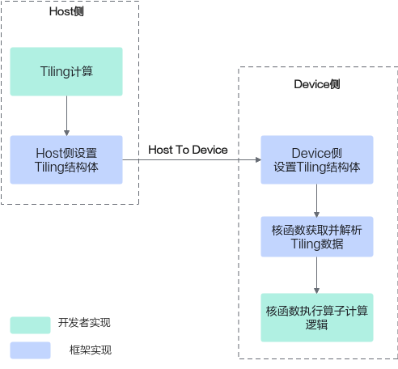

# 异构计算-算子实践参考-Ascend C算子开发-算子开发-CANN社区版8.5.0开发文档-昇腾社区

**页面ID:** atlas_ascendc_best_practices_10_0002
**来源：** https://www.hiascend.com/document/detail/zh/CANNCommunityEdition/850/opdevg/Ascendcopdevg/atlas_ascendc_best_practices_10_0002.html
---

# 异构计算

使用Ascend C进行编程时，会涉及到在两个不同的平台(Host、Device)上开发代码。本章简单介绍Host、Device之间的差异，便于开发者宏观地了解这个异构系统；同时给出算子相关的数据流，结合异构架构的特点，开发者可以进一步了解应该如何合理安排算子代码的执行位置，便于得到更好的性能。

#### Host侧CPU和Device侧NPU的主要区别

- 不同的硬件资源CPU是为了执行通用计算任务而设计的，但在处理大量的并行计算（如矩阵乘、批数据处理）时效率不高。NPU是为了加速机器学习和深度学习任务而设计的，它擅长执行大量的并行计算。NPU包含了大量的专用硬件，比如：支持矩阵计算的Cube单元，NPU中一个核可以支持一个时钟周期内完成数据量为16 * 16 * 16、数据类型为float16的乘累加运算；支持向量计算的Vector单元，NPU中一个核可以支持一个时钟周期内完成数据量为128 + 128、数据类型为float16的加法运算。
- 不同的物理内存空间Host和Device的物理内存是分离的，通常需要在Host侧内存和Device侧内存之间进行数据交换。

#### 如何合理安排算子代码

开发者进行Ascend C算子开发时，可以将Host和Device视为一个协同的异构系统，为每个处理单元分配其擅长的工作。在Host侧推荐执行非计算密集型任务，一般为标量计算任务。在Device侧推荐进行计算密集型任务，利用Device侧NPU的SIMD(Single Instruction Multiple Data)指令可以高效的实现批量数据的矩阵运算、向量运算等。

Ascend C算子的实现主要包含两个部分：

- Host侧Tiling实现由于NPU中AI Core内部存储无法完全容纳算子输入输出的所有数据，需要每次搬运一部分输入数据进行计算然后搬出，再搬运下一部分输入数据进行计算，这个过程就称之为Tiling。切分数据的算法称为Tiling算法或者Tiling策略。根据算子的shape等信息来确定数据切分算法相关参数（比如每次搬运的块大小，循环的总次数）的计算程序，称之为Tiling实现，也叫Tiling函数(Tiling Function)。由于Tiling实现中均为标量计算，AI Core并不擅长，所以我们将其独立出来放在Host侧CPU上执行。
- Device侧Kernel实现Kernel实现即算子核函数实现，在Kernel函数内部通过解析Host侧传入的Tiling结构体获取Tiling信息，根据Tiling信息控制数据搬入搬出Local Memory的流程；通过调用计算、数据搬运、内存管理、任务同步等API实现算子逻辑。其核心逻辑基本上都为计算密集型任务，适合在Device侧NPU上执行。

#### 算子数据流

算子执行过程中涉及到Host和Device的数据交换。这里仅针对Tiling参数的传递，给出具体的数据流：Host侧Tiling算法根据算子具体输入输出的信息，完成Tiling参数的计算，并存放在Tiling结构体中；将Host侧的Tiling结构体发送到Device侧，Device侧的算子获取并解析Tiling结构体，基于该信息执行后续的算子计算逻辑。

