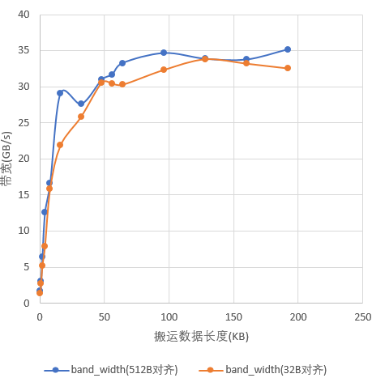
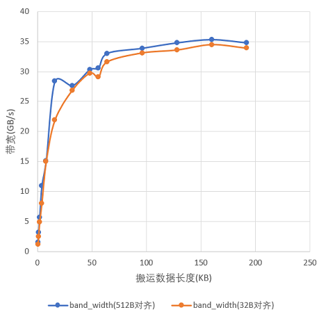

# GM地址尽量512B对齐-内存访问-SIMD算子性能优化-算子实践参考-Ascend C算子开发-算子开发-CANN社区版8.5.0开发文档-昇腾社区

**页面ID:** atlas_ascendc_best_practices_10_0014
**来源：** https://www.hiascend.com/document/detail/zh/CANNCommunityEdition/850/opdevg/Ascendcopdevg/atlas_ascendc_best_practices_10_0014.html
---

# GM地址尽量512B对齐

【优先级】高

【描述】由于AI处理器内部设计约束，从GM向Local Memory搬运数据时，保证GM地址512B对齐可以最有效的发挥出带宽的效率。如下图示例，展示了在512B对齐以及32B对齐情况下单核的带宽效率：搬运同等数据量，带宽差距最大的情况，32B对齐场景只能达到512B对齐场景的70%。

