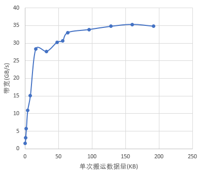
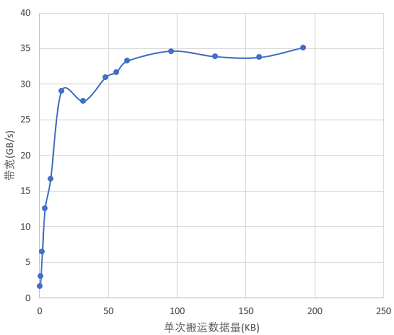

# 尽量一次搬运较大的数据块-内存访问-SIMD算子性能优化-算子实践参考-Ascend C算子开发-算子开发-CANN社区版8.5.0开发文档-昇腾社区

**页面ID:** atlas_ascendc_best_practices_10_0016
**来源：** https://www.hiascend.com/document/detail/zh/CANNCommunityEdition/850/opdevg/Ascendcopdevg/atlas_ascendc_best_practices_10_0016.html
---

# 尽量一次搬运较大的数据块

【优先级】高

【描述】搬运不同大小的数据块时，对带宽的利用率（有效带宽/理论带宽）不一样。根据实测经验，单次搬运数据长度16KB以上时，通常能较好地发挥出带宽的最佳性能。因此对于单次搬运，应考虑尽可能的搬运较大的数据块。下图展示了某款AI处理器上实测的不同搬运数据量下带宽的变化图。

