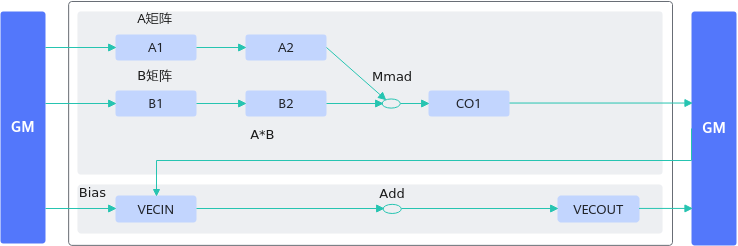
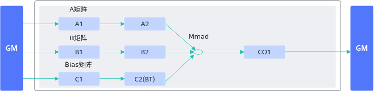

# 通过BT Buffer实现高效的bias计算-矩阵计算-SIMD算子性能优化-算子实践参考-Ascend C算子开发-算子开发-CANN社区版8.5.0开发文档-昇腾社区

**页面ID:** atlas_ascendc_best_practices_10_0021
**来源：** https://www.hiascend.com/document/detail/zh/CANNCommunityEdition/850/opdevg/Ascendcopdevg/atlas_ascendc_best_practices_10_0021.html
---

# 通过BT Buffer实现高效的bias计算

【优先级】高

【描述】算子中进行带bias的矩阵乘计算时，可将bias数据搬运至C2(Bias Table Buffer)上，调用一次Mmad接口实现矩阵乘加bias的计算，或者直接调用Matmul高阶API完成功能。相比于先将矩阵乘的结果从CO1(L0C)搬运到GM上，再搬运到UB上进行加bias的过程，减少了数据搬运的次数，可提升内存使用效率。数据流图对比如下：

【反例】

该算子进行带bias的矩阵乘计算时，过程如下：

- 将矩阵乘的计算结果从CO1(L0C)搬运到workspace(GM)上；
- 从workspace搬运到UB上；
- 在UB上进行加bias的运算；
- 最后将结果搬运到GM。

当循环n次该计算过程，则分别增加了n次CO1->workspace、workspace->UB的搬运。

| 123456789101112131415161718192021222324252627282930313233343536373839404142434445464748495051525354555657585960616263646566676869707172737475767778798081828384858687888990919293949596979899100101102103104105106107108109110111112113114115116117118119120121122123124125126127128129130131132133134135136137138139140141142143144145146147148149150151152153154 | // 该样例仅做示例说明，非完整代码，省略了部分同步控制代码public:__aicore__inlineKernelSample(){aSize=m*k;bSize=k*n;cSize=m*n;}__aicore__inlinevoidInit(__gm__uint8_t*a,__gm__uint8_t*b,__gm__uint8_t*bias,__gm__uint8_t*c){aGM.SetGlobalBuffer((__gm__half*)a);bGM.SetGlobalBuffer((__gm__half*)b);cGM.SetGlobalBuffer((__gm__float*)c);biasGM.SetGlobalBuffer((__gm__float*)bias);pipe.InitBuffer(inQueueA1,1,aSize*sizeof(half));pipe.InitBuffer(inQueueA2,1,aSize*sizeof(half));pipe.InitBuffer(inQueueB1,1,bSize*sizeof(half));pipe.InitBuffer(inQueueB2,2,bSize*sizeof(half));pipe.InitBuffer(outQueueCO1,1,cSize*sizeof(float));pipe.InitBuffer(inQueueBias,1,n*sizeof(float));pipe.InitBuffer(inQueueSrc0,1,cSize*sizeof(float));pipe.InitBuffer(outQueueDst,1,cSize*sizeof(float));}__aicore__inlinevoidProcess(){CopyIn();SplitA();SplitB();Compute();CopyOut();CopyIn1();Compute1();CopyOut1();}private:__aicore__inlinevoidCopyIn(){LocalTensor<half>a1Local=inQueueA1.AllocTensor<half>();LocalTensor<half>b1Local=inQueueB1.AllocTensor<half>();LocalTensor<float>biasLocal=inQueueBias.AllocTensor<float>();Nd2NzParamsdataCopyA1Params;dataCopyA1Params.ndNum=1;dataCopyA1Params.nValue=m;dataCopyA1Params.dValue=k;dataCopyA1Params.srcNdMatrixStride=0;dataCopyA1Params.srcDValue=k;dataCopyA1Params.dstNzC0Stride=m;dataCopyA1Params.dstNzNStride=1;dataCopyA1Params.dstNzMatrixStride=0;DataCopy(a1Local,aGM,dataCopyA1Params);Nd2NzParamsdataCopyB1Params;dataCopyB1Params.ndNum=1;dataCopyB1Params.nValue=k;dataCopyB1Params.dValue=n;dataCopyB1Params.srcNdMatrixStride=0;dataCopyB1Params.srcDValue=n;dataCopyB1Params.dstNzC0Stride=k;dataCopyB1Params.dstNzNStride=1;dataCopyB1Params.dstNzMatrixStride=0;DataCopy(b1Local,bGM,dataCopyB1Params);// 将bias搬运到UBDataCopy(biasLocal,biasGM,n);inQueueA1.EnQue(a1Local);inQueueB1.EnQue(b1Local);inQueueBias.EnQue(biasLocal);}__aicore__inlinevoidSplitA(){...}__aicore__inlinevoidSplitB(){...}__aicore__inlinevoidCompute(){LocalTensor<half>a2Local=inQueueA2.DeQue<half>();LocalTensor<half>b2Local=inQueueB2.DeQue<half>();LocalTensor<float>c1Local=outQueueCO1.AllocTensor<float>();MmadParamsmmadParams;mmadParams.m=m;mmadParams.n=n;mmadParams.k=k;// 矩阵乘Mmad(c1Local,a2Local,b2Local,mmadParams);// m*noutQueueCO1.EnQue<float>(c1Local);inQueueA2.FreeTensor(a2Local);inQueueB2.FreeTensor(b2Local);}__aicore__inlinevoidCopyOut(){LocalTensor<float>c1Local=outQueueCO1.DeQue<float>();GM_ADDRusrWorkspace=AscendC:GetUserWorkspace(workspace);xGm.SetGlobalBuffer((__gm__float*)(usrWorkspace));FixpipeParamsV220fixpipeParams;fixpipeParams.nSize=n;fixpipeParams.mSize=m;fixpipeParams.srcStride=m;fixpipeParams.dstStride=n;fixpipeParams.ndNum=1;fixpipeParams.srcNdStride=0;fixpipeParams.dstNdStride=0;// 将矩阵乘的计算结果从CO1搬运到workspaceFixpipe(xGm,c1Local,fixpipeParams);outQueueCO1.FreeTensor(c1Local);}__aicore__inlinevoidCopyIn1(){PipeBarrier<PIPE_ALL>();// 将矩阵乘的计算结果从workspace搬运到UBLocalTensor<float>src0Local=inQueueSrc0.AllocTensor<float>();DataCopy(src0Local,xGm,cSize);inQueueSrc0.EnQue(src0Local);}__aicore__inlinevoidCompute1(){LocalTensor<float>src0Local=inQueueSrc0.DeQue<float>();LocalTensor<float>biasLocal=inQueueBias.DeQue<float>();LocalTensor<float>dstLocal=outQueueDst.AllocTensor<float>();BinaryRepeatParamsaddRepeatParams;addRepeatParams.dstRepStride=8;addRepeatParams.src0RepStride=8;addRepeatParams.src1RepStride=0;// 加bias的运算Add(dstLocal,src0Local,biasLocal,32,m,addRepeatParams);outQueueDst.EnQue<float>(dstLocal);inQueueSrc0.FreeTensor(src0Local);inQueueBias.FreeTensor(biasLocal);}__aicore__inlinevoidCopyOut1(){...}private:TPipepipe;TQue<TPosition:A1,1>inQueueA1;TQue<TPosition:A2,1>inQueueA2;TQue<TPosition:B1,1>inQueueB1;TQue<TPosition:B2,1>inQueueB2;TQue<TPosition:VECIN,1>inQueueBias;TQue<TPosition:VECIN,1>inQueueSrc0;TQue<TPosition:VECOUT,1>outQueueDst;GlobalTensor<half>aGM;GlobalTensor<half>bGM;GlobalTensor<float>cGM;GlobalTensor<float>biasGM;uint16_tm=32,k=32,n=32;uint16_taSize,bSize,cSize;... |
| ------------------------------------------------------------------------------------------------------------------------------------------------------------------------------------------------------------------------------------------------------------------------------------------------------------------------------------------------------------------ | ------------------------------------------------------------------------------------------------------------------------------------------------------------------------------------------------------------------------------------------------------------------------------------------------------------------------------------------------------------------------------------------------------------------------------------------------------------------------------------------------------------------------------------------------------------------------------------------------------------------------------------------------------------------------------------------------------------------------------------------------------------------------------------------------------------------------------------------------------------------------------------------------------------------------------------------------------------------------------------------------------------------------------------------------------------------------------------------------------------------------------------------------------------------------------------------------------------------------------------------------------------------------------------------------------------------------------------------------------------------------------------------------------------------------------------------------------------------------------------------------------------------------------------------------------------------------------------------------------------------------------------------------------------------------------------------------------------------------------------------------------------------------------------------------------------------------------------------------------------------------------------------------------------------------------------------------------------------------------------------------------------------------------------------------------------------------------------------------------------------------------------------------------------------------------------------------------------------------------------------------------------------------------------------------------------------------------------------------------------------------------------------------------------------------------------------------------------------------------------------------------------------------------------------------------------------------------------------------------------------------------------------------------------------------------------------------------------------------------------------------------------------------------------------------------------------------------------------------------------------------------------------------------------------------------------------------------------------------------------------------------------------------------------------------------------------------------------------------------------------------------------------------------------------------------------------------------------------------------------------------------------------------------------------------------------------------------------------------------------------------------------------------------------------------------------------------------------------------------------------------------------------------------------------------------------------------------------------------------------------------------------------------------------------------------------------------------------------------------------------------------------------------------------------------------------------------------------------------------------------------------------------------------------------------------------------------------------------------------------------------------------------------------------------------------------------------------------------------------------ |

【正例】

该算子进行带bias的矩阵乘计算时，先将bias搬运到BT上，调用一次Mmad接口实现矩阵乘加bias的计算。

| 123456789101112131415161718192021222324252627282930313233343536373839404142434445464748495051525354555657585960616263646566676869707172737475767778798081828384858687888990919293949596979899100101102103104105106107108109110111112113114115116117118119120121122123124125126127128129130131132133 | ...// 该样例仅做示例说明，非完整代码，省略了部分同步控制代码public:__aicore__inlineKernelSample(){aSize=m*k;bSize=k*n;cSize=m*n;}__aicore__inlinevoidInit(__gm__uint8_t*a,__gm__uint8_t*b,__gm__uint8_t*bias,__gm__uint8_t*c){aGM.SetGlobalBuffer((__gm__half*)a);bGM.SetGlobalBuffer((__gm__half*)b);cGM.SetGlobalBuffer((__gm__float*)c);biasGM.SetGlobalBuffer((__gm__float*)bias);pipe.InitBuffer(inQueueA1,1,aSize*sizeof(half));pipe.InitBuffer(inQueueA2,1,aSize*sizeof(half));pipe.InitBuffer(inQueueB1,1,bSize*sizeof(half));pipe.InitBuffer(inQueueB2,2,bSize*sizeof(half));pipe.InitBuffer(outQueueCO1,1,cSize*sizeof(float));pipe.InitBuffer(inQueueC1,1,n*sizeof(float));pipe.InitBuffer(outQueueC2,1,n*sizeof(float));}__aicore__inlinevoidProcess(){CopyIn();SplitA();SplitB();SplitBias();Compute();CopyOut();}private:__aicore__inlinevoidCopyIn(){LocalTensor<half>a1Local=inQueueA1.AllocTensor<half>();LocalTensor<half>b1Local=inQueueB1.AllocTensor<half>();LocalTensor<float>bias1Local=inQueueC1.AllocTensor<float>();Nd2NzParamsdataCopyA1Params;dataCopyA1Params.ndNum=1;dataCopyA1Params.nValue=m;dataCopyA1Params.dValue=k;dataCopyA1Params.srcNdMatrixStride=0;dataCopyA1Params.srcDValue=k;dataCopyA1Params.dstNzC0Stride=m;dataCopyA1Params.dstNzNStride=1;dataCopyA1Params.dstNzMatrixStride=0;DataCopy(a1Local,aGM,dataCopyA1Params);Nd2NzParamsdataCopyB1Params;dataCopyB1Params.ndNum=1;dataCopyB1Params.nValue=k;dataCopyB1Params.dValue=n;dataCopyB1Params.srcNdMatrixStride=0;dataCopyB1Params.srcDValue=n;dataCopyB1Params.dstNzC0Stride=k;dataCopyB1Params.dstNzNStride=1;dataCopyB1Params.dstNzMatrixStride=0;DataCopy(b1Local,bGM,dataCopyB1Params);// 将bias从GM搬运到L1DataCopy(bias1Local,biasGM,n);inQueueA1.EnQue(a1Local);inQueueB1.EnQue(b1Local);inQueueC1.EnQue(bias1Local);}__aicore__inlinevoidSplitA(){...}__aicore__inlinevoidSplitB(){...}__aicore__inlinevoidSplitBias(){LocalTensor<float>bias1Local=inQueueC1.DeQue<float>();LocalTensor<float>bias2Local=outQueueC2.AllocTensor<float>();// 将bias从L1搬运到BTDataCopy(bias2Local,bias1Local,{1,(uint16_t)(n*sizeof(float)/64),0,0});outQueueC2.EnQue<float>(bias2Local);inQueueC1.FreeTensor(bias1Local);}__aicore__inlinevoidCompute(){LocalTensor<half>a2Local=inQueueA2.DeQue<half>();LocalTensor<half>b2Local=inQueueB2.DeQue<half>();LocalTensor<float>bias2Local=outQueueC2.DeQue<float>();LocalTensor<float>c1Local=outQueueCO1.AllocTensor<float>();MmadParamsmmadParams;mmadParams.m=m;mmadParams.n=n;mmadParams.k=k;mmadParams.cmatrixInitVal=false;// 矩阵乘Mmad(c1Local,a2Local,b2Local,bias2Local,mmadParams);outQueueCO1.EnQue<float>(c1Local);inQueueA2.FreeTensor(a2Local);inQueueB2.FreeTensor(b2Local);outQueueC2.FreeTensor(bias2Local);}__aicore__inlinevoidCopyOut(){LocalTensor<float>c1Local=outQueueCO1.DeQue<float>();FixpipeParamsV220fixpipeParams;fixpipeParams.nSize=n;fixpipeParams.mSize=m;fixpipeParams.srcStride=m;fixpipeParams.dstStride=n;fixpipeParams.ndNum=1;fixpipeParams.srcNdStride=0;fixpipeParams.dstNdStride=0;Fixpipe(cGM,c1Local,fixpipeParams);outQueueCO1.FreeTensor(c1Local);}private:TPipepipe;TQue<TPosition:A1,1>inQueueA1;TQue<TPosition:A2,1>inQueueA2;TQue<TPosition:B1,1>inQueueB1;TQue<TPosition:B2,1>inQueueB2;TQue<TPosition:CO1,1>outQueueCO1;TQue<TPosition:C1,1>inQueueC1;TQue<TPosition:C2,1>outQueueC2;GlobalTensor<half>aGM;GlobalTensor<half>bGM;GlobalTensor<float>cGM;GlobalTensor<float>biasGM;uint16_tm=32,k=32,n=32;uint16_taSize,bSize,cSize; |
| --------------------------------------------------------------------------------------------------------------------------------------------------------------------------------------------------------------------------------------------------------------------------------------------------- | ----------------------------------------------------------------------------------------------------------------------------------------------------------------------------------------------------------------------------------------------------------------------------------------------------------------------------------------------------------------------------------------------------------------------------------------------------------------------------------------------------------------------------------------------------------------------------------------------------------------------------------------------------------------------------------------------------------------------------------------------------------------------------------------------------------------------------------------------------------------------------------------------------------------------------------------------------------------------------------------------------------------------------------------------------------------------------------------------------------------------------------------------------------------------------------------------------------------------------------------------------------------------------------------------------------------------------------------------------------------------------------------------------------------------------------------------------------------------------------------------------------------------------------------------------------------------------------------------------------------------------------------------------------------------------------------------------------------------------------------------------------------------------------------------------------------------------------------------------------------------------------------------------------------------------------------------------------------------------------------------------------------------------------------------------------------------------------------------------------------------------------------------------------------------------------------------------------------------------------------------------------------------------------------------------------------------------------------------------------------------------------------------------------------------------------------------------------------------------------------------------------------------------------------------------------------------------------------------------------------------------------------------------------------------------------------------------------------------------------------------------------------------------------------------------------------------------------------------------------------------------------------------------------------------------------------------------------------------------------------------------------------------------------------------------------------------------------------------------------------------------------------------------------------------------------------------------------------------------------------------------------------------------------------------------------------------------------------------------------------------------------------------------------------------------------------------------------------------------------------------------------------------------------- |
