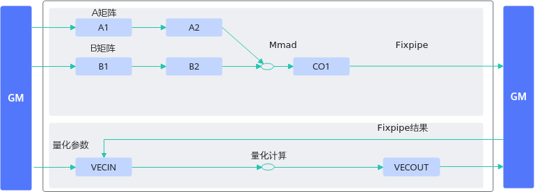
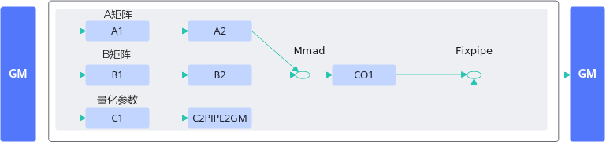

# 通过FP Buffer存放量化参数实现高效随路量化-矩阵计算-SIMD算子性能优化-算子实践参考-Ascend C算子开发-算子开发-CANN社区版8.5.0开发文档-昇腾社区

**页面ID:** atlas_ascendc_best_practices_10_0022
**来源：** https://www.hiascend.com/document/detail/zh/CANNCommunityEdition/850/opdevg/Ascendcopdevg/atlas_ascendc_best_practices_10_0022.html
---

# 通过FP Buffer存放量化参数实现高效随路量化

【优先级】高

【描述】算子实现中对矩阵乘结果进行量化计算时，可将量化参数搬运到C2PIPE2GM(Fixpipe Buffer)上，调用一次Fixpipe接口实现矩阵乘结果的量化计算。相比于将矩阵乘的结果从CO1(L0C)搬运到GM，再从GM搬运到UB，在UB进行量化计算的过程，数据搬运的次数更少，内存使用效率更高。

【反例】

对矩阵乘结果进行量化计算的过程如下：

- 将矩阵乘的结果从CO1搬运到workspace上；
- 再从workspace搬运到UB上；
- 将量化参数搬运到UB上，和矩阵乘的结果一起在UB上进行一系列量化计算；
- 将最终量化结果从UB搬运到GM上。

| 123456789101112131415161718192021222324252627282930313233343536373839404142434445464748495051525354555657585960616263646566676869707172737475767778798081828384858687888990919293949596979899100101102103104105106107108109110111112113114115116117118119120121122123124125126127128129130131132133134135136137138139140141142143144145146147148149150151152153154155156157 | ...// 该样例仅做示例说明，非完整代码，省略了部分同步控制代码public:__aicore__inlineKernelSample(){aSize=m*k;bSize=k*n;cSize=m*n;}__aicore__inlinevoidInit(__gm__uint8_t*a,__gm__uint8_t*b,__gm__uint8_t*c,__gm__uint8_t*deqTensor){aGM.SetGlobalBuffer((__gm__half*)a);bGM.SetGlobalBuffer((__gm__half*)b);cGM.SetGlobalBuffer((__gm__float*)c);deqGM.SetGlobalBuffer((__gm__half*)deqTensor);pipe.InitBuffer(inQueueA1,1,aSize*sizeof(half));pipe.InitBuffer(inQueueA2,1,aSize*sizeof(half));pipe.InitBuffer(inQueueB1,1,bSize*sizeof(half));pipe.InitBuffer(inQueueB2,2,bSize*sizeof(half));pipe.InitBuffer(outQueueCO1,1,cSize*sizeof(float));pipe.InitBuffer(inQueueSrc0,1,cSize*sizeof(float));pipe.InitBuffer(inQueueTmp,1,cSize*sizeof(half));pipe.InitBuffer(inQueueDeq,1,cSize*sizeof(half));pipe.InitBuffer(outQueueDst,1,cSize*sizeof(int8_t));}__aicore__inlinevoidProcess(){CopyIn();SplitA();SplitB();Compute();CopyOut();CopyIn1();Compute1();CopyOut1();}private:__aicore__inlinevoidCopyIn(){LocalTensor<half>a1Local=inQueueA1.AllocTensor<half>();LocalTensor<half>b1Local=inQueueB1.AllocTensor<half>();LocalTensor<half>deqLocal=inQueueDeq.AllocTensor<half>();Nd2NzParamsdataCopyA1Params;dataCopyA1Params.ndNum=1;dataCopyA1Params.nValue=m;dataCopyA1Params.dValue=k;dataCopyA1Params.srcNdMatrixStride=0;dataCopyA1Params.srcDValue=k;dataCopyA1Params.dstNzC0Stride=m;dataCopyA1Params.dstNzNStride=1;dataCopyA1Params.dstNzMatrixStride=0;DataCopy(a1Local,aGM,dataCopyA1Params);Nd2NzParamsdataCopyB1Params;dataCopyB1Params.ndNum=1;dataCopyB1Params.nValue=k;dataCopyB1Params.dValue=n;dataCopyB1Params.srcNdMatrixStride=0;dataCopyB1Params.srcDValue=n;dataCopyB1Params.dstNzC0Stride=k;dataCopyB1Params.dstNzNStride=1;dataCopyB1Params.dstNzMatrixStride=0;DataCopy(b1Local,bGM,dataCopyB1Params);// 将量化参数搬运到UBDataCopy(deqLocal,deqGM,cSize);inQueueA1.EnQue(a1Local);inQueueB1.EnQue(b1Local);inQueueDeq.EnQue(deqLocal);}__aicore__inlinevoidSplitA(){...}__aicore__inlinevoidSplitB(){...}__aicore__inlinevoidCompute(){LocalTensor<half>a2Local=inQueueA2.DeQue<half>();LocalTensor<half>b2Local=inQueueB2.DeQue<half>();LocalTensor<float>c1Local=outQueueCO1.AllocTensor<float>();MmadParamsmmadParams;mmadParams.m=m;mmadParams.n=n;mmadParams.k=k;// 矩阵乘Mmad(c1Local,a2Local,b2Local,mmadParams);// m*noutQueueCO1.EnQue<float>(c1Local);inQueueA2.FreeTensor(a2Local);inQueueB2.FreeTensor(b2Local);}__aicore__inlinevoidCopyOut(){LocalTensor<float>c1Local=outQueueCO1.DeQue<float>();GM_ADDRusrWorkspace=AscendC:GetUserWorkspace(workspace);xGm.SetGlobalBuffer((__gm__float*)(usrWorkspace));FixpipeParamsV220fixpipeParams;fixpipeParams.nSize=n;fixpipeParams.mSize=m;fixpipeParams.srcStride=m;fixpipeParams.dstStride=n;fixpipeParams.ndNum=1;fixpipeParams.srcNdStride=0;fixpipeParams.dstNdStride=0;// 将矩阵乘的计算结果从CO1搬运到workspaceFixpipe(xGm,c1Local,fixpipeParams);outQueueCO1.FreeTensor(c1Local);}__aicore__inlinevoidCopyIn1(){// 将矩阵乘的计算结果从workspace搬运到UBLocalTensor<float>src0Local=inQueueSrc0.AllocTensor<float>();DataCopy(src0Local,xGm,cSize);inQueueSrc0.EnQue(src0Local);}__aicore__inlinevoidCompute1(){LocalTensor<float>src0Local=inQueueSrc0.DeQue<float>();LocalTensor<half>tmpLocal=inQueueTmp.AllocTensor<half>();LocalTensor<half>deqLocal=inQueueDeq.DeQue<half>();LocalTensor<int8_t>dstLocal=outQueueDst.AllocTensor<int8_t>();// 量化计算Cast(tmpLocal,src0Local,RoundMode:CAST_NONE,cSize);LocalTensor<half>tmpHalfBuffer=src0Local.ReinterpretCast<half>();Mul(tmpHalfBuffer,tmpLocal,deqLocal,cSize);Cast(dstLocal,tmpHalfBuffer,RoundMode:CAST_NONE,cSize);outQueueDst.EnQue<int8_t>(dstLocal);inQueueSrc0.FreeTensor(src0Local);inQueueTmp.FreeTensor(tmpLocal);inQueueDeq.FreeTensor(deqLocal);}__aicore__inlinevoidCopyOut1(){...}private:TPipepipe;TQue<TPosition:A1,1>inQueueA1;TQue<TPosition:A2,1>inQueueA2;TQue<TPosition:B1,1>inQueueB1;TQue<TPosition:B2,1>inQueueB2;TQue<TPosition:CO1,1>outQueueCO1;TQue<TPosition:VECIN,1>inQueueDeq;TQue<TPosition:VECIN,1>inQueueSrc0;TQue<TPosition:VECCALC,1>inQueueTmp;TQue<TPosition:VECOUT,1>outQueueDst;GlobalTensor<half>aGM;GlobalTensor<half>bGM;GlobalTensor<float>cGM;GlobalTensor<float>biasGM;uint16_tm=32,k=32,n=32;uint16_taSize,bSize,cSize;... |
| --------------------------------------------------------------------------------------------------------------------------------------------------------------------------------------------------------------------------------------------------------------------------------------------------------------------------------------------------------------------------- | --------------------------------------------------------------------------------------------------------------------------------------------------------------------------------------------------------------------------------------------------------------------------------------------------------------------------------------------------------------------------------------------------------------------------------------------------------------------------------------------------------------------------------------------------------------------------------------------------------------------------------------------------------------------------------------------------------------------------------------------------------------------------------------------------------------------------------------------------------------------------------------------------------------------------------------------------------------------------------------------------------------------------------------------------------------------------------------------------------------------------------------------------------------------------------------------------------------------------------------------------------------------------------------------------------------------------------------------------------------------------------------------------------------------------------------------------------------------------------------------------------------------------------------------------------------------------------------------------------------------------------------------------------------------------------------------------------------------------------------------------------------------------------------------------------------------------------------------------------------------------------------------------------------------------------------------------------------------------------------------------------------------------------------------------------------------------------------------------------------------------------------------------------------------------------------------------------------------------------------------------------------------------------------------------------------------------------------------------------------------------------------------------------------------------------------------------------------------------------------------------------------------------------------------------------------------------------------------------------------------------------------------------------------------------------------------------------------------------------------------------------------------------------------------------------------------------------------------------------------------------------------------------------------------------------------------------------------------------------------------------------------------------------------------------------------------------------------------------------------------------------------------------------------------------------------------------------------------------------------------------------------------------------------------------------------------------------------------------------------------------------------------------------------------------------------------------------------------------------------------------------------------------------------------------------------------------------------------------------------------------------------------------------------------------------------------------------------------------------------------------------------------------------------------------------------------------------------------------------------------------------------------------------------------------------------------------------------------------------------------------------------------------------------------------------------------------------------------------------------------------------------------------------------------------------------------------------------------------------------------------------------------------------------------------------------------------------------- |

【正例】

该算子对矩阵乘的结果进行量化计算时，可将量化参数搬运到FB(Fixpipe Buffer)上，调用一次Fixpipe接口实现矩阵乘结果的量化计算。

| 123456789101112131415161718192021222324252627282930313233343536373839404142434445464748495051525354555657585960616263646566676869707172737475767778798081828384858687888990919293949596979899100101102103104105106107108109110111112113114115116117118119120121122123124125126127128129130131132 | ...public:__aicore__inlineKernelSample(){aSize=m*k;bSize=k*n;cSize=m*n;QuantSize=n;}__aicore__inlinevoidInit(__gm__uint8_t*a,__gm__uint8_t*b,__gm__uint8_t*c,__gm__uint8_t*deqTensor){aGM.SetGlobalBuffer((__gm__half*)a);bGM.SetGlobalBuffer((__gm__half*)b);cGM.SetGlobalBuffer((__gm__float*)c);deqGM.SetGlobalBuffer((__gm__uint64_t*)deqTensor);pipe.InitBuffer(inQueueA1,1,aSize*sizeof(half));pipe.InitBuffer(inQueueA2,1,aSize*sizeof(half));pipe.InitBuffer(inQueueB1,1,bSize*sizeof(half));pipe.InitBuffer(inQueueB2,2,bSize*sizeof(half));pipe.InitBuffer(outQueueCO1,1,cSize*sizeof(float));pipe.InitBuffer(inQueueDeq1,1,QuantSize*sizeof(uint64_t));pipe.InitBuffer(inQueueDeq,1,QuantSize*sizeof(uint64_t));}__aicore__inlinevoidProcess(){CopyIn();SplitA();SplitB();SplitDeq();Compute();CopyOut();}private:__aicore__inlinevoidCopyIn(){LocalTensor<half>a1Local=inQueueA1.AllocTensor<half>();LocalTensor<half>b1Local=inQueueB1.AllocTensor<half>();LocalTensor<uint64_t>deq1Local=inQueueDeq1.AllocTensor<uint64_t>();Nd2NzParamsdataCopyA1Params;dataCopyA1Params.ndNum=1;dataCopyA1Params.nValue=m;dataCopyA1Params.dValue=k;dataCopyA1Params.srcNdMatrixStride=0;dataCopyA1Params.srcDValue=k;dataCopyA1Params.dstNzC0Stride=m;dataCopyA1Params.dstNzNStride=1;dataCopyA1Params.dstNzMatrixStride=0;DataCopy(a1Local,aGM,dataCopyA1Params);Nd2NzParamsdataCopyB1Params;dataCopyB1Params.ndNum=1;dataCopyB1Params.nValue=k;dataCopyB1Params.dValue=n;dataCopyB1Params.srcNdMatrixStride=0;dataCopyB1Params.srcDValue=n;dataCopyB1Params.dstNzC0Stride=k;dataCopyB1Params.dstNzNStride=1;dataCopyB1Params.dstNzMatrixStride=0;DataCopy(b1Local,bGM,dataCopyB1Params);// 将量化参数搬运到L1上DataCopy(deq1Local,deqGM,QuantSize);inQueueA1.EnQue(a1Local);inQueueB1.EnQue(b1Local);inQueueDeq.EnQue(deq1Local);}__aicore__inlinevoidSplitA(){...}__aicore__inlinevoidSplitB(){...}__aicore__inlinevoidSplitDeq(){LocalTensor<uint64_t>deq1Local=inQueueDeq1.DeQue<uint64_t>();LocalTensor<uint64_t>deqLocal=inQueueDeq.AllocTensor<uint64_t>();// 将量化参数从L1->FBDataCopy(deqLocal,deq1Local,{1,(uint16_t)(QuantSize*sizeof(uint64_t)/128),0,0});inQueueDeq.EnQue<uint64_t>(deqLocal);inQueueDeq1.FreeTensor(deq1Local);}__aicore__inlinevoidCompute(){LocalTensor<half>a2Local=inQueueA2.DeQue<half>();LocalTensor<half>b2Local=inQueueB2.DeQue<half>();LocalTensor<float>c1Local=outQueueCO1.AllocTensor<float>();MmadParamsmmadParams;mmadParams.m=m;mmadParams.n=n;mmadParams.k=k;// 矩阵乘Mmad(c1Local,a2Local,b2Local,mmadParams);// m*noutQueueCO1.EnQue<float>(c1Local);inQueueA2.FreeTensor(a2Local);inQueueB2.FreeTensor(b2Local);}__aicore__inlinevoidCopyOut(){LocalTensor<float>c1Local=outQueueCO1.DeQue<float>();LocalTensor<uint64_t>deqLocal=inQueueDeq.DeQue<uint64_t>();SetFixpipeNz2ndFlag(1,0,0);DataCopyCO12DstParamsdataCopyParams;dataCopyParams.nSize=n;dataCopyParams.mSize=m;dataCopyParams.srcStride=m;dataCopyParams.dstStride=n;dataCopyParams.quantPre=QuantMode_t:VQF322B8_PRE;dataCopyParams.nz2ndEn=true;// 将矩阵乘进行量化后的计算结果搬出DataCopy(cGM,c1Local,DataCopyCO12DstParams);outQueueCO1.FreeTensor(c1Local);}private:TPipepipe;TQue<QuePosition:A1,1>inQueueA1;TQue<QuePosition:A2,1>inQueueA2;TQue<QuePosition:B1,1>inQueueB1;TQue<QuePosition:B2,1>inQueueB2;TQue<QuePosition:C1,1>inQueueDeq1;TQue<QuePosition:C2PIPE2GM,1>inQueueDeq;TQue<QuePosition:CO1,1>outQueueCO1;GlobalTensor<half>aGM;GlobalTensor<half>bGM;GlobalTensor<float>cGM;GlobalTensor<uint64_t>deqTensorGM;uint16_tm=32,k=32,n=32;uint16_taSize,bSize,cSize,QuantSize;... |
| ------------------------------------------------------------------------------------------------------------------------------------------------------------------------------------------------------------------------------------------------------------------------------------------------ | --------------------------------------------------------------------------------------------------------------------------------------------------------------------------------------------------------------------------------------------------------------------------------------------------------------------------------------------------------------------------------------------------------------------------------------------------------------------------------------------------------------------------------------------------------------------------------------------------------------------------------------------------------------------------------------------------------------------------------------------------------------------------------------------------------------------------------------------------------------------------------------------------------------------------------------------------------------------------------------------------------------------------------------------------------------------------------------------------------------------------------------------------------------------------------------------------------------------------------------------------------------------------------------------------------------------------------------------------------------------------------------------------------------------------------------------------------------------------------------------------------------------------------------------------------------------------------------------------------------------------------------------------------------------------------------------------------------------------------------------------------------------------------------------------------------------------------------------------------------------------------------------------------------------------------------------------------------------------------------------------------------------------------------------------------------------------------------------------------------------------------------------------------------------------------------------------------------------------------------------------------------------------------------------------------------------------------------------------------------------------------------------------------------------------------------------------------------------------------------------------------------------------------------------------------------------------------------------------------------------------------------------------------------------------------------------------------------------------------------------------------------------------------------------------------------------------------------------------------------------------------------------------------------------------------------------------------------------------------------------------------------------------------------------------------------------------------------------------------------------------------------------------------------------------------------------------------------------------------------------------------------------------------------------------------------------------------------------------------------------------------------------------------------------------------------------------------------------------------------------------------------------------------------------------------------------------------------------------------------------- |
