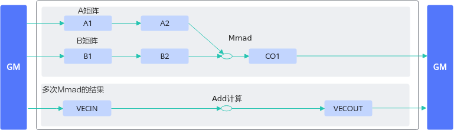
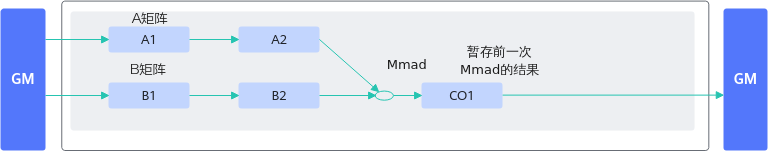

# 通过L0C Buffer数据暂存实现高效的矩阵乘结果累加-矩阵计算-SIMD算子性能优化-算子实践参考-Ascend C算子开发-算子开发-CANN社区版8.5.0开发文档-昇腾社区

**页面ID:** atlas_ascendc_best_practices_10_0023
**来源：** https://www.hiascend.com/document/detail/zh/CANNCommunityEdition/850/opdevg/Ascendcopdevg/atlas_ascendc_best_practices_10_0023.html
---

# 通过L0C Buffer数据暂存实现高效的矩阵乘结果累加

【优先级】高

【描述】算子实现中对矩阵乘的结果进行累加时（比如矩阵A1 * B1 + A2 * B2...结果的累加），可将前一次矩阵乘的结果暂存在CO1(L0C)上，调用Mmad接口实现矩阵乘结果累加。相比于每次矩阵乘的结果从CO1搬运到GM上，再搬运到UB上进行累加计算，可减少数据搬运的次数，提升内存使用效率。

【反例】

优化前，算子进行2次矩阵乘结果累加的过程如下：

- 将前一次矩阵乘的计算结果从CO1搬运到workspace上，再从workspace搬运到UB上；
- 下一次矩阵乘计算重复完成上述步骤将结果搬运到UB上；
- 在UB上将2次矩阵乘的结果相加。

当需要累加n次矩阵乘时，分别增加了n次CO1->workspace、workspace->UB搬运以及n次Add运算。

| 123456789101112131415161718192021222324252627282930313233343536373839404142434445464748495051525354555657585960616263646566676869707172737475767778798081828384858687888990919293949596979899100101102103104105106107108109110111112113114115116117118119120121122123124125126127128129130131132133134135136137138139140141142143144145146147148149150151152153154155156157158159160161162163164165166167168169170171172173174175176177178179180181182183184185186187188189190191192193 | ...// 该样例仅做示例说明，非完整代码，省略了部分同步控制代码public:__aicore__inlineKernelSample(){aSize=m*k;bSize=k*n;cSize=m*n;}__aicore__inlinevoidInit(__gm__uint8_t*a,__gm__uint8_t*b,__gm__uint8_t*c){aGM.SetGlobalBuffer((__gm__half*)a);bGM.SetGlobalBuffer((__gm__half*)b);cGM.SetGlobalBuffer((__gm__float*)c);pipe.InitBuffer(inQueueA1,1,aSize*sizeof(half));pipe.InitBuffer(inQueueA2,1,aSize*sizeof(half));pipe.InitBuffer(inQueueB1,1,bSize*sizeof(half));pipe.InitBuffer(inQueueB2,2,bSize*sizeof(half));pipe.InitBuffer(outQueueCO1,1,cSize*sizeof(float));pipe.InitBuffer(inQueueSrc0,1,cSize*sizeof(float));pipe.InitBuffer(inQueueSrc1,1,cSize*sizeof(float));pipe.InitBuffer(outQueueDst,1,cSize*sizeof(float));}__aicore__inlinevoidProcess(){// 第一次矩阵乘计算CopyIn();SplitA();SplitB();Compute();// 将第一次矩阵乘的结果搬出CopyOut();// 将第一次矩阵乘的结果搬运到UBCopyIn1();// 第二次矩阵乘计算Compute1();// 将第一次矩阵乘的结果搬出CopyOut1();// 将第二次矩阵乘的结果搬运到UBCopyIn1();// 将两次矩阵乘的结果累加Compute2();CopyOut2();}private:__aicore__inlinevoidCopyIn(){LocalTensor<half>a1Local=inQueueA1.AllocTensor<half>();LocalTensor<half>b1Local=inQueueB1.AllocTensor<half>();Nd2NzParamsdataCopyA1Params;dataCopyA1Params.ndNum=1;dataCopyA1Params.nValue=m;dataCopyA1Params.dValue=k;dataCopyA1Params.srcNdMatrixStride=0;dataCopyA1Params.srcDValue=k;dataCopyA1Params.dstNzC0Stride=m;dataCopyA1Params.dstNzNStride=1;dataCopyA1Params.dstNzMatrixStride=0;DataCopy(a1Local,aGM,dataCopyA1Params);Nd2NzParamsdataCopyB1Params;dataCopyB1Params.ndNum=1;dataCopyB1Params.nValue=k;dataCopyB1Params.dValue=n;dataCopyB1Params.srcNdMatrixStride=0;dataCopyB1Params.srcDValue=n;dataCopyB1Params.dstNzC0Stride=k;dataCopyB1Params.dstNzNStride=1;dataCopyB1Params.dstNzMatrixStride=0;DataCopy(b1Local,bGM,dataCopyB1Params);inQueueA1.EnQue<half>(a1Local);inQueueB1.EnQue<half>(b1Local);}__aicore__inlinevoidSplitA(){...}__aicore__inlinevoidSplitB(){...}__aicore__inlinevoidCompute(){LocalTensor<half>a2Local=inQueueA2.DeQue<half>();LocalTensor<half>b2Local=inQueueB2.DeQue<half>();LocalTensor<float>c1Local=outQueueCO1.AllocTensor<float>();MmadParamsmmadParams;mmadParams.m=m;mmadParams.n=n;mmadParams.k=k;// 矩阵乘Mmad(c1Local,a2Local,b2Local,mmadParams);outQueueCO1.EnQue<float>(c1Local);inQueueA2.EnQue<half>(a2Local);inQueueB2.EnQue<half>(b2Local);}__aicore__inlinevoidCopyOut(){LocalTensor<float>c1Local=outQueueCO1.DeQue<float>();GM_ADDRusrWorkspace=AscendC:GetUserWorkspace(workspace);xGm.SetGlobalBuffer((__gm__float*)(usrWorkspace));FixpipeParamsV220fixpipeParams;fixpipeParams.nSize=n;fixpipeParams.mSize=m;fixpipeParams.srcStride=m;fixpipeParams.dstStride=n;fixpipeParams.ndNum=1;fixpipeParams.srcNdStride=0;fixpipeParams.dstNdStride=0;// 将矩阵乘的计算结果从CO1搬运到workspaceFixpipe(xGm,c1Local,fixpipeParams);outQueueCO1.EnQue<float>(c1Local);}__aicore__inlinevoidCopyIn1(){LocalTensor<float>src0Local=inQueueSrc0.AllocTensor<float>();// 将矩阵乘的计算结果从workspace搬运到UBDataCopy(src0Local,xGm,cSize);inQueueSrc0.EnQue<float>(src0Local);}__aicore__inlinevoidCompute1(){LocalTensor<half>a2Local=inQueueA2.DeQue<half>();LocalTensor<half>b2Local=inQueueB2.DeQue<half>();LocalTensor<float>c1Local=outQueueCO1.DeQue<float>();MmadParamsmmadParams;mmadParams.m=m;mmadParams.n=n;mmadParams.k=k;// 矩阵乘Mmad(c1Local,a2Local,b2Local,mmadParams);outQueueCO1.EnQue<float>(c1Local);inQueueA2.FreeTensor(a2Local);inQueueB2.FreeTensor(b2Local);}__aicore__inlinevoidCopyOut1(){LocalTensor<float>c1Local=outQueueCO1.DeQue<float>();FixpipeParamsV220fixpipeParams;fixpipeParams.nSize=n;fixpipeParams.mSize=m;fixpipeParams.srcStride=m;fixpipeParams.dstStride=n;fixpipeParams.ndNum=1;fixpipeParams.srcNdStride=0;fixpipeParams.dstNdStride=0;// 将矩阵乘的计算结果从CO1搬运到workspaceFixpipe(xGm,c1Local,fixpipeParams);outQueueCO1.FreeTensor(c1Local);}__aicore__inlinevoidCopyIn2(){PipeBarrier<PIPE_ALL>();LocalTensor<float>src1Local=inQueueSrc1.AllocTensor<float>();// 将矩阵乘的计算结果从workspace搬运到UBDataCopy(src1Local,xGm,cSize);inQueueSrc1.EnQue<float>(src1Local);}__aicore__inlinevoidCompute2(){LocalTensor<float>src0Local=inQueueSrc0.DeQue<float>();LocalTensor<float>src1Local=inQueueSrc1.DeQue<float>();LocalTensor<float>dstLocal=outQueueDst.AllocTensor<float>();// 两次矩阵乘的结果相加Add(dstLocal,src0Local,src1Local,cSize);outQueueDst.EnQue<float>(dstLocal);inQueueSrc0.FreeTensor(src0Local);inQueueSrc1.FreeTensor(src1Local);}__aicore__inlinevoidCopyOut2(){...}private:TPipepipe;TQue<TPosition:A1,1>inQueueA1;TQue<TPosition:A2,1>inQueueA2;TQue<TPosition:B1,1>inQueueB1;TQue<TPosition:B2,1>inQueueB2;TQue<TPosition:CO1,1>outQueueCO1;TQue<TPosition:VECIN,1>inQueueSrc0;TQue<TPosition:VECIN,1>inQueueSrc1;TQue<TPosition:VECOUT,1>outQueueDst;GlobalTensor<half>aGM;GlobalTensor<half>bGM;GlobalTensor<float>cGM;uint16_tm=32,k=32,n=32;uint16_taSize,bSize,cSize;... |
| --------------------------------------------------------------------------------------------------------------------------------------------------------------------------------------------------------------------------------------------------------------------------------------------------------------------------------------------------------------------------------------------------------------------------------------------------------------------------------------- | --------------------------------------------------------------------------------------------------------------------------------------------------------------------------------------------------------------------------------------------------------------------------------------------------------------------------------------------------------------------------------------------------------------------------------------------------------------------------------------------------------------------------------------------------------------------------------------------------------------------------------------------------------------------------------------------------------------------------------------------------------------------------------------------------------------------------------------------------------------------------------------------------------------------------------------------------------------------------------------------------------------------------------------------------------------------------------------------------------------------------------------------------------------------------------------------------------------------------------------------------------------------------------------------------------------------------------------------------------------------------------------------------------------------------------------------------------------------------------------------------------------------------------------------------------------------------------------------------------------------------------------------------------------------------------------------------------------------------------------------------------------------------------------------------------------------------------------------------------------------------------------------------------------------------------------------------------------------------------------------------------------------------------------------------------------------------------------------------------------------------------------------------------------------------------------------------------------------------------------------------------------------------------------------------------------------------------------------------------------------------------------------------------------------------------------------------------------------------------------------------------------------------------------------------------------------------------------------------------------------------------------------------------------------------------------------------------------------------------------------------------------------------------------------------------------------------------------------------------------------------------------------------------------------------------------------------------------------------------------------------------------------------------------------------------------------------------------------------------------------------------------------------------------------------------------------------------------------------------------------------------------------------------------------------------------------------------------------------------------------------------------------------------------------------------------------------------------------------------------------------------------------------------------------------------------------------------------------------------------------------------------------------------------------------------------------------------------------------------------------------------------------------------------------------------------------------------------------------------------------------------------------------------------------------------------------------------------------------------------------------------------------------------------------------------------------------------------------------------------------------------------------------------------------------------------------------------------------------------------------------------------------------------------------------------------------------------------------------------------------------------------------------------------------------------------------------------------------------------------------------------------------------------------------------------------------------------------------------------------------------------------------------------------------------------------------------------------------------------------------------------------------------------------------------------------------------------------------------------------------------------------------------------------------------------------------------------------------------------------------------------------------------------------------- |

【正例】

通过优化，算子对矩阵乘结果累加时，可将前一次矩阵乘的结果暂存在L0C上，通过Mmad接口参数cmatrixInitVal和cmatrixSource配置C矩阵的初始值，只调用2次Mmad接口实现2次矩阵乘结果累加。

| 123456789101112131415161718192021222324252627282930313233343536373839404142434445464748495051525354555657585960616263646566676869707172737475767778798081828384858687888990919293949596979899100101102103104105106107108109110111112113114 | ...// 该样例仅做示例说明，非完整代码，省略了部分同步控制代码public:__aicore__inlineKernelSample(){aSize=m*k;bSize=k*n;cSize=m*n;}__aicore__inlinevoidInit(__gm__uint8_t*a,__gm__uint8_t*b,__gm__uint8_t*c){aGM.SetGlobalBuffer((__gm__half*)a);bGM.SetGlobalBuffer((__gm__half*)b);cGM.SetGlobalBuffer((__gm__float*)c);pipe.InitBuffer(inQueueA1,1,aSize*sizeof(half));pipe.InitBuffer(inQueueA2,1,aSize*sizeof(half));pipe.InitBuffer(inQueueB1,1,bSize*sizeof(half));pipe.InitBuffer(inQueueB2,2,bSize*sizeof(half));pipe.InitBuffer(outQueueCO1,1,cSize*sizeof(float));}__aicore__inlinevoidProcess(){CopyIn();SplitA();SplitB();Compute();CopyOut();}private:__aicore__inlinevoidCopyIn(){LocalTensor<half>a1Local=inQueueA1.AllocTensor<half>();LocalTensor<half>b1Local=inQueueB1.AllocTensor<half>();Nd2NzParamsdataCopyA1Params;dataCopyA1Params.ndNum=1;dataCopyA1Params.nValue=m;dataCopyA1Params.dValue=k;dataCopyA1Params.srcNdMatrixStride=0;dataCopyA1Params.srcDValue=k;dataCopyA1Params.dstNzC0Stride=m;dataCopyA1Params.dstNzNStride=1;dataCopyA1Params.dstNzMatrixStride=0;DataCopy(a1Local,aGM,dataCopyA1Params);Nd2NzParamsdataCopyB1Params;dataCopyB1Params.ndNum=1;dataCopyB1Params.nValue=k;dataCopyB1Params.dValue=n;dataCopyB1Params.srcNdMatrixStride=0;dataCopyB1Params.srcDValue=n;dataCopyB1Params.dstNzC0Stride=k;dataCopyB1Params.dstNzNStride=1;dataCopyB1Params.dstNzMatrixStride=0;DataCopy(b1Local,bGM,dataCopyB1Params);inQueueA1.EnQue(a1Local);inQueueB1.EnQue(b1Local);}__aicore__inlinevoidSplitA(){...}__aicore__inlinevoidSplitB(){...}__aicore__inlinevoidCompute(){LocalTensor<half>a2Local=inQueueA2.DeQue<half>();LocalTensor<half>b2Local=inQueueB2.DeQue<half>();LocalTensor<float>c1Local=outQueueCO1.AllocTensor<float>();MmadParamsmmadParams;mmadParams.m=m;mmadParams.n=n;mmadParams.k=k;// 第一次矩阵乘Mmad(c1Local,a2Local,b2Local,mmadParams);PipeBarrier<PIPE_M>();// 第二次矩阵乘累加第一次矩阵乘的结果mmadParams.cmatrixInitVal=false;Mmad(c1Local,a2Local,b2Local,c1Local,mmadParams);outQueueCO1.EnQue<float>(c1Local);inQueueA2.FreeTensor(a2Local);inQueueB2.FreeTensor(b2Local);}__aicore__inlinevoidCopyOut(){LocalTensor<float>c1Local=outQueueCO1.DeQue<float>();FixpipeParamsV220fixpipeParams;fixpipeParams.nSize=n;fixpipeParams.mSize=m;fixpipeParams.srcStride=m;fixpipeParams.dstStride=n;fixpipeParams.ndNum=1;fixpipeParams.srcNdStride=0;fixpipeParams.dstNdStride=0;Fixpipe(cGM,c1Local,fixpipeParams);outQueueCO1.FreeTensor(c1Local);}private:TPipepipe;TQue<TPosition:A1,1>inQueueA1;TQue<TPosition:A2,1>inQueueA2;TQue<TPosition:B1,1>inQueueB1;TQue<TPosition:B2,1>inQueueB2;TQue<TPosition:CO1,1>outQueueCO1;GlobalTensor<half>aGM;GlobalTensor<half>bGM;GlobalTensor<dst_T>cGM;uint16_tm=32,k=32,n=32;uint16_taSize,bSize,cSize; |
| ------------------------------------------------------------------------------------------------------------------------------------------------------------------------------------------------------------------------------------------ | --------------------------------------------------------------------------------------------------------------------------------------------------------------------------------------------------------------------------------------------------------------------------------------------------------------------------------------------------------------------------------------------------------------------------------------------------------------------------------------------------------------------------------------------------------------------------------------------------------------------------------------------------------------------------------------------------------------------------------------------------------------------------------------------------------------------------------------------------------------------------------------------------------------------------------------------------------------------------------------------------------------------------------------------------------------------------------------------------------------------------------------------------------------------------------------------------------------------------------------------------------------------------------------------------------------------------------------------------------------------------------------------------------------------------------------------------------------------------------------------------------------------------------------------------------------------------------------------------------------------------------------------------------------------------------------------------------------------------------------------------------------------------------------------------------------------------------------------------------------------------------------------------------------------------------------------------------------------------------------------------------------------------------------------------------------------------------------------------------------------------------------------------------------------------------------------------------------------------------------------------------------------------------------------------------------------------------------------------------------------------------------------------------------------------------------------------------------------------------------------------------------------------------------------------------------------------------------------------------------------------------------------------------------------------------------------------------------------------------------------------------------------------------------------------------------------- |
