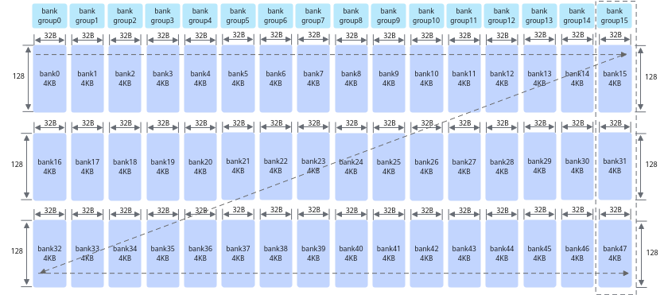

# 避免Unified Buffer的bank冲突-内存访问-SIMD算子性能优化-算子实践参考-Ascend C算子开发-算子开发-CANN社区版8.5.0开发文档-昇腾社区

**页面ID:** atlas_ascendc_best_practices_10_0025
**来源：** https://www.hiascend.com/document/detail/zh/CANNCommunityEdition/850/opdevg/Ascendcopdevg/atlas_ascendc_best_practices_10_0025.html
---

# 避免Unified Buffer的bank冲突

【优先级】高

【描述】为了提高数据访问的效率和吞吐量，Unified Buffer采用了bank（大小相等的内存模块）结构设计。Unified Buffer总大小为192K，划分为48个bank。每个bank由128行组成，每行长度为32B。这48个bank进一步组织为16个bank group，每个bank group包含3个bank，例如bank15、bank31和bank47组成一个bank group。

每个bank可以独立地进行数据的读写操作，允许多个数据请求同时进行。然而，当多个读写操作试图同时访问同一个bank或bank group时，由于硬件资源的限制，这些操作必须排队等待，会导致bank冲突，引起性能下降。

具体来说，Vector计算单元每拍（一个指令周期）能够从每个bank group中读取或写入一行数据。如果同一个API中的多个操作试图同时访问同一个bank或bank group，Vector计算单元无法在同一个周期内处理所有请求，导致这些请求排队等待。这种排队增加了数据访问的延迟，降低了系统的整体性能。

#### bank冲突的典型场景

bank冲突主要可以分为以下三种场景：

- 读写冲突：读操作和写操作同时尝试访问同一个bank。
- 写写冲突：多个写操作同时尝试访问同一个bank group。
- 读读冲突：多个读操作同时尝试访问同一个bank group。

下文给出了一些具体的示例，假设，0x10000地址在bank16上，0x10020在bank17上，0x20020在bank33上，如下图所示：

- 读写冲突示例
- 写写冲突示例Vector指令目的操作数dst对应的8个DataBlock(block0-block7)同时写到一个bank group时造成写写冲突，具体分析如下：表1写写冲突示例序号dst地址blk_strideblock0_addrblock1_addrblock2_addr...结论示例10x1FE00160x1FE000x200000x20200...8个DataBlock均在一个bank group下，故全部冲突，8拍完成一个Repeat的写入。示例20x1FE0080x1FE000x1FF000x20000...block0和block2在一个bank group，存在冲突，4拍完成一个Repeat的写入。

- 读读冲突Vector指令多个源操作数同时读到同一个bank group时造成读读冲突，具体分析如下：表2双src场景读读冲突示例序号src0地址src1地址bankbank group结论示例10x100200x20020bank_id0 != bank_id1bank_group_id0 == bank_group_id1存在冲突。示例20x100200x10000bank_id0 != bank_id1bank_group_id0 != bank_group_id1无冲突。Vector指令某一个源操作数对应的8个DataBlock(block0-block7)读到同一个bank group时造成读读冲突，具体分析如下：表3单src场景读读冲突示例序号src地址blk_strideblock0_addrblock1_addrblock2_addr...结论示例10x1FE00160x1FE000x200000x20200...8个DataBlock均在一个bank group下，故全部冲突，8拍完成一个Repeat的读操作。示例20x1FE0080x1FE000x1FF000x20000...block0和block2在同一个bank group下，存在冲突，4拍完成一个Repeat。

通过msProf工具可以进行资源冲突占比的相关性能数据采集。

工具的具体使用方法请参考算子调优(msProf)。资源冲突占比文件性能数据文件说明请参考ResourceConflictRatio（资源冲突占比）。

#### 如何避免bank冲突

避免bank冲突的方法有两种：优化计算逻辑和优化地址分配。

- 优化计算逻辑实现方案原始实现优化实现实现方法跳读，连续写同一Repeat内输入的8个DataBlock都在同一个bank group而发生读读冲突。连续读，跳写同一个Repeat内输入的8个DataBlock不在同一个bank group内，避免了读读冲突。示意图示例代码1234567uint64_tmask=128;UnaryRepeatParamsparams;params.dstBlkStride=1;params.srcBlkStride=16;for(uint32_ti=0;i<16;i++){AscendC:Adds(dstLocal[i*128],srcLocal[i*16],0,mask,1,params);}1234567uint64_tmask=128;UnaryRepeatParamsparams;params.dstBlkStride=8;params.srcBlkStride=1;for(uint32_ti=0;i<8;i++){AscendC:Adds(dstLocal[i*16],srcLocal[i*256],0,mask,2,params);}
- 优化地址分配实现连续4096个float元素的加法z = x + y，通过在内存分配时适当扩大内存，保证在一个Repeat内，x和y不会同时出现在同一个bank group内，x/y和z不会同时出现同一个bank内。完整样例可参考避免bank冲突样例。实现方案原始实现优化实现实现方法不做地址优化，直接使用InitBuffer分配内存，各个Tensor的地址分别为：x：起始地址0x0，tensor长度为4096 * sizeof(float)字节y：起始地址0x4000，tensor长度为4096 * sizeof(float)字节z：起始地址0x8000，tensor长度为4096 * sizeof(float)字节在一个Repeat内，x和y同时读同一个bank group，x/y和z同时读写同一个bank。优化地址，使用InitBuffer分配内存时适当扩大内存申请，各个Tensor的地址分别为：x：起始地址0x0，tensor长度为(4096 * sizeof(float) + 256)字节y：起始地址0x4100，tensor长度为(64 * 1024 - (4096 * sizeof(float) + 256))字节z：起始地址0x10000，tensor长度为4096 * sizeof(float)字节x多申请256字节，避免一个Repeat内x y同时读同一个bank group；y多申请空间，确保z不会和x/y落入同一个bank示意图示例代码123pipe.InitBuffer(inQueueX,1,4096*sizeof(float));pipe.InitBuffer(inQueueY,1,4096*sizeof(float));pipe.InitBuffer(outQueueZ,1,4096*sizeof(float));123pipe.InitBuffer(inQueueX,1,4096*sizeof(float)+256);// 多申请256字节pipe.InitBuffer(inQueueY,1,64*1024-(4096*sizeof(float)+256));//多申请空间，确保z不会和x/y落入同一个bank，64 * 1024是16个bank group的空间，4096 * sizeof(float) + 256是x所占的空间pipe.InitBuffer(outQueueZ,1,4096*sizeof(float));
