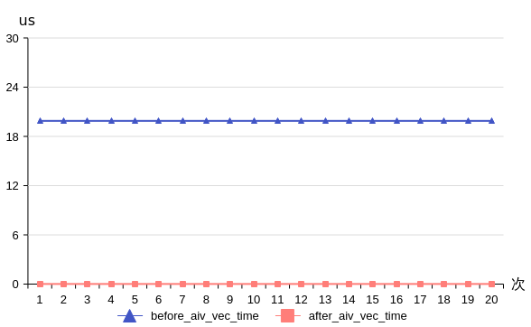

# 纯搬运类算子VECIN和VECOUT建议复用-内存访问-SIMD算子性能优化-算子实践参考-Ascend C算子开发-算子开发-CANN社区版8.5.0开发文档-昇腾社区

**页面ID:** atlas_ascendc_best_practices_10_0027
**来源：** https://www.hiascend.com/document/detail/zh/CANNCommunityEdition/850/opdevg/Ascendcopdevg/atlas_ascendc_best_practices_10_0027.html
---

# 纯搬运类算子VECIN和VECOUT建议复用

【优先级】高

【描述】纯搬运类算子在执行时并不涉及实际vector计算，若存在冗余的vector指令，会导致算子整体执行时间变长。这种场景可以使用Ascend C针对纯搬运类算子提供的TQueBind接口，该接口可以将VECIN与VECOUT绑定，省略将数据从VECIN拷贝到VECOUT的步骤，从而避免vector的无谓消耗。

【反例】

| 12345678910111213141516171819202122232425262728293031323334353637 | template<typenameComputeT>classKernelExample{public:...__aicore__inlinevoidProcess(...){for(inti=0;i<iLen;++i){...autoiLocal=QueI.AllocTensor<ComputeT>();DataCopy(iLocal,inGm[i*32],size);QueI.EnQue(iLocal);iLocal=QueI.DeQue<ComputeT>();for(intj=0;j<jLen;++j){...autooLocal=QueO.AllocTensor<ComputeT>();DataCopy(oLocal,iLocal,size);// LocalTensor -> LocalTensor的DataCopy指令，以实现数据从VECIN到VECOUT的搬运QueO.EnQue(oLocal);autooLocal=QueO.DeQue<ComputeT>();DataCopyPad(outGm[j],oLocal,...);QueO.FreeTensor(oLocal);}QueI.FreeTensor(iLocal);}}private:...TQue<TPosition:VECIN,BUFFER_NUM>QueI;TQue<TPosition:VECOUT,BUFFER_NUM>QueO;...};extern"C"__global____aicore__voidexample_kernel(...){...op.Process(...);} |
| ----------------------------------------------------------------- | ------------------------------------------------------------------------------------------------------------------------------------------------------------------------------------------------------------------------------------------------------------------------------------------------------------------------------------------------------------------------------------------------------------------------------------------------------------------------------------------------------------------------------------------------------------------------------------------------------------------------------------------------------------------------------------------------------------------------------------ |

【正例】

将LocalTensor -> LocalTensor的DataCopy指令替换为TQueBind接口，减少将VECIN拷贝到VECOUT的步骤，从而避免了冗余拷贝。

| 123456789101112131415161718192021222324252627282930 | template<typenameComputeT>classKernelExample{public:...__aicore__inlinevoidProcess(...){for(inti=0;i<iLen;++i){...autobindLocal=queBind.AllocTensor<ComputeT>();DataCopy(bindLocal,inGm[i*32],size);queBind.EnQue(bindLocal);bindLocal=queBind.DeQue<ComputeT>();for(intj=0;j<jlen;++j){...DataCopyPad(outGm[j],bindLocal,...);}queBind.FreeTensor(bindLocal);}}private:...TQueBind<TPosition:VECIN,TPosition:VECOUT,BUFFER_NUM>queBind;// 使用TQueBind替换原来的QueI，QueO...};extern"C"__global____aicore__voidexample_kernel(...){...op.Process(...);} |
| --------------------------------------------------- | --------------------------------------------------------------------------------------------------------------------------------------------------------------------------------------------------------------------------------------------------------------------------------------------------------------------------------------------------------------------------------------------------------------------------------------------------------------------------------------------------------------------------------------------------------- |

【性能对比】

如上图所示，将反例中DataCopy指令替换为TQueBind之后有明显优化。由于省略了数据从VECIN拷贝到VECOUT的步骤，aiv_vec_time几乎缩减为0。
