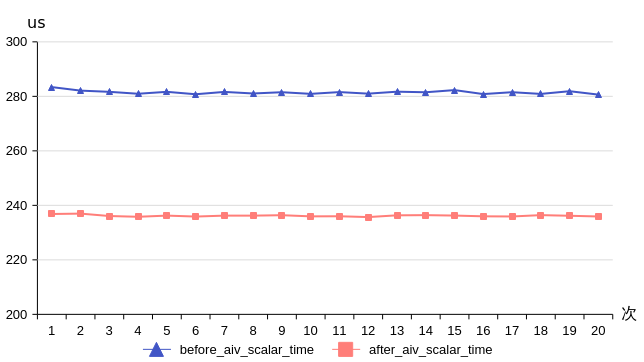
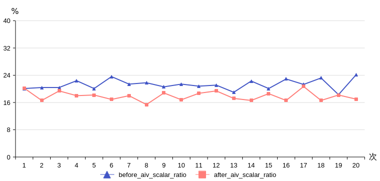

# 避免TPipe在对象内创建和初始化-头尾开销优化-SIMD算子性能优化-算子实践参考-Ascend C算子开发-算子开发-CANN社区版8.5.0开发文档-昇腾社区

**页面ID:** atlas_ascendc_best_practices_10_0028
**来源：** https://www.hiascend.com/document/detail/zh/CANNCommunityEdition/850/opdevg/Ascendcopdevg/atlas_ascendc_best_practices_10_0028.html
---

# 避免TPipe在对象内创建和初始化

【优先级】中

【编译器背景知识】创建类对象时，会分配内存空间，用于存储类中的相关成员变量或函数。当类中变量需要参与计算时，变量值从内存被加载到寄存器，计算完成后，变量从寄存器存储回内存。Scalar常量折叠和常量传播是编译器编译时的优化方式，优化前编译器会判断变量是否只初始化过一次或只赋值过一次，若满足此编译优化的前提条件，变量值将会尽量驻留在寄存器中，从而在后续使用变量时，将减少读取内存的操作，提升运行性能。

【描述】TPipe是用来管理全局内存和同步的框架，用户可以调用TPipe的接口，为TQue/TBuf进行内存分配。在编写Ascend C算子过程中，经常用一个类存放计算所需的相关变量，这里称类名为KernelExample。当TPipe对象在KernelExample类的实现中定义并初始化时，TPipe对象的内存空间在整个KernelExample对象的内存空间之中；需要注意的是，创建TPipe对象时，对象初始化会设置全局变量的TPipe指针，这导致KernelExample对象的内存有被外部污染的风险，此时编译器的编译优化将采取保守策略，不会对KernelExample对象中的Scalar变量进行常量折叠和常量传播。因此，在任何场景下，我们都建议将TPipe对象创建于KernelExample类外部，使得TPipe对象的内存空间独立于KernelExample类对象的内存空间，触发编译器对KernelExample类内Scalar的编译优化，减少算子Scalar指令耗时。

【反例】

代码中TPipe对象由KernelExample类内部创建并初始化，影响编译器Scalar折叠优化，在NPU侧导致Scalar不必要的增加。

| 123456789101112131415161718192021222324 | template<typenameComputeT>classKernelExample{public:__aicore__inlineKernelExample(){}__aicore__inlinevoidInit(...){...pipe.InitBuffer(xxxBuf,BUFFER_NUM,xxxSize);...}private:...TPipepipe;...};extern"C"__global____aicore__voidexample_kernel(...){...KernelExample<float>op;op.Init(...);...} |
| --------------------------------------- | ----------------------------------------------------------------------------------------------------------------------------------------------------------------------------------------------------------------------------------------------------------------------------------------------- |

【正例】

改为由Kernel入口函数创建TPipe对象，在KernelExample类中保存TPipe指针使用。

| 1234567891011121314151617181920212223242526 | template<typenameComputeT>classKernelExample{public:__aicore__inlineKernelExample(){}__aicore__inlinevoidInit(...,TPipe*pipeIn){...pipe=pipeIn;pipe->InitBuffer(xxxBuf,BUFFER_NUM,xxxSize);...}private:...TPipe*pipe;...};extern"C"__global____aicore__voidexample_kernel(...){...TPipepipe;KernelExample<float>op;op.Init(...,&pipe);...} |
| ------------------------------------------- | ------------------------------------------------------------------------------------------------------------------------------------------------------------------------------------------------------------------------------------------------------------------------------------------------------------------------------------------ |

【性能对比】

通过性能数据对比可以看出，Scalar优化效果显著，平均时间从281us减少到236us，下降17%；平均scalar_time时延占比从21%下降到17%。因此在Scalar bound（达到上限）的场景下可以使用此优化措施。
