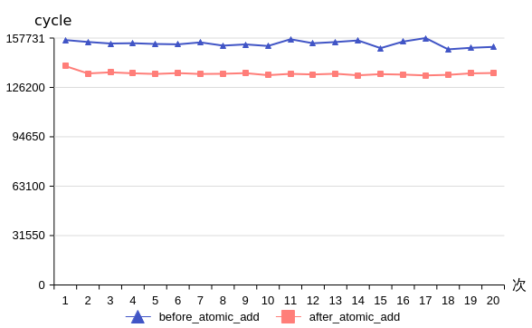

# Matmul使能AtomicAdd选项-矩阵计算-SIMD算子性能优化-算子实践参考-Ascend C算子开发-算子开发-CANN社区版8.5.0开发文档-昇腾社区

**页面ID:** atlas_ascendc_best_practices_10_0029
**来源：** https://www.hiascend.com/document/detail/zh/CANNCommunityEdition/850/opdevg/Ascendcopdevg/atlas_ascendc_best_practices_10_0029.html
---

# Matmul使能AtomicAdd选项

【优先级】中

【描述】对于Matmul得到的结果矩阵C(m, n)，若后续需要和GM上的矩阵D(m, n)进行Add操作，则可以在GetTensorC接口或者IterateAll接口的GM通路上，将enAtomic参数设为1，开启AtomicAdd累加操作，在搬出矩阵C到GM时，矩阵C的结果将直接累加到矩阵D的GM地址上，从而实现与矩阵D的Add操作。

【反例】

| 123456789101112131415161718192021222324252627282930313233 | template<classA_TYPE,classB_TYPE,classC_TYPE,classBIAS_TYPE>__aicore__inlinevoidMatMulKernel(...){...AscendC:Matmul<A_TYPE,B_TYPE,C_TYPE,BIAS_TYPE,CFG_MDL>mm;TPipepipe;REGIST_MATMUL_OBJ(&pipe,GetSysWorkSpacePtr(),mm);mm.SetTensorA(gm_a);mm.SetTensorB(gm_b);mm.SetBias(gm_bias);mm.IterateAll(gm_c);DataCopy(local_c,gm_c,c_size);DataCopy(local_d,gm_d,d_size);event_teventIdMTE2ToV=static_cast<event_t>(GetTPipePtr()->FetchEventID(HardEvent:MTE2_V));SetFlag<HardEvent:MTE2_V>(eventIdMTE2ToV);WaitFlag<HardEvent:MTE2_V>(eventIdMTE2ToV);Add(local_d,local_d,local_c,d_size);DataCopy(gm_d,local_d,d_size);...}extern"C"__global____aicore__voidexample_kernel(...){...typedefAscendC:MatmulType<TPosition:GM,CubeFormat:ND,half>aType;typedefAscendC:MatmulType<TPosition:GM,CubeFormat:ND,half>bType;typedefAscendC:MatmulType<TPosition:GM,CubeFormat:ND,float>cType;typedefAscendC:MatmulType<TPosition:GM,CubeFormat:ND,float>biasType;MatMulKernel<aType,bType,cType,biasType>(...);...} |
| --------------------------------------------------------- | --------------------------------------------------------------------------------------------------------------------------------------------------------------------------------------------------------------------------------------------------------------------------------------------------------------------------------------------------------------------------------------------------------------------------------------------------------------------------------------------------------------------------------------------------------------------------------------------------------------------------------------------------------------------------------------------------------------------------------------------------------------------------------------------------------------------------------------------------------------------------------------------------------------------------------------------------------------------------------------------------------- |

【正例】

计算Matmul结果时，调用IterateAll接口或者GetTensorC接口搬运到矩阵D的GM地址上，同时将接口中enAtomic参数设为1，搬出到GM时，Matmul结果矩阵C会累加到矩阵D上，从而得到两个矩阵Add后的结果。

| 1234567891011121314151617181920212223242526272829 | template<classA_TYPE,classB_TYPE,classC_TYPE,classBIAS_TYPE>__aicore__inlinevoidMatMulKernel(...){...AscendC:Matmul<A_TYPE,B_TYPE,C_TYPE,BIAS_TYPE,CFG_MDL>mm;TPipepipe;REGIST_MATMUL_OBJ(&pipe,GetSysWorkSpacePtr(),mm);mm.SetTensorA(gm_a);mm.SetTensorB(gm_b);mm.SetBias(gm_bias);mm.IterateAll(gm_d,1);// IterateAll接口中的enAtomic设为1// while (mm. Iterate()) {// mm.GetTensorC(gm_d, 1);     // GetTensorC接口中的enAtomic设为1// }...}extern"C"__global____aicore__voidexample_kernel(...){...typedefAscendC:MatmulType<TPosition:GM,CubeFormat:ND,half>aType;typedefAscendC:MatmulType<TPosition:GM,CubeFormat:ND,half>bType;typedefAscendC:MatmulType<TPosition:GM,CubeFormat:ND,float>cType;typedefAscendC:MatmulType<TPosition:GM,CubeFormat:ND,float>biasType;MatMulKernel<aType,bType,cType,biasType>(...);...} |
| ------------------------------------------------- | ------------------------------------------------------------------------------------------------------------------------------------------------------------------------------------------------------------------------------------------------------------------------------------------------------------------------------------------------------------------------------------------------------------------------------------------------------------------------------------------------------------------------------------------------------------------------------------------------------------------------------------------------------------------------------------------------------------------------------------------------------------------------------------------------------------------------------- |

【性能对比】

以矩阵维度M=64，N=256，K=256，矩阵D为(64, 256)为例，Matmul使能AtomicAdd选项前后的性能对比如上图所示，平均cycle数从开启AtomicAdd选项前的154181变为开启后的135054，性能优化12.4%。因此在这种场景下，使能AtomicAdd选项能获取更优的性能。
