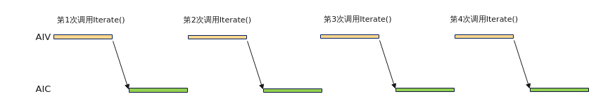
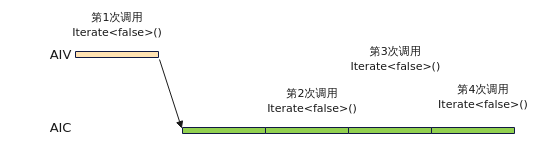

# 使能Iterate或IterateAll异步接口避免AIC/AIV同步依赖-流水编排-SIMD算子性能优化-算子实践参考-Ascend C算子开发-算子开发-CANN社区版8.5.0开发文档-昇腾社区

**页面ID:** atlas_ascendc_best_practices_10_0034
**来源：** https://www.hiascend.com/document/detail/zh/CANNCommunityEdition/850/opdevg/Ascendcopdevg/atlas_ascendc_best_practices_10_0034.html
---

# 使能Iterate或IterateAll异步接口避免AIC/AIV同步依赖

【优先级】高

【描述】在MIX场景，即AIC（AI Cube核）和AIV（AI Vector核）混合编程中，调用Matmul Iterate或者IterateAll时，AIV发送消息到AIC启动Matmul计算。若通过Iterate<true>同步方式，如图1同步方式消息发送示意图，每次调用都会触发一次消息发送，而通过Iterate<false>异步方式，如图2异步方式消息发送示意图，仅第一次需要发送消息，后续无需发送消息，从而减少Cube与Vector核间交互，减少核间通信开销。因此，MIX场景推荐使用Iterate<false>或者IterateAll<false>异步接口（注意：使用异步接口时需要设置Workspace）。

【反例】

MIX场景使用Iterate接口的同步方式。

| 12345678910111213141516 | TQueBind<TPosition:CO2,TPosition:VECIN>qVecIn;TQueBind<TPosition:VECIN,TPosition:VECOUT>qVecOut;mm.SetTensorA(gmA);mm.SetTensorB(gmB);int16_tscalar=2;while(mm.templateIterate()){autocInUB=qVecIn.AllocTensor<float>();mm.GetTensorC(cInUB);qVecIn.EnQue(cInUB);cInUB=qVecIn.DeQue<float>();autocOutUB=qVecOut.AllocTensor<float>();Muls(cOutUB,cInUB,scalar,baseM*baseN);qVecIn.FreeTensor(cInUB);...} |
| ----------------------- | -------------------------------------------------------------------------------------------------------------------------------------------------------------------------------------------------------------------------------------------------------------------------------------------------------------------------------------------------------------------------------------------------------- |

【正例】

MIX场景使用Iterate接口的异步方式。

| 1234567891011121314151617 | TQueBind<TPosition:CO2,TPosition:VECIN>qVecIn;TQueBind<TPosition:VECIN,TPosition:VECOUT>qVecOut;mm.SetTensorA(gmA);mm.SetTensorB(gmB);mm.SetWorkspace(workspace,size);//其中，workspace为临时空间的物理地址，size为singleCoreM*singleCoreN大小的矩阵C占用的内存大小：singleCoreM*singleCoreN*sizeof(float)int16_tscalar=2;while(mm.templateIterate<false>()){autocInUB=qVecIn.AllocTensor<float>();mm.GetTensorC(cInUB);qVecIn.EnQue(cInUB);cInUB=qVecIn.DeQue<float>();autocOutUB=qVecOut.AllocTensor<float>();Muls(cOutUB,cInUB,scalar,baseM*baseN);qVecIn.FreeTensor(cInUB);...} |
| ------------------------- | ----------------------------------------------------------------------------------------------------------------------------------------------------------------------------------------------------------------------------------------------------------------------------------------------------------------------------------------------------------------------------------------------------------------------------------------------------------------------------------------------------------------------------------------------------------------------------------- |
