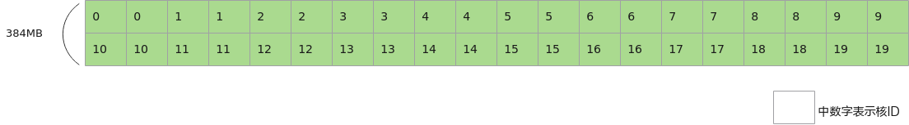
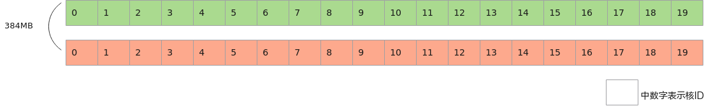

# L2 Cache切分-内存访问-SIMD算子性能优化-算子实践参考-Ascend C算子开发-算子开发-CANN社区版8.5.0开发文档-昇腾社区

**页面ID:** atlas_ascendc_best_practices_10_0036
**来源：** https://www.hiascend.com/document/detail/zh/CANNCommunityEdition/850/opdevg/Ascendcopdevg/atlas_ascendc_best_practices_10_0036.html
---

# L2 Cache切分

【优先级】：高

【描述】假设，AI处理器的L2 Cache大小为192MB，L2 Cache读写混合带宽约为7TB/s，而GM的带宽约为1.6TB/s，两者之间存在较大差距。搬入或搬出相同数据量的情况下，访问L2 Cache读写数据比GM更快。若数据无法命中L2 Cache，即需要访问的数据不在L2 Cache内，导致需要去GM上读写，带宽利用效率较低，最终算子搬入或搬出数据变为算子整个运行过程的性能瓶颈。切分策略建议：当输入和输出数据的数据量超过L2 Cache大小时，Tiling中使能L2 Cache切分策略。

【反例】

假设输入数据大小为InputTotalSize，L2 Cache大小为L2CacheSize，InputTotalSize = L2CacheSize * 2，总核数为20个核，数据未切分，整体一次完成计算。假设20个核一次可以处理共L2CacheSize的数据，则每个核至少两次读取输入数据。

| 1234567891011121314151617181920212223242526272829303132333435363738394041424344454647484950515253545556 | constexprint32_tTOTAL_LENGTH=InputTotalSize/sizeof(half);constexprint32_tUSE_CORE_NUM=20;constexprint32_tTILE_NUM=2;constexprint32_tBLOCK_LENGTH=TOTAL_LENGTH/USE_CORE_NUM;constexprint32_tTILE_LENGTH=BLOCK_LENGTH/TILE_NUM;classKernelSample{public:__aicore__inlineKernelSample(){}__aicore__inlinevoidInit(GM_ADDRx){xGm.SetGlobalBuffer((__gm__half*)x+BLOCK_LENGTH*GetBlockIdx(),BLOCK_LENGTH);yGm.SetGlobalBuffer((__gm__half*)y+BLOCK_LENGTH*GetBlockIdx(),BLOCK_LENGTH);pipe.InitBuffer(inQueueX,1,BLOCK_LENGTH*sizeof(half));pipe.InitBuffer(inQueueY,1,BLOCK_LENGTH*sizeof(half));}__aicore__inlinevoidProcess(){// 示例演示对输入数据加2的运算constexprint32_tloopCount=2;for(int32_ti=0;i<loopCount;i++){// 外层的每次循环对输入数据进行加1的运算for(int32_tj=0;j<TILE_NUM;j++){// 内层循环分别处理每个核第0块和第1块数据CopyIn(j);Compute();CopyOut(j);}}}private:__aicore__inlinevoidCopyIn(int32_tprocess){LocalTensor<half>xLocal=inQueueX.AllocTensor<half>();// 对于每个核，除了首次读取外，读取第0块数据时，L2 Cache内缓存的是第1块数据；// 对于每个核，读取第1块数据时，L2 Cache内缓存的是第0块数据；// 每个核需要4次读取GM上的数据DataCopy(xLocal,xGm[process*TILE_LENGTH],TILE_LENGTH);inQueueX.EnQue(xLocal);}__aicore__inlinevoidCompute(){LocalTensor<half>yLocal=inQueueY.AllocTensor<half>();LocalTensor<half>xLocal=inQueueX.DeQue<half>();Adds(yLocal,xLocal,1,TILE_LENGTH);inQueueY.EnQue<half>(yLocal);inQueueX.FreeTensor(xLocal);}__aicore__inlinevoidCopyOut(int32_tprocess){LocalTensor<half>yLocal=inQueueY.DeQue<half>();DataCopy(yGm[process*TILE_LENGTH],yLocal,TILE_LENGTH);inQueueY.FreeTensor(yLocal);}}... |
| ------------------------------------------------------------------------------------------------------- | ------------------------------------------------------------------------------------------------------------------------------------------------------------------------------------------------------------------------------------------------------------------------------------------------------------------------------------------------------------------------------------------------------------------------------------------------------------------------------------------------------------------------------------------------------------------------------------------------------------------------------------------------------------------------------------------------------------------------------------------------------------------------------------------------------------------------------------------------------------------------------------------------------------------------------------------------------------------------------------------------------------------------------------------------------------------------------------------------------------------------------------------------------------------------------------------------------------------------------------------------------------------------------------------------------------------------------------------------------------------------------------------------------------------------------------------------------------------------------------------------------------------------------------------------------------------------------------------------------------------------------------------------------ |

【正例】

假设输入数据大小为InputTotalSize，L2 Cache大小为L2CacheSize，InputTotalSize = L2CacheSize * 2，能使用的总核数为20个核，输入数据均等切分成2份数据，则整体分两次进行计算，每次的计算量为L2CacheSize，第一次20个核先计算前L2CacheSize个数据，第二次20个核计算后L2CacheSize个数据。每次计算前读取的数据能够命中L2 Cache，提升算子性能。

| 123456789101112131415161718192021222324252627282930313233343536373839404142434445464748495051525354555657585960616263 | constexprint32_tTOTAL_LENGTH=InputTotalSize/sizeof(half);constexprint32_tTILE_NUM=2;constexprint32_tUSE_CORE_NUM=20;constexprint32_tTILE_LENGTH=TOTAL_LENGTH/TILE_NUM;constexprint32_tBLOCK_LENGTH=TILE_LENGTH/USE_CORE_NUM;classKernelSample{public:__aicore__inlineKernelSample(){}__aicore__inlinevoidInit(GM_ADDRx,GM_ADDRy,int32_tindex){xGm.SetGlobalBuffer((__gm__half*)x+BLOCK_LENGTH*GetBlockIdx()+index*TILE_LENGTH,BLOCK_LENGTH);yGm.SetGlobalBuffer((__gm__half*)y+BLOCK_LENGTH*GetBlockIdx()+index*TILE_LENGTH,BLOCK_LENGTH);pipe.InitBuffer(inQueueX,1,BLOCK_LENGTH*sizeof(half));pipe.InitBuffer(inQueueY,1,BLOCK_LENGTH*sizeof(half));}__aicore__inlinevoidProcess(){// 示例演示对输入数据加2的运算constexprint32_tloopCount=2;for(int32_ti=0;i<loopCount;i++){// 每次循环对输入数据进行加1的运算CopyIn();Compute();CopyOut();}}private:__aicore__inlinevoidCopyIn(){LocalTensor<half>xLocal=inQueueX.AllocTensor<half>();// 对于每个核，除了首次读取外，第二次读取可以命中L2 Cache；// 每个核2次读取GM上的数据，2次访问L2 Cache读数据DataCopy(xLocal,xGm,BLOCK_LENGTH);inQueueX.EnQue(xLocal);}__aicore__inlinevoidCompute(){LocalTensor<half>yLocal=inQueueY.AllocTensor<half>();LocalTensor<half>xLocal=inQueueX.DeQue<half>();Adds(yLocal,xLocal,1,BLOCK_LENGTH);inQueueY.EnQue<half>(yLocal);inQueueX.FreeTensor(xLocal);}__aicore__inlinevoidCopyOut(){LocalTensor<half>yLocal=inQueueY.DeQue<half>();DataCopy(yGm,yLocal,BLOCK_LENGTH);inQueueY.FreeTensor(yLocal);}}...extern"C"__global____aicore__voidsimple_kernel(__gm__uint8_t*srcGm,__gm__uint8_t*dstGm){AscendC:KernelSampleop;// 输入数据均等切分成2份数据进行计算for(int32_ti=0;i<TILE_NUM;i++){op.Init(srcGm,dstGm,i);op.Process();}}... |
| --------------------------------------------------------------------------------------------------------------------- | -------------------------------------------------------------------------------------------------------------------------------------------------------------------------------------------------------------------------------------------------------------------------------------------------------------------------------------------------------------------------------------------------------------------------------------------------------------------------------------------------------------------------------------------------------------------------------------------------------------------------------------------------------------------------------------------------------------------------------------------------------------------------------------------------------------------------------------------------------------------------------------------------------------------------------------------------------------------------------------------------------------------------------------------------------------------------------------------------------------------------------------------------------------------------------------------------------------------------------------------------------------------------------------------------------------------------------------------------------------------------------------------------------------------------------------------------------------------------------------------------------------------------------------------------------------------------------------------------------------------------------------------------------------------------------------------------------------------------- |
