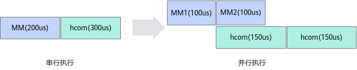

# MC²算子性能调优案例-优秀实践-算子实践参考-Ascend C算子开发-算子开发-CANN社区版8.5.0开发文档-昇腾社区

**页面ID:** atlas_ascendc_best_practices_10_0043
**来源：** https://www.hiascend.com/document/detail/zh/CANNCommunityEdition/850/opdevg/Ascendcopdevg/atlas_ascendc_best_practices_10_0043.html
---

# MC²算子性能调优案例

#### 案例介绍

MC2通算融合算子的性能收益主要来自于通信、计算的并行执行，即将输入数据切分为多个子块，子块的计算和通信任务形成两条流水线，通过两条流水线上任务的并行执行，实现流水掩盖，从而提升算子性能。如下图所示，MC2算子先做Matmul计算、后通信的场景，输入矩阵沿M轴被切分为两块，第二块数据的Matmul计算和第一块数据的通信可以并行执行，从而达到计算和通信时间相互掩盖的目的。本节的所有图示中MM代表Matmul计算，hcom代表通信任务。

本案例将介绍如何分析通算融合算子的性能收益、如何制定较好的数据切分策略。更多MC2算子的完整样例请参考MatmulAllReduce样例、MatmulReduceScatter样例、AllGatherMatmul样例。

#### 获取性能数据

通过msProf算子调优工具获取算子性能数据：

- 获取真实环境执行的性能数据，包含各个流水的占比情况；
- 获取仿真性能数据（指令流水图），包含各个流水的占用区间，可观察流水间依赖情况，从而优化并行效率。

#### 分析主要瓶颈点

MC2算子性能收益公式为：

融合前算子串行耗时 = 融合前计算算子耗时 + 融合前通信算子耗时

MC2算子收益 = （融合前算子串行耗时 - 融合后MC2算子耗时） / 融合前算子串行耗时

融合后MC2算子的执行耗时，受以下因素制约，从而影响算子性能收益。

- 因素一：计算和通信的执行时间差异若计算和通信任务的执行时间相差不大，则融合后，MC2算子的计算和通信并行执行，实现流水掩盖效果，性能收益较大。若计算和通信任务的执行时间差异较大，则融合后，MC2算子内计算和通信并行执行，能够掩盖的时间较少，算子整体执行耗时与未切分串行时的算子执行耗时接近，此时无法获得较大性能收益。
- 因素二：数据切分导致的计算或通信的执行时间膨胀当对输入数据进行切分后，原本的整块数据被切分成若干小数据块，对若干小数据块分别做Matmul计算或者执行通信任务，此时相比切分前，计算或者通信任务的执行时间可能发生膨胀（即执行时间变长）。该膨胀产生的原因包括：切分后的数据块过小导致计算或通信的效率降低、切分的数据块过多导致增加额外的调度开销、并行执行后计算和通信对L2 Cache或device存储内存的访问冲突等。以Matmul计算为例，简单说明数据切分后执行时间可能发生的膨胀情况。未发生膨胀：数据切分前，Matmul执行时间为200us，将Matmul的输入均匀切分为两块，假设切分后，每块数据的Matmul执行时间都是100us，通过计算的并行执行，下图实际性能收益为100us。发生一般程度的膨胀：数据切分前，Matmul执行时间为200us，将Matmul的输入均匀切分为两块，假设切分后，每块数据的Matmul执行时间都是150us，通过计算的并行执行，下图实际性能收益为50us。发生严重程度的膨胀：数据切分前，Matmul执行时间为200us，将Matmul的输入均匀切分为两块，假设切分后，每块数据的Matmul执行时间都是200us，通过计算的并行执行，下图实际性能收益为劣化50us。

综合上述分析，计算和通信执行时间较均衡的场景，有更好的流水掩盖和性能收益；同时，性能收益也受到数据切分导致的执行时间膨胀的影响。下文将介绍如何制定数据切分策略，以达到最佳流水掩盖效果。

#### 设计优化方案

以Atlas A2 训练系列产品/Atlas A2 推理系列产品，输入数据格式为ND、数据类型为half的MatmulAllReduce算子为例，该算子中计算执行在前，通信任务执行在后。假定Matmul计算中左矩阵的形状为[M, K]，右矩阵的形状为[K, N]，算子中的通信对象为Matmul的输出矩阵，则通信任务的输入shape为[M, N]。因为K轴只在Matmul计算中存在，当K轴较大时，计算量大，计算执行时间大于通信执行时间，此时计算为算子的瓶颈(bound)；反之，当K轴较小时，计算量小，计算执行时间小于通信执行时间，此时通信为算子的瓶颈。在制定数据切分策略前，对原始矩阵分别执行计算和通信任务，根据两个任务的执行时间判定bound场景。

该算子的数据切分策略应满足如下要求：

- 只切分M轴。因为通信任务调用的Hccl API要求分块数据内存连续，若按N轴切分，则每行数据都被切断，导致通信数据的内存不连续，不满足通信要求；若按M轴切分，则每行数据都是内存连续的，满足通信要求。
- 若A表示长块、B表示短块，只能切出A或B连续排布的形式，例如AAAB、BAAA等情况。

如上文所述，数据切分的目标是达成尽可能多的流水掩盖。根据计算与通信任务的执行时间差异，实际场景可以分解为如下两个具体场景，两个场景有各自细分的切分目标。

- 计算bound：对于同一个切分后的数据块，计算执行耗时大于通信执行耗时，此时，计算连续，且通信的尾块要短，如下图所示。图1计算bound示意图
- 通信bound：对于同一个切分后的数据块，通信执行耗时大于计算执行耗时，此时，通信连续，且计算的头块要短，如下图所示。图2通信bound示意图

前置工作：

在进行最终的数据切分前，需要做的前置工作有：判定bound场景、分别对Matmul计算和AllReduce通信的数据量与执行时间关系做公式拟合。具体步骤如下。

1. 将输入数据分别单独执行Matmul计算和AllReduce通信任务，利用msProf工具分别采集执行时间，判定时间较长的任务为对应的bound场景。例如通信执行时间大于计算执行时间，则为通信bound场景。
1. 将输入数据按M轴切分，分别切成M轴为256、512、768、1024、2048的若干数据块，这里可以根据实际情况调整切块大小。
1. 将步骤2得到的数据块分别做AllReduce通信，利用msProf工具采集执行时间，得到每个数据块的执行时间t1, t2, ..., tn。然后，作图分析数据量与对应的执行时间的关系，拟合得到公式t = CostComm(m)，其中m表示数据块的M轴长度，t表示数据块的通信执行时间，CostComm表示拟合得到的m和t的映射关系。该映射关系一般为线性，若不满足线性关系，可以采用分段拟合的方式。示例如下：数据量x = m * N * sizeof(dataType)，单位是Bytes。该拟合公式表示为：x小于8MB：t = -0.9698202 * x * x + 27.0622573 * x + 14.769，单位是us。x大于等于8MB：t = 13.58491263 * x + 61.508333，单位是us。
1. 将步骤2切分得到的各数据块做Matmul计算，按与步骤3相同的方式采集各数据块的计算执行时间t，并拟合得到M轴长度和计算执行时间关系的公式t = CostMM(m)，CostMM是拟合得到的m和t的映射关系。

切分算法步骤：

1. 根据输入矩阵的shape：M、K、N，按照经验值设置合适的M轴方向切分的短块长度。如下表达式中，a、b、c表示根据经验值给出的短块长度的备选，将K、N带入如下三个表达式后，取a、b、c的最小值m0为选定的短块长度。a * K * N >= 4 * 1024 * 1024 * 1024，a取不等式的最小值b * K * N / 1024 + b * N >= 6 * 1024 * 1024，b取不等式的最小值c >= 3 * 128，c取不等式的最小值m0 = min(a, b, c)
1. 根据短块长度m0和拟合公式，分别得到计算执行时间t0 = CostMM(m0) * 1.15，通信执行时间t1 = CostComm(m0) * 1.15。注意：通信和计算并行执行时，可能出现抢占内存带宽的情况，导致执行时间增加，一般按经验在拟合公式中乘以1.15的系数，用户可以根据实测情况调整该系数。
1. 根据短块的长度，按图1或图2配平通算，得到长块的长度，长块长度尽量对齐128个元素，以保证计算亲和。本案例为通信bound场景，这里的配平，即将短块的通信时间和长块的计算时间匹配相等：将t1作为长块的计算执行时间，带入t1 = CostMM(m1)公式，计算得到m1，即为长块的长度。
1. 根据短块长度m0、长块长度m1、原始M轴长度M，得出长块的切块个数count = (M - m0) / m1。该式一般不能整除，此时需要做如下处理：将结果的小数部分舍弃，保留整数部分作为切块个数。由于舍弃了小数部分，M轴长度有剩余，因此需要调整长块长度m1 = (M - m0) / count。为保持计算亲和，将长块长度m1调整至128对齐，即向下取128倍数的整数，更新长块长度m1。由于调整m1后，M轴长度有剩余，因此调整短块长度m0 = M - (m1 * count)。最终得到短块长度m0，长块长度m1，长块个数count。

#### 验证优化方案性能收益

- 制定切分策略并验证性能收益本MatmulAllReduce案例中，给定的输入矩阵Shape为M=4096，K=3072，N=8192，数据类型为half，分核数为8，通过融合前msProf工具采集，得到该输入的Matmul计算执行时间为803us，AllReduce通信的执行时间为1071us，总耗时1874us，属于通信bound场景。按照上述的切分算法，本案例的具体切分情况如下：根据经验值选定短块（bound场景中短块为头块，即切分后的第一个数据块）M方向长度m0为384，则通信数据量x为：384 * 8192 * 2 / 1024 / 1024 = 6MB。按通信拟合公式估算通信的执行时间为143us。考虑可能会发生内存带宽冲突，因此再乘以1.15的系数，得出通信执行时间164us。计算长块M方向长度。根据短块通信时间，配平长块的计算执行时间同样为164us，按计算拟合公式估算出该长度m1为768。根据M=4096、m0=384、m1=768，计算长块个数：(4096 - 384) / 768 = 4.83，向下取整为4。根据短块长度m0=384，长块个数4，调整长块m1长度：(4096 - 384) / 4 = 928，向下按128对齐，调整m1为896。根据长块长度m1=896，长块个数4，调整短块m0长度：4096 - 896 * 4 = 512。最终得到将原始输入矩阵切分为5个数据块，长度分别为：{512，896，896，896，896}。如下代码所示，在算子的Tiling代码中设置制定好的切分策略。按该切分策略测试，融合后该算子的执行时间为1262us，则融合算子的性能收益为(1874 - 1262) / 1874 = 32.7%。1234567891011121314MatmulAllReduceCustomTilingData*tiling=context->GetTilingData<MatmulAllReduceCustomTilingData>();tiling->param.rankDim=8;tiling->param.tileM=512;// 短块大小tiling->param.tileNum=1;// 短块个数tiling->param.tailM=896;// 长块大小tiling->param.tailNum=4;// 长块个数tiling->param.rankM=4096;tiling->param.rankN=8192;tiling->param.rankK=4096;tiling->param.isTransposeA=0;tiling->param.isTransposeB=0;tiling->param.cToFloatLen=0;tiling->param.nd2NzWorkLen=true;tiling->param.dataType=static_cast<uint8_t>(HCCL_DATA_TYPE_MAP.at(aType));

- 针对切分膨胀做调整上文提到，切分数据会引起计算或通信执行时间的膨胀，使实测结果与理论值有偏差。比如切块数量较多时，执行时间的膨胀对性能影响较大，可能导致性能收益变小或者出现性能劣化，因此最终需要根据上述理论切分策略，结合实测，对切分策略做调整。

#### 总结

MC2算子通过数据切分后计算和通信的并行执行，获得性能收益，但受数据切分后执行时间膨胀的影响。对MC2算子进行性能调优的主要方式是制定数据切分策略，开发人员需要根据理论推导找到理想切分策略，然后根据实测结果调整，最终找到最优切分策略。
