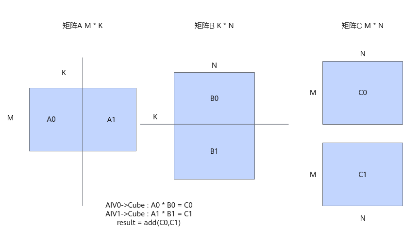
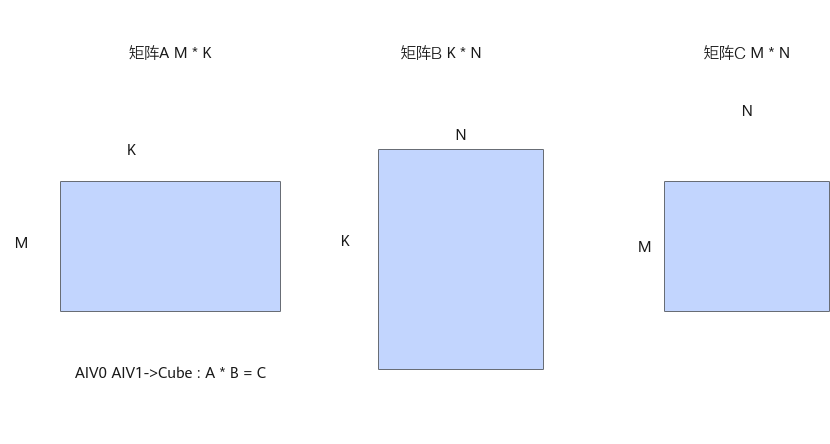
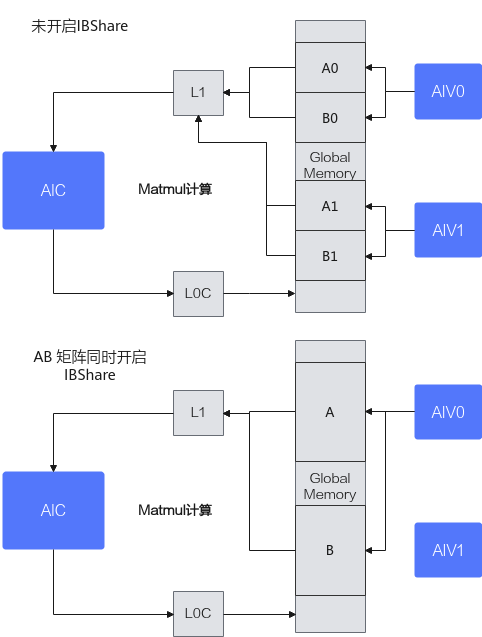
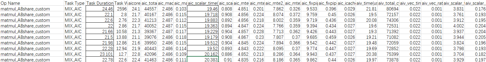

# Matmul高阶API使能IBShare模板共享A和B矩阵数据-Matmul性能调优案例-优秀实践-算子实践参考-Ascend C算子开发-算子开发-CANN社区版8.5.0开发文档-昇腾社区

**页面ID:** atlas_ascendc_best_practices_10_10000
**来源：** https://www.hiascend.com/document/detail/zh/CANNCommunityEdition/850/opdevg/Ascendcopdevg/atlas_ascendc_best_practices_10_10000.html
---

# Matmul高阶API使能IBShare模板共享A和B矩阵数据

#### 案例介绍

本案例呈现了在融合算子场景中，使用Matmul高阶API进行矩阵乘法计算时，A矩阵和B矩阵同时启用IBShare对性能的提升效果。

该案例的关键优化措施包括：

- 分核逻辑：以Cube核视角分核，Matmul计算结果输出到GM，提供给Vector核进行后续计算。
- 开启IBShare：A矩阵和B矩阵同时开启IBShare。

本案例的算子规格如下：

| 输入 | Shape   | Data type | Format |
| ---- | ------- | --------- | ------ |
| x    | 128,384 | float16   | ND     |
| y    | 384,256 | float16   | ND     |

开启IBShare和未开启IBShare的完整样例请参考MatmulABshare样例和MatmulNoABshare样例。

#### 获取性能数据

使用msProf工具获取算子的Profiling的数据，重点分析MTE2，Cube，Scalar的流水情况。

#### 分析主要瓶颈点

通过分析以上Profiling数据可以看出，算子执行多次的平均耗时为27.11us，aic_scalar_time的平均耗时为26.27us，当前性能瓶颈点为Cube的Scalar流水。

#### 设计优化方案

A矩阵和B矩阵均未开启IBShare时，数据需要根据K轴、M轴或N轴进行切分计算。这里以K轴切分为例，未开启IBShare之前，算子以AIV Block为视角进行tiling切分，AIV0发起A0*B0的计算，AIV1发起A1*B1的计算。

当A矩阵和B矩阵都启用IBShare时，可以一次性加载到L1 Buffer上，省去了切分，分开搬运的过程，同时Cube计算单元完全由AIV0单核驱动，发起一次计算，计算的结果由AIV0和AIV1共享，从而减少Cube响应的次数，减少Scalar计算。

开启IBShare和不开启IBShare的数据交互对比示意图如下：

通过设置A和B矩阵MatmulType的IBShare均为true，开启该优化，具体代码如下：

| 1234567891011121314151617181920212223242526272829303132333435363738394041 | constexprboolisABshare=true;template<typenameaType,typenamebType,typenamecType>classMatmulABshareKernel{public:__aicore__inlineMatmulABshareKernel(){};__aicore__inlinevoidInit(GM_ADDRa,GM_ADDRb,GM_ADDRc,GM_ADDRworkspace,constTCubeTiling&tiling,AscendC:TPipe*pipe);__aicore__inlinevoidProcess(AscendC:TPipe*pipe);__aicore__inlinevoidCalcOffset(int32_tblockIdx,constTCubeTiling&tiling,int32_t&offsetA,int32_t&offsetB,int32_t&offsetC);AscendC:Matmul<AscendC:MatmulType<AscendC:TPosition:GM,CubeFormat:ND,aType,false,LayoutMode:NONE,isABshare>,AscendC:MatmulType<AscendC:TPosition:GM,CubeFormat:ND,bType,false,LayoutMode:NONE,isABshare>,AscendC:MatmulType<AscendC:TPosition:VECIN,CubeFormat:ND,cType>>matmulObj;AscendC:GlobalTensor<aType>aGlobal;AscendC:GlobalTensor<bType>bGlobal;AscendC:GlobalTensor<cType>cGlobal;TCubeTilingtiling;};template<typenameaType,typenamebType,typenamecType>__aicore__inlinevoidMatmulABshareKernel<aType,bType,cType>:Init(GM_ADDRa,GM_ADDRb,GM_ADDRc,GM_ADDRworkspace,constTCubeTiling&tiling,AscendC:TPipe*pipe){this->tiling=tiling;aGlobal.SetGlobalBuffer(reinterpret_cast<__gm__aType*>(a),tiling.M*tiling.Ka);bGlobal.SetGlobalBuffer(reinterpret_cast<__gm__bType*>(b),tiling.Kb*tiling.N);cGlobal.SetGlobalBuffer(reinterpret_cast<__gm__cType*>(c),tiling.M*tiling.N);int32_toffsetA,offsetB,offsetC;CalcOffset(AscendC:GetBlockIdx(),tiling,offsetA,offsetB,offsetC);// calculate offsetaGlobal=aGlobal[offsetA];bGlobal=bGlobal[offsetB];cGlobal=cGlobal[offsetC];}template<typenameaType,typenamebType,typenamecType>__aicore__inlinevoidMatmulABshareKernel<aType,bType,cType>:CalcOffset(int32_tblockIdx,constTCubeTiling&tiling,int32_t&offsetA,int32_t&offsetB,int32_t&offsetC){offsetA=0;offsetB=0;offsetC=0;} |
| ------------------------------------------------------------------------- | ---------------------------------------------------------------------------------------------------------------------------------------------------------------------------------------------------------------------------------------------------------------------------------------------------------------------------------------------------------------------------------------------------------------------------------------------------------------------------------------------------------------------------------------------------------------------------------------------------------------------------------------------------------------------------------------------------------------------------------------------------------------------------------------------------------------------------------------------------------------------------------------------------------------------------------------------------------------------------------------------------------------------------------------------------------------------------------------------------------------------------------------------------------------------------------------------------------------------------------------------------------------------------------------------------------------------------------------------------------------------------------------------------------------------------------------------------------------------------------------------------------------------------------------------------------------------------------------------------------------------------------------------------------------------------------------------------------------------------------------------------------------------------------------- |

#### 验证优化方案性能收益

优化后执行多次的平均耗时：22.44us，较优化前有较大提升。

#### 总结

融合算子场景下，Matmul A矩阵和B矩阵同时开启IBShare，以Cube核视角分核，可以有效减少Cube侧的Scalar开销，提升性能。
