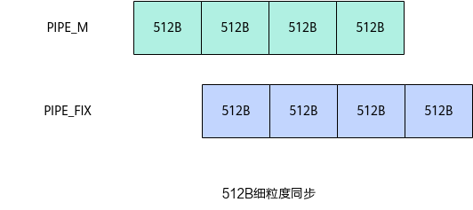

# Matmul高阶API使能UnitFlag-Matmul性能调优案例-优秀实践-算子实践参考-Ascend C算子开发-算子开发-CANN社区版8.5.0开发文档-昇腾社区

**页面ID:** atlas_ascendc_best_practices_10_10003
**来源：** https://www.hiascend.com/document/detail/zh/CANNCommunityEdition/850/opdevg/Ascendcopdevg/atlas_ascendc_best_practices_10_10003.html
---

# Matmul高阶API使能UnitFlag

#### 案例介绍

本案例呈现了在矩阵乘算子场景中，使用Matmul高阶API进行矩阵乘法计算，使能UnitFlag功能对算子性能的提升效果。UnitFlag功能为AIC核中MMAD计算指令和FIXPIPE数据搬运指令提供了基于内存访问的细粒度同步，使计算与搬运流水并行。使能UnitFlag功能的方式为将MatmulConfig中的enUnitFlag参数设置为true。enUnitFlag参数的详细介绍请参考MatmulConfig。

- 使能UnitFlag的适用场景算子的MMAD流水和FIXPIPE流水之间串行执行，FIXPIPE等待MMAD计算完成才搬出结果，这个指令同步等待的时间在算子整体执行耗时中占比较高。这种场景可以使能UnitFlag功能，以获得MMAD和FIXPIPE流水并行的性能收益。如果算子原本的MMAD、FIXPIPE流水可以被其他流水掩盖（比如MTE2 Bound），这时使能UnitFlag功能总体收益很小。

- 使能UnitFlag的约束条件UnitFlag功能仅支持Norm、IBShare、MDL三个模板。使能UnitFlag功能时，不支持算子内同时存在CO1(L0C)搬出到Global Memory和A1(L1)搬出到Global Memory的两种流水。使能UnitFlag功能时，若同时使能L0C累加功能，不支持多次Iterate计算、一次GetTensorC输出。

本案例的算子规格如下：

| 输入 | Shape     | Data type | Format |
| ---- | --------- | --------- | ------ |
| a    | 128, 64   | float16   | ND     |
| b    | 64, 30720 | float16   | ND     |

当前案例使用的AI处理器共20个核，每个核包含1个AIC核和2个AIV核。

算子的Tiling参数如下：

- 原始shape：M=128, N=30720, K=64。
- 单核shape：按20个AIC核进行切分，singleCoreM=128，singleCoreN=1536，singleCoreK=64。对于B矩阵，沿着N轴进行切分，切分成20份singleCoreN，单核上处理K * SingleCoreN大小的数据。对于A矩阵，M轴不进行切分即singleCoreM=M，单核上处理singleCoreM * K大小的数据。总共20个核参与计算。
- 基本块shape：baseM=128，baseN=256，baseK=64。
- L1相关Tiling参数：stepM=1，stepN=1，stepKa=4，stepKb=4，depthA1=8，depthB1=8。

#### 获取性能数据

使用msProf工具获取算子仿真流水图和上板Profiling数据。因为UnitFlag功能主要优化MMAD和FIXPIPE流水串行问题，所以获取性能数据后重点分析Cube、FIXPIPE的流水情况。

#### 分析主要瓶颈点

- 优化前的流水图如下。如下图中红框所示，每一轮MMAD计算流水和FIXPIPE数据搬出流水之间都是串行执行的，完成MMAD计算后才开始FIXPIPE数据搬出，考虑实现MMAD与FIXPIPE之间流水并行来优化算子性能。
- 优化前的Profiling数据如下，从C列的aic_time数据可以看出，多个核中最大算子执行耗时为37.39us。

#### 设计优化方案

如下图所示，未开启UnitFlag功能时，MMAD和FIXPIPE是指令级别的同步，FIXPIPE指令需要等MMAD指令执行完成才进行结果搬出，MMAD和FIXPIPE之间流水串行。

如下图所示，开启UnitFlag功能时，MMAD和FIXPIPE指令是512B大小的细粒度同步。在一条MMAD指令执行过程中，每当完成一个512B数据结果的计算，FIXPIPE立即开始搬出该512B的数据，从而实现MMAD和FIXPIPE之间的流水并行，提升算子性能。

Matmul API使能UnitFlag功能的完整样例请参考Matmul API性能优化样例。使能UnitFlag功能的主要步骤如下：

1. 自定义MatmulConfig模板参数，将其中的enUnitFlag参数设置为true，使能UnitFlag功能。1234567__aicore__inlineconstexprMatmulConfigGetCustomMDLCFG(){autommCfg=CFG_MDL;mmCfg.enUnitFlag=true;returnmmCfg;}constexprstaticMatmulConfigCUSTOM_CFG_MDL=GetCustomMDLCFG();
1. 基于自定义的MatmulConfig模板参数，创建Matmul对象。12345usingA_TYPE=AscendC:MatmulType<AscendC:TPosition:GM,CubeFormat:ND,AType>;usingB_TYPE=AscendC:MatmulType<AscendC:TPosition:GM,CubeFormat:ND,BType>;usingC_TYPE=AscendC:MatmulType<AscendC:TPosition:GM,CubeFormat:ND,CType>;usingBIAS_TYPE=AscendC:MatmulType<AscendC:TPosition:GM,CubeFormat:ND,BiasType>;AscendC:Matmul<A_TYPE,B_TYPE,C_TYPE,BIAS_TYPE,CUSTOM_CFG_MDL>matmulObj;

#### 验证优化方案性能收益

- 优化后的流水图如下，MMAD计算流水和FIXPIPE数据搬出流水之间实现了流水并行。
- 优化后的Profiling数据如下，从C列的aic_time数据可以看出，多个核中最大算子执行耗时为34.66us，较优化前的37.39us有约7.3%的性能提升。

#### 总结

在算子的MMAD计算流水和FIXPIPE数据搬出流水串行且未被其他流水掩盖（比如MTE2 Bound）时，考虑使能UnitFlag功能，实现MMAD计算流水和FIXPIPE数据搬出流水的流水并行，提升算子性能。
