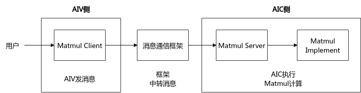
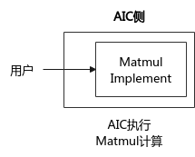

# Matmul高阶API使能纯Cube模式-Matmul性能调优案例-优秀实践-算子实践参考-Ascend C算子开发-算子开发-CANN社区版8.5.0开发文档-昇腾社区

**页面ID:** atlas_ascendc_best_practices_10_10008
**来源：** https://www.hiascend.com/document/detail/zh/CANNCommunityEdition/850/opdevg/Ascendcopdevg/atlas_ascendc_best_practices_10_10008.html
---

# Matmul高阶API使能纯Cube模式

#### 案例介绍

本案例呈现了在矩阵乘算子场景中，使能Matmul高阶API的纯Cube模式对算子性能的提升效果。如下图所示，Matmul API默认使用MIX模式，即用户从AIV侧发起消息，通过消息通信框架中转消息后，在AIC侧执行Matmul计算。这套消息处理机制会带来额外的Scalar性能开销。相较于MIX模式，纯Cube模式可以直接跳过消息通信框架，完成Matmul计算，提升算子性能。

- 使能纯Cube模式的适用场景非融合算子，只有矩阵计算的场景。即相较于MIX模式（包含矩阵计算和矢量计算），没有矢量计算的场景。本案例的算子规格如下：

| 输入 | Shape     | Data type | Format |
| ---- | --------- | --------- | ------ |
| a    | 128, 64   | float16   | ND     |
| b    | 64, 30720 | float16   | ND     |

当前案例使用的AI处理器共24个核，每个核中包含1个AIC核和2个AIV核。

Tiling参数如下：

- 原始shape：M=128, N=30720, K=64。
- 单核shape：MIX场景：按48个AIV核进行切分，singleCoreM=128，singleCoreN=640，singleCoreK=64。纯Cube场景：按24个AIC核进行切分，singleCoreM=128，singleCoreN=1280，singleCoreK=64。
- 基本块shape：baseM=128，baseN=256，baseK=64。
- L1相关Tiling参数：stepM=1，stepN=1，stepKa=4，stepKb=4，depthA1=8，depthB1=8。

#### 获取性能数据

使用msProf工具获取算子仿真流水图和上板Profiling数据。因为纯Cube模式主要优化Scalar流水性能，可以重点分析Scalar的流水情况。

#### 分析主要瓶颈点

- 优化前的Profiling数据如下，从C列的aic_time数据可以看出，多个核中最大算子执行耗时为17.85us。从G列的aic_scalar_time数据可以看出，Scalar平均耗时为15.02us，性能瓶颈在Scalar流水。
- 优化前的流水图如下，由于默认为MIX模式，每次Matmul计算均涉及消息通信框架对消息进行处理，Scalar流水重，性能开销较大，如下图红框所示。

#### 设计优化方案

默认MIX模式下，用户在AIV侧发起消息，通过消息通信框架中转消息后，在AIC侧执行Matmul计算。基于这样的流程，用户使用Matmul高阶API编写算子代码时，可以使用REGIST_MATMUL_OBJ宏，无需区分AIV和AIC，但也因这套消息处理机制导致产生了额外的性能开销，如图1默认MIX模式的Matmul流程示意图所示。

实现默认MIX模式的具体步骤如下：

1. Kernel侧，定义Matmul对象。1234567#include"lib/matmul_intf.h"usingA_TYPE=AscendC:MatmulType<AscendC:TPosition:GM,CubeFormat:ND,AType>;usingB_TYPE=AscendC:MatmulType<AscendC:TPosition:GM,CubeFormat:ND,BType>;usingC_TYPE=AscendC:MatmulType<AscendC:TPosition:GM,CubeFormat:ND,CType>;usingBIAS_TYPE=AscendC:MatmulType<AscendC:TPosition:GM,CubeFormat:ND,BiasType>;AscendC:Matmul<A_TYPE,B_TYPE,C_TYPE,BIAS_TYPE,CFG_NORM>matmulObj;
1. Host侧，Matmul多核Tiling对象调用SetDim接口设置参与运算的核数。1234autoascendcPlatform=platform_ascendc:PlatformAscendCManager:GetInstance();matmul_tiling:MultiCoreMatmulTilingcubeTiling(*ascendcPlatform);int32_tblockDim=ascendcPlatform->GetCoreNumAiv();// MIX模式使用GetCoreNumAiv获取AI处理器可用的核数。cubeTiling.SetDim(blockDim);
1. 调用核函数，参考核函数定义和调用，设置核函数的blockDim参数配置。1matmul_custom_do(ascendcPlatform->GetCoreNumAic(),stream,x1,x2,bias,y,workspaceDevice,tilingDevice);// MIX模式下，启动时，按照AIV和AIC组合启动，blockDim用于设置启动多少个AI Core。

在没有矢量计算的算子场景下，可以跳过消息通信框架的机制，使能纯Cube模式完成Matmul计算，减少消息通信的性能开销，提升算子性能。

Matmul API使能纯Cube模式的完整样例请参考Matmul API性能优化样例。使能纯Cube模式的主要步骤如下：

1. Kernel侧，在定义Matmul对象的代码中，包含matmul_intf.h头文件前设置ASCENDC_CUBE_ONLY宏。12345678#define ASCENDC_CUBE_ONLY// 在#include "lib/matmul_intf.h"前，设置ASCENDC_CUBE_ONLY宏#include"lib/matmul_intf.h"usingA_TYPE=AscendC:MatmulType<AscendC:TPosition:GM,CubeFormat:ND,AType>;usingB_TYPE=AscendC:MatmulType<AscendC:TPosition:GM,CubeFormat:ND,BType>;usingC_TYPE=AscendC:MatmulType<AscendC:TPosition:GM,CubeFormat:ND,CType>;usingBIAS_TYPE=AscendC:MatmulType<AscendC:TPosition:GM,CubeFormat:ND,BiasType>;AscendC:Matmul<A_TYPE,B_TYPE,C_TYPE,BIAS_TYPE,CFG_NORM>matmulObj;
1. Host侧，Matmul多核Tiling对象调用SetDim接口设置参与运算的核数。1234autoascendcPlatform=platform_ascendc:PlatformAscendCManager:GetInstance();matmul_tiling:MultiCoreMatmulTilingcubeTiling(*ascendcPlatform);int32_tblockDim=ascendcPlatform->GetCoreNumAic();// 纯Cube模式使用GetCoreNumAic接口获取AI处理器可用的核数。cubeTiling.SetDim(blockDim);
1. 调用核函数，参考核函数定义和调用，设置核函数的blockDim参数配置。1matmul_custom_do(ascendcPlatform->GetCoreNumAic(),stream,x1,x2,bias,y,workspaceDevice,tilingDevice);// 仅包含Cube计算的算子，blockDim用于设置启动多少个AIC。
1. Kernel侧，核函数实现中增加AIV侧返回分支。123456789extern"C"__global____aicore__voidmatmul_custom(GM_ADDRa,GM_ADDRb,GM_ADDRbias,GM_ADDRc,GM_ADDRworkspace,GM_ADDRtilingGm){if(g_coreType==AscendC:AIV){// 纯Cube模式，AIV侧直接returnreturn;}...// 其他代码}

#### 验证优化方案性能收益

- 优化后的Profiling数据如下，从C列的aic_time数据来看，多个核中最大算子执行耗时为11.21us，较优化前的17.85us有较大提升。从G列的aic_scalar_time数据来看，Scalar平均耗时从优化前的15.02us降低至5.17us。
- 优化后的流水图如下。对比优化前的流水图，红框所示位置的Scalar流水明显变稀疏。纯Cube模式相较于MIX模式，减少了对消息通信的处理，优化了整体Scalar性能开销。

#### 总结

在只有矩阵计算，没有矢量计算的场景下，可以考虑使能纯Cube模式，优化Matmul计算中的消息通信性能开销，提升算子性能。
