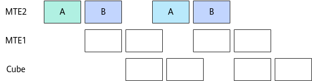
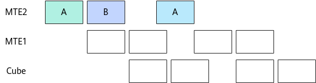

# Matmul高阶API使能IBShare模板共享B矩阵数据-Matmul性能调优案例-优秀实践-算子实践参考-Ascend C算子开发-算子开发-CANN社区版8.5.0开发文档-昇腾社区

**页面ID:** atlas_ascendc_best_practices_10_10010
**来源：** https://www.hiascend.com/document/detail/zh/CANNCommunityEdition/850/opdevg/Ascendcopdevg/atlas_ascendc_best_practices_10_10010.html
---

# Matmul高阶API使能IBShare模板共享B矩阵数据

#### 案例介绍

本案例呈现了在矩阵乘算子场景中，使用Matmul高阶API进行矩阵乘法计算，B矩阵使能IBShare对算子性能的提升效果。IBShare功能通过共享L1 Buffer上相同的A矩阵或B矩阵数据，减少重复的MTE2数据搬运开销，提升算子性能。该功能支持A矩阵和B矩阵其中一个矩阵使能IBShare，也支持A矩阵和B矩阵同时使能IBShare。

- 使能IBShare的适用场景MIX场景（包含矩阵计算和矢量计算）下，多个AIV的A矩阵或B矩阵GM地址相同，且多个AIV复用的A矩阵或B矩阵在L1 Buffer上全载。

- 使能IBShare的约束条件A矩阵和B矩阵同时使能IBShare的场景，同一算子中其它Matmul对象的A矩阵和B矩阵也必须同时使能IBShare。A矩阵和B矩阵同时使能IBShare的场景，获取矩阵计算结果时，只支持调用IterateAll接口，且只支持输出到Global Memory。

本案例的算子规格如下：

| 输入 | Shape    | Data type | Format |
| ---- | -------- | --------- | ------ |
| a    | 64, 384  | float16   | ND     |
| b    | 384, 256 | float16   | ND     |

当前案例使用的AI处理器共20个核，每个核中包含1个AIC核和2个AIV核。因为输入shape较小，本案例以单核为示例，参考SetDim接口在MIX模式下的使用，在Tiling程序中设置参与运算的核数为2。Tiling参数如下：

- 原始shape：M=64, N= 256, K=384。
- 单核shape：singleCoreM=32，singleCoreN=256，singleCoreK=384。A矩阵拆成两半，一半在AIV0上处理，一半在AIV1上处理；AIV0和AIV1使用的B矩阵数据相同。
- 基本块shape：baseM=32，baseN=256，baseK=64。
- L1缓存相关Tiling参数：stepM=1，stepN=1，stepKa=6，stepKb=6。

#### 获取性能数据

使用msProf工具获取算子仿真流水图和上板Profiling数据，因为IBShare功能主要是通过共享L1 Buffer上相同的A矩阵或B矩阵数据，减少重复的MTE2数据搬运开销，所以重点分析MTE2的流水情况。

#### 分析主要瓶颈点

- 优化前的流水图如下，不使能IBShare模板，默认使用的Norm模板。黑框标识AIV0发起的MTE2搬运流水：MTE2总共搬运了12次，其中A矩阵搬运了6次(stepM*stepKa=6)，B矩阵搬运了6次(stepN*stepKb=6)。红框标识的AIV1发起的MTE2搬运流水，跟AIV0基本一致。在该案例中，因为AIV1使用的B矩阵跟AIV0使用的B矩阵数据相同，且singleCoreN=baseN*stepN，singleCoreK=baseK*stepKb，即B矩阵可以在L1全载。考虑在AIV0搬入B矩阵到L1 Buffer后，将B矩阵数据缓存在L1 Buffer上等待AIV1进行复用，进而节省B矩阵的MTE2重复搬运开销。
- 优化前的Profiling数据如下，C列的aic_time是10.29us，K列的aic_mte2_time是5.56us。

#### 设计优化方案

下图是不使能IBShare模板（默认使用Norm模板）的Matmul计算流水示意图。MTE2分多次从Global Memory搬运基本块到A1或B1，即使前后两次搬运的B矩阵基本块数据是相同的数据，也会重复搬运。

下图是使能IBShare模板的Matmul计算流水示意图。MTE2分多次从Global Memory搬运基本块到A1或B1，若前后两次搬运的B矩阵基本块数据相同，不会重复搬运，第一次搬运到B1内的数据会被复用。

Matmul API使能IBShare模板共享B矩阵的完整样例请参考仅B矩阵使能IBShare样例。使能IBShare功能的主要步骤如下：

1. 创建Matmul对象。12345678#define ASCENDC_CUBE_ONLY#include"lib/matmul_intf.h"usingA_TYPE=AscendC:MatmulType<AscendC:TPosition:GM,CubeFormat:ND,AType>;usingB_TYPE=AscendC:MatmulType<AscendC:TPosition:GM,CubeFormat:ND,BType,false,LayoutMode:NONE,true>;// 设置B矩阵的IBSHARE参数为trueusingC_TYPE=AscendC:MatmulType<AscendC:TPosition:GM,CubeFormat:ND,CType>;usingBIAS_TYPE=AscendC:MatmulType<AscendC:TPosition:GM,CubeFormat:ND,BiasType>;AscendC:Matmul<A_TYPE,B_TYPE,C_TYPE,BIAS_TYPE,CFG_IBSHARE_NORM>matmulObj;// 使用默认的IBShare模板参数CFG_IBSHARE_NORM定义Matmul对象

#### 验证优化方案性能收益

- 优化后的流水图如下，黑框标识的AIV0发起的MTE2搬运流水，与优化前一致。红框标识的AIV1发起的MTE2搬运流水，相较于优化前的A矩阵和B矩阵一共12次MTE2数据搬运，减少到了仅6次A矩阵的MTE2数据搬运，省去了B矩阵的6次MTE2数据搬运开销。
- 优化后的Profiling数据如下，C列的aic_time是9.93us，较优化前的10.29us提升了3.55%。K列的aic_mte2_time是4.71us，较优化前的5.56us提升了15.46%。

#### 总结

MIX场景（包含矩阵计算和矢量计算）下，若多个AIV的A矩阵或B矩阵GM地址相同，且多个AIV复用的A矩阵/B矩阵在L1 Buffer上全载。可以考虑使能IBShare模板，通过共享L1 Buffer上相同的A矩阵或B矩阵数据，减少重复的MTE2数据搬运开销，提升算子性能。
