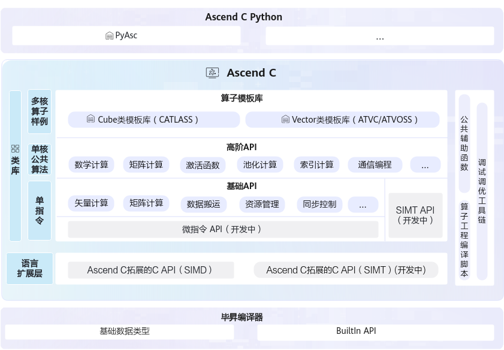
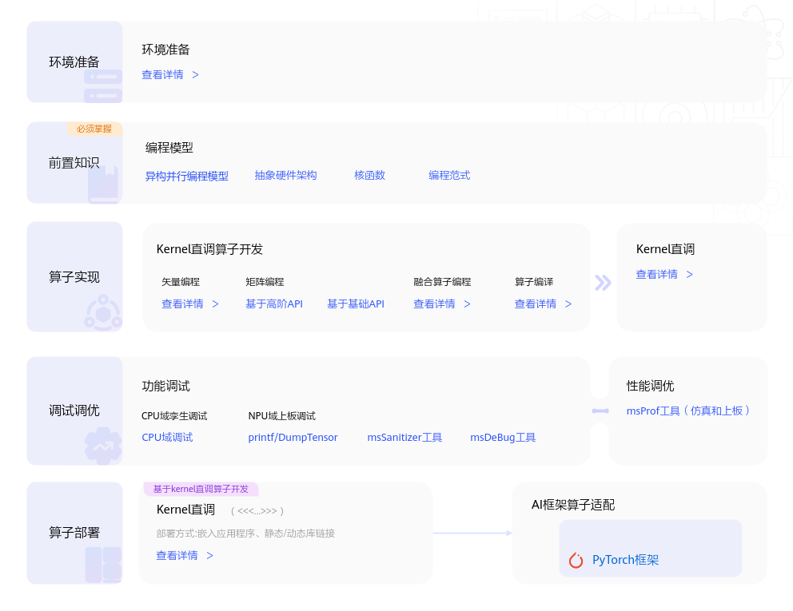
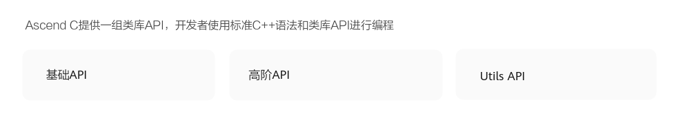
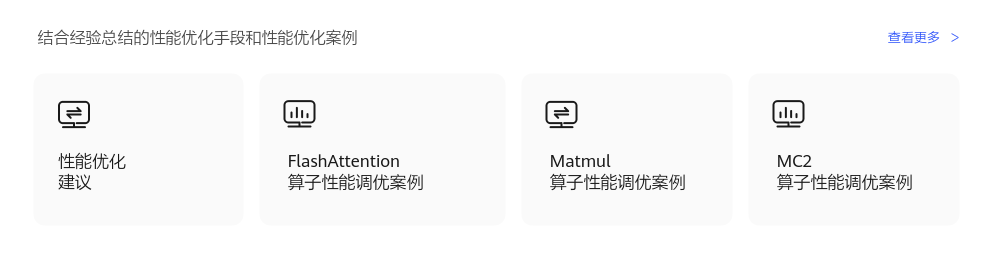

# 什么是Ascend C-入门教程-Ascend C算子开发-算子开发-CANN社区版8.5.0开发文档-昇腾社区

**页面ID:** atlas_ascendc_map_10_0001
**来源：** https://www.hiascend.com/document/detail/zh/CANNCommunityEdition/850/opdevg/Ascendcopdevg/atlas_ascendc_map_10_0001.html
---

# 什么是Ascend C

Ascend C是CANN针对算子开发场景推出的编程语言，原生支持C和C++标准规范，兼具开发效率和运行性能。基于Ascend C编写的算子程序，通过编译器编译和运行时调度，运行在昇腾AI处理器上。使用Ascend C，开发者可以基于昇腾AI硬件，高效的实现自定义的创新算法。您可以通过Ascend C主页了解更详细的内容。

Ascend C提供多层级API，满足多维场景算子开发诉求。

- 基础API：基于Tensor进行编程的C++类库API，实现单指令级抽象，为底层算子开发提供灵活控制能力。
- 高阶API：封装单核公共算法，涵盖一些常见的计算算法（如卷积、矩阵运算等），显著降低复杂算法开发门槛。
- 算子模板库：基于模板提供算子完整实现参考，简化Tiling（切分算法）开发，支撑用户自定义扩展。
- Python前端：PyAsc编程语言基于Python原生接口，提供芯片底层完备编程能力，支持基于Python接口开发高性能Ascend C算子。

#### 快速入门

#### 成长地图

#### 概念原理

#### API参考

#### 算子实践参考

Ascend C支持在如下AI处理器型号使用：

- Atlas A3 训练系列产品/Atlas A3 推理系列产品
- Atlas A2 训练系列产品/Atlas A2 推理系列产品

- Atlas 200I/500 A2 推理产品
- Atlas推理系列产品
- Atlas训练系列产品
