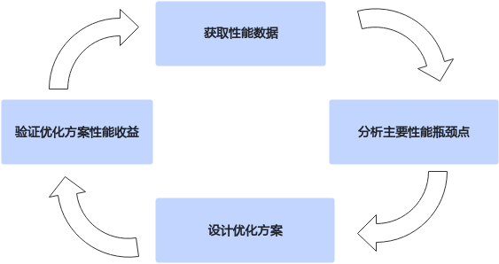

# 本文档组织结构-算子实践参考-Ascend C算子开发-算子开发-CANN社区版8.5.0开发文档-昇腾社区

**页面ID:** atlas_ascendc_map_10_0010
**来源：** https://www.hiascend.com/document/detail/zh/CANNCommunityEdition/850/opdevg/Ascendcopdevg/atlas_ascendc_map_10_0010.html
---

# 本文档组织结构

#### 需要具备的知识

本文档主要用于指导开发者基于Ascend C编程语言在昇腾AI处理器上开发高性能的算子。在阅读此文档时，需要开发者具备如下能力：

- 熟练使用C++编程语言。
- 了解计算机架构。
- 理解昇腾AI处理器硬件架构。
- 完成Ascend C编程相关文档、课程学习。
- 可以完成Ascend C开发、调试环境搭建。
- 可以独立完成Ascend C算子的开发。
- 熟练使用性能分析工具获取性能数据。

您可以通过LINK获取如上内容的学习资料。

#### 可以解决的问题

开发者完成Ascend C算子（本文后续提到的算子均指使用Ascend C开发的算子）的开发后，如果需要对算子性能进行进一步优化，那么通过阅读本文档可以得到有效帮助。

本文档首先介绍异构计算的硬件特点及运行的数据交互，然后介绍使用Ascend C编程时调试调优的思路以及各种性能优化手段，最后介绍具体的性能优化案例。

优化算子性能是一个持续迭代的流程，将如下步骤不断循环迭代，直至达成性能目标。在优秀实践章节，开发者可以进一步了解基于以下四个步骤的具体实践。

本文档分为五个章节，各章的内容以及目标如下：

- 异构计算：介绍算子在硬件上的部署以及运行的数据流。目的是让开发者在宏观上了解硬件架构上可能影响算子执行性能的流程。
- SIMD算子实现：介绍矢量编程、矩阵编程、融合算子编程三种典型场景下的算子Tiling、Kernel实现，是对Ascend C编程范式的具体应用。
- 功能调试：介绍部分比较常见的影响算子功能的场景。目的是让开发者可以快速解决功能问题，便于进行性能优化，以及快速解决在性能优化过程中可能出现的功能问题。
- 性能分析：介绍了算子性能数据分析的方向。目的是让开发者能够通过分析性能数据，识别性能的优化方向。算子性能数据的测试方法，以及性能工具使用方式的详细说明请参考《性能调优工具用户指南》，本章不做赘述。
- 性能优化：介绍性能优化的手段。目的是让开发者结合算子性能瓶颈点，开展性能优化工作。将主要的优化建议分成搬运优化、内存优化、API使用优化、流水优化以及Tiling优化。有一些优化建议是对上述分类的综合体现，则写在了相关性比较大的章节。这些建议按优先级进行分类，优先级是综合考虑性能效果及其范围来设定：为大多数Ascend C算子带来性能收益的建议具有最高优先级，而仅影响特定情况的手段被给予较低优先级。开发者不必熟悉所有优化手段，可以根据分析得到的算子性能瓶颈，获取对应的优化手段，逐渐了解优化策略全貌。
- 优秀实践：介绍算子性能优化的优秀实践案例。目的是让开发者结合实例更深入的理解上文内容，同时参考其中的优化手段和优化思路，完成算子的性能优化，实现从理论到实践的过渡。
